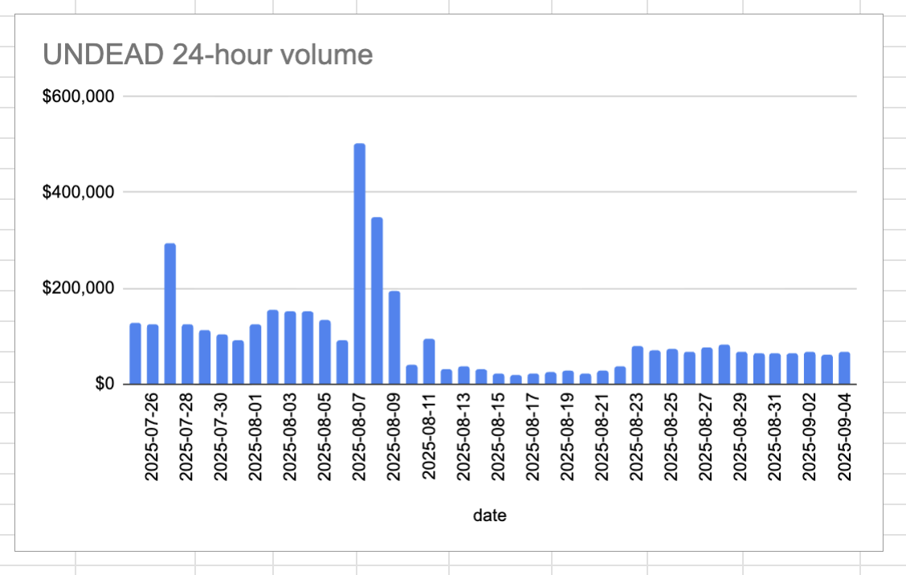

# 2025-09-04 Status of @UndeadBlocks / $UNDEAD 

 
 
 
 

* rank: 8772 
* quote: $0.002961 
* market cap: $44,417 
* 24-hr volume: $67,479 (δ: $6,688 ) 

[UNDEAD data source](https://www.coingecko.com/en/coins/undead-blocks) 

When we get LPs funded on multiple blockchains, the game released, and the Pivot protocol launched, what will $UNDEAD look like? 

## $UNDEAD performance analysis, 2025-09-04 

* "δ" indicates change since 2025-07-17 
* "α" is annualized since 2025-07-17 

 
 
 
 

* rank: 8772 (δ: -3.44% ) , α: -25.65% 
* quote: $0.002961 (δ: 33.92% ) , α: 252.68% 
* market cap: $44,417 (δ: 33.84% ) , α: 252.08% 
* 24-hr volume: $67,479 (δ: -28.68% ) , α: -213.66% 

[2025-07-17 $UNDEAD report (archived)](https://github.com/pivoteur/biz/tree/main/blog/snapshot) 

