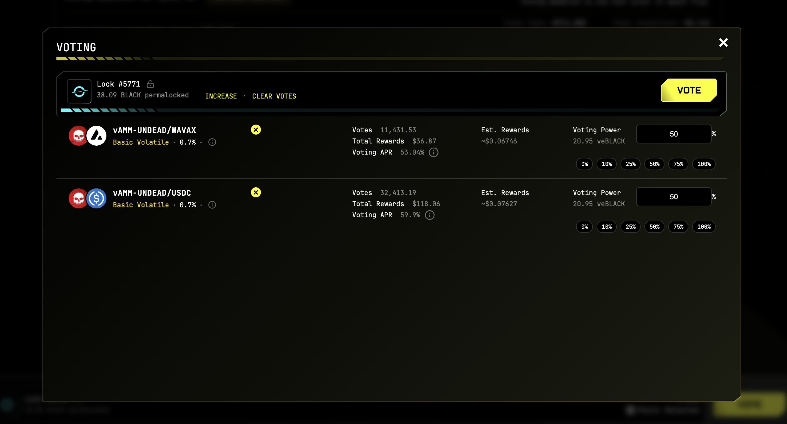

# 2025-09-05 Status of @UndeadBlocks / $UNDEAD 

 
 
 
 

* rank: 8803 
* quote: $0.002911 
* market cap: $43,658 
* 24-hr volume: $71,807 (δ: $4,329 ) 

[UNDEAD data source](https://www.coingecko.com/en/coins/undead-blocks) 

When we get LPs funded on multiple blockchains, the game released, and the Pivot protocol launched, what will $UNDEAD look like? 

## $UNDEAD performance analysis, 2025-09-05 

* "δ" indicates change since 2025-07-17 
* "α" is annualized since 2025-07-17 

 
 
 
 

* rank: 8803 (δ: -3.81% ) , α: -27.81% 
* quote: $0.002911 (δ: 31.66% ) , α: 231.12% 
* market cap: $43,658 (δ: 31.55% ) , α: 230.32% 
* 24-hr volume: $71,807 (δ: -24.11% ) , α: -175.99% 

[2025-07-17 $UNDEAD report (archived)](https://github.com/pivoteur/biz/tree/main/blog/snapshot) 

# Liquidity Pools

The 'experiment' of destaking the @BlackholeDex $UNDEAD LPs has come to a close: I made $2 destaked as opposed to $7 staked.

I've restaked the $UNDEAD LPs on @BlackholeDex. 

# Vote for $UNDEAD LPs on Blackhole 

2025-09-05 

Good day, pivoteurs! 

A new day; a new Epoch on @BlackholeDex. 

Reminder to go [vote](https://blackhole.xyz/vote) for the @UndeadBlocks $UNDEAD liquidity pools on that DEX. Reminder to go to https://blackhole.xyz/vote and vote for the @UndeadBlocks $UNDEAD liquidity pools on that DEX. 

 
 

[HOWTO vote instructions](https://x.com/pivocateur/status/1945637734682341791)

#IVotedForUNDEAD 

## Liquidity Pool Positions 

 
 

The Blackhole and Uniswap $UNDEAD LPs are as shown. 

# DEX UNDEAD/USDC-swap Race 

Same swap; 3 DEX, 2025-09-05 

I swap 175000 $UNDEAD for: 

1. 474.51 $USDC on @BlackholeDex 

 

2. 481.52 $USDC on @KyberNetwork 

 

3. 482.07 $USDC on @LFJ_gg 💥 

 

Winner: @LFJ_gg (10-day streak) 

# Bitcoin vault 

* I swap some accumulated $AVAX to $BTC.b 

 

* I send this $BTC.b to the vault 

 

