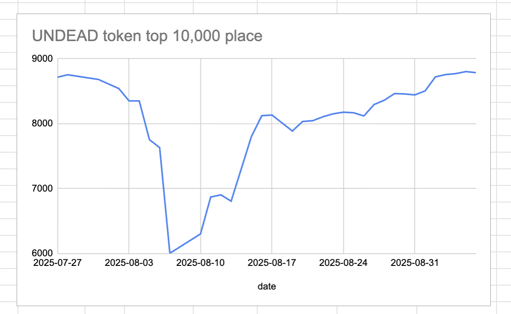
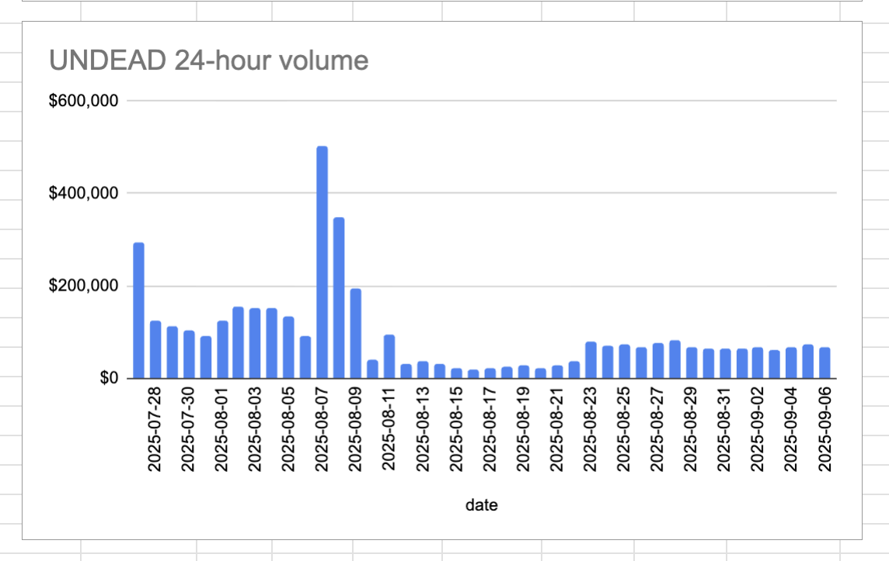

# 2025-09-06 Status of @UndeadBlocks / $UNDEAD 

 
 
 
 

* rank: 8786 
* quote: $0.002929 
* market cap: $43,850 
* 24-hr volume: $66,711 (δ: -$5,096 ) 

[UNDEAD data source](https://www.coingecko.com/en/coins/undead-blocks) 

When we get LPs funded on multiple blockchains, the game released, and the Pivot protocol launched, what will $UNDEAD look like? 

## $UNDEAD performance analysis, 2025-09-06 

* "δ" indicates change since 2025-07-17 
* "α" is annualized since 2025-07-17 

 
 
 
 

* rank: 8786 (δ: -3.61% ) , α: -25.83% 
* quote: $0.002929 (δ: 32.47% ) , α: 232.41% 
* market cap: $43,850 (δ: 32.13% ) , α: 229.95% 
* 24-hr volume: $66,711 (δ: -29.49% ) , α: -211.09% 

[2025-07-17 $UNDEAD report (archived)](https://github.com/pivoteur/biz/tree/main/blog/snapshot) 

# DEX UNDEAD/USDC-swap Race 

Same swap; 3 DEX, 2025-09-06 

I swap 187000 $UNDEAD for: 

1. 500.47 $USDC on @BlackholeDex 

 

2. 511.83 $USDC on @KyberNetwork 

 

3. 511.94 $USDC on @LFJ_gg 💥 

 

Winner: @LFJ_gg (11-day streak) 

# Liquidity Pool Positions 

 
 

The Blackhole and Uniswap $UNDEAD LPs are as shown. 

# Bitcoin vault 

* I swap some accumulated $AVAX to $BTC.b 

 

* I send this $BTC.b to the vault 

 

# State of the Pivot Protocol, 2025-09-06 

 
 
 

Good day, pivoteurs! 

News: I tightened up the (internal) reportage. Today I will focus on the staker-profiles. 
## Pivot Protocol Snapshot 

 
 
 

### Custody 

* 50M $UNDEAD = $146,050 

### Investments 

* 1 $BTC = $110,848 
* 3.501M $UNDEAD = $10,226 

total: $267,124 

### Pivot Protocol 

* NAV = $279,660 
* reinvestments/distributions = $16,158 

This shows the protocol has generated $28,694 in value. 

