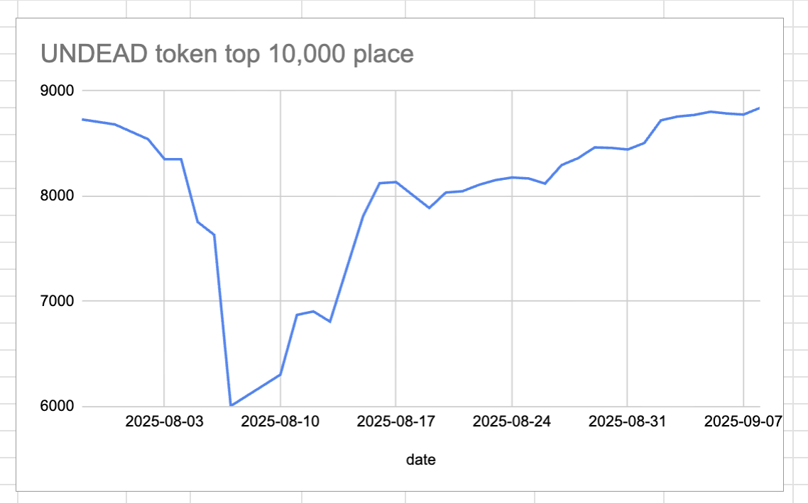
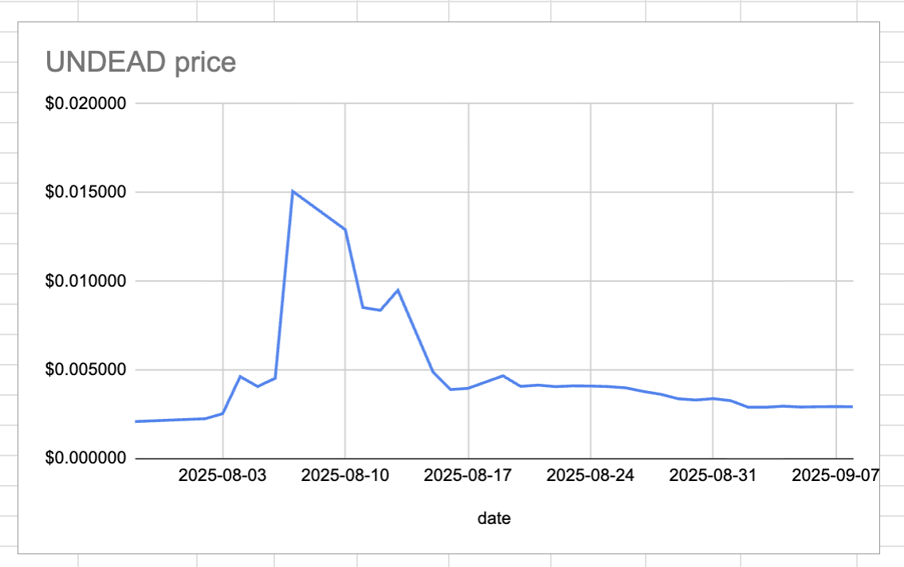
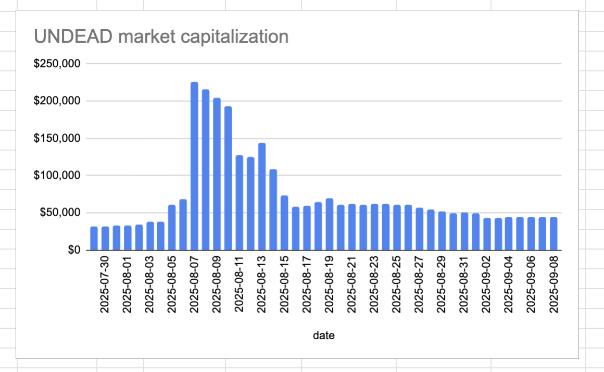
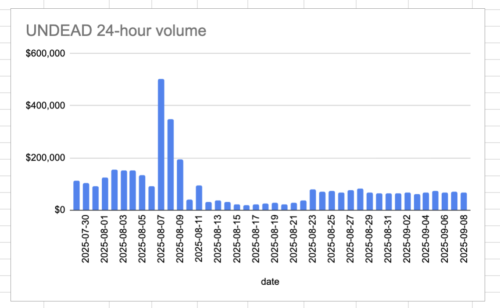

# 2025-09-08 Status of @UndeadBlocks / $UNDEAD 

 
 
 
 

* rank: 8840 
* quote: $0.002929 
* market cap: $44,045 
* 24-hr volume: $66,646 (δ: -$4,061 ) 

[UNDEAD data source](https://www.coingecko.com/en/coins/undead-blocks) 

When we get LPs funded on multiple blockchains, the game released, and the Pivot protocol launched, what will $UNDEAD look like? 

## $UNDEAD performance analysis, 2025-09-08 

* "δ" indicates change since 2025-07-17 
* "α" is annualized since 2025-07-17 

 
 
 
 

* rank: 8840 (δ: -4.25% ) , α: -29.24% 
* quote: $0.002929 (δ: 32.47% ) , α: 223.64% 
* market cap: $44,045 (δ: 32.72% ) , α: 225.33% 
* 24-hr volume: $66,646 (δ: -29.56% ) , α: -203.60% 

[2025-07-17 $UNDEAD report (archived)](https://github.com/pivoteur/biz/tree/main/blog/snapshot) 

