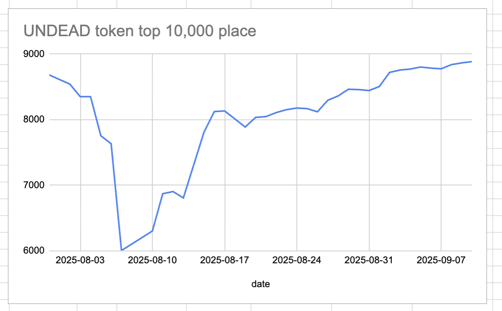
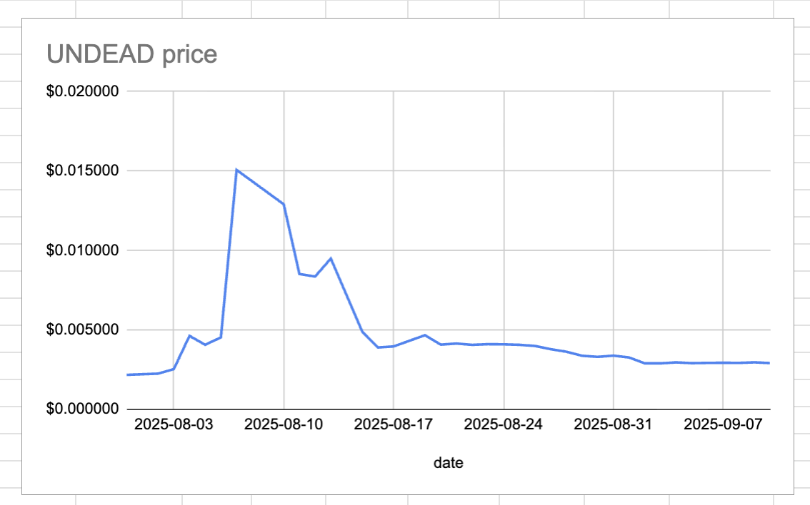
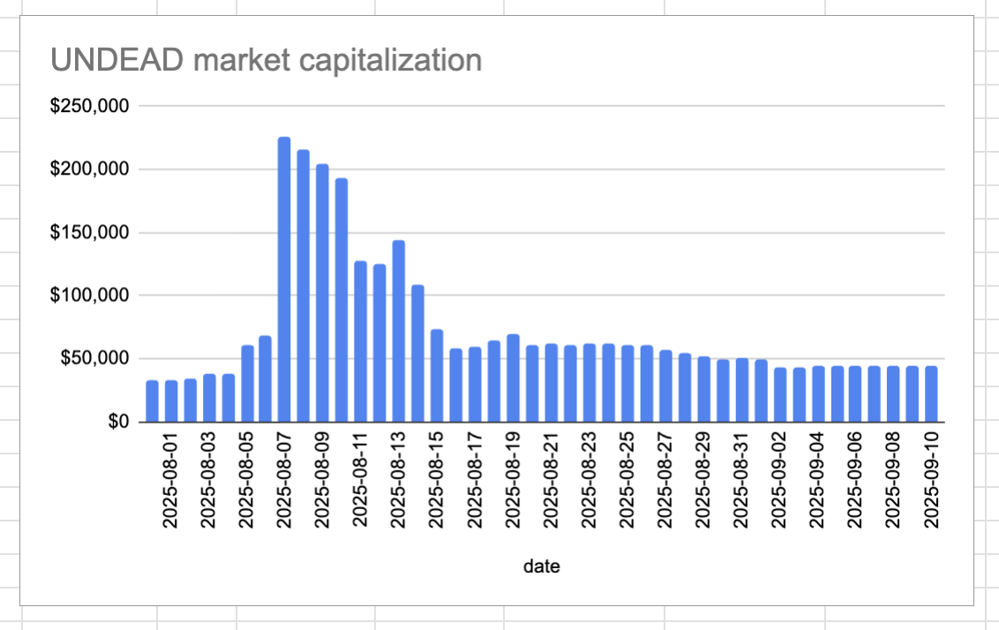
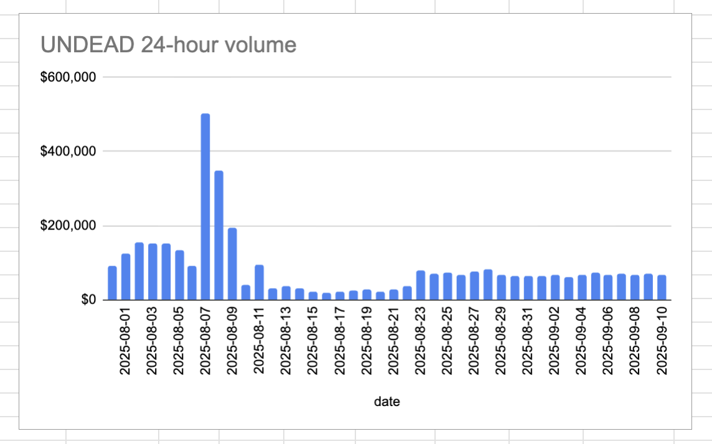
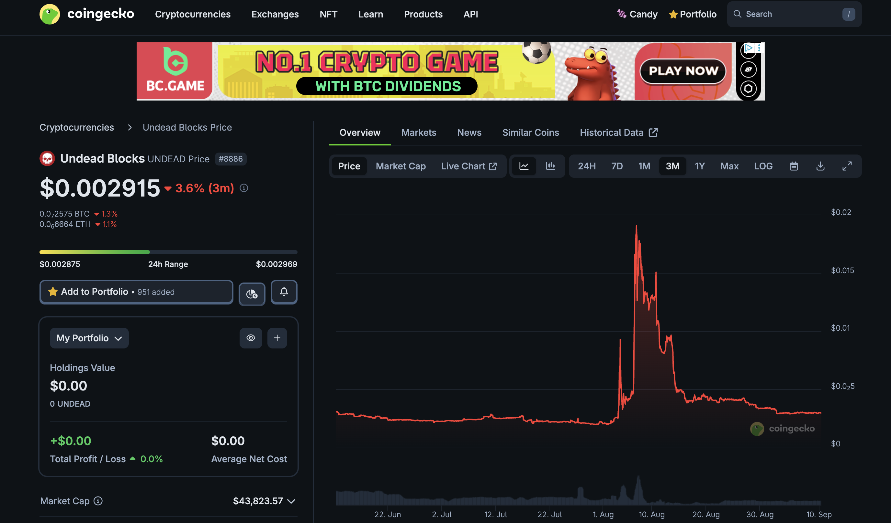
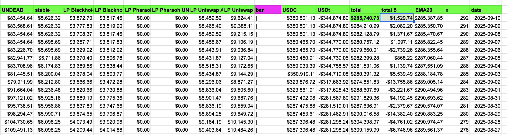
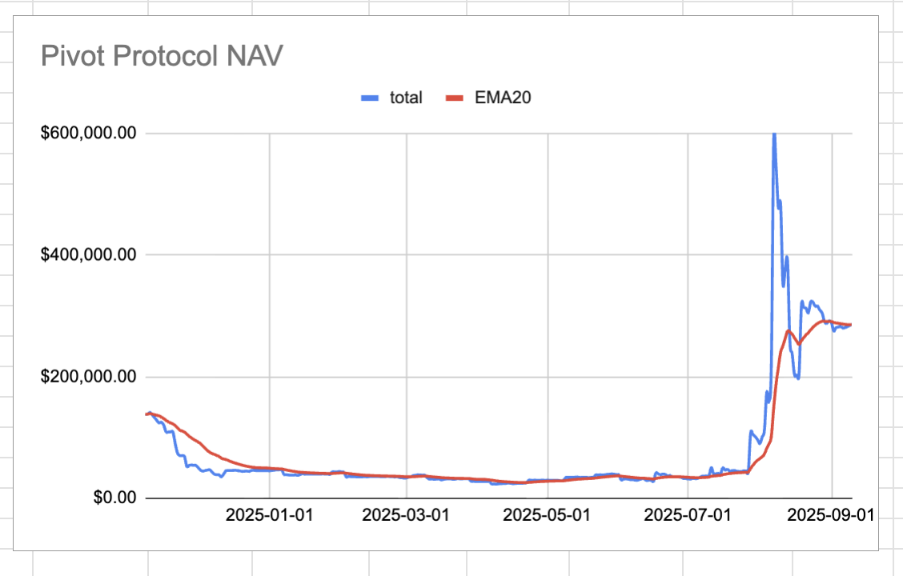

# 2025-09-10 Status of @UndeadBlocks / $UNDEAD 

 
 
 
 

* rank: 8886 
* quote: $0.002915 
* market cap: $43,824 
* 24-hr volume: $66,204 (δ: -$5,103 ) 

[UNDEAD data source](https://www.coingecko.com/en/coins/undead-blocks) 

When we get LPs funded on multiple blockchains, the game released, and the Pivot protocol launched, what will $UNDEAD look like? 

## $UNDEAD performance analysis, 2025-09-10 

* "δ" indicates change since 2025-07-17 
* "α" is annualized since 2025-07-17 

 
 
 
 

* rank: 8886 (δ: -4.79% ) , α: -31.77% 
* quote: $0.002915 (δ: 31.84% ) , α: 211.31% 
* market cap: $43,824 (δ: 32.05% ) , α: 212.70% 
* 24-hr volume: $66,204 (δ: -30.03% ) , α: -199.29% 

[2025-07-17 $UNDEAD report (archived)](https://github.com/pivoteur/biz/tree/main/blog/snapshot) 

# State of the Pivot Protocol, 2025-09-10 

 

Good day, pivoteurs! 

News: Hey, folks. I have been quiet recently, but busy in the background. I have the [1/2-month personal finance I must address today](https://x.com/logicalgraphs/status/1965759041843741100).

I also have also Pivot protocol goals of: 

1. Pivot all pivot-pools 
2. Correct virtual swap representaitons 
3. begin coding/testing individual staker-portfolio page 

 
 

You will note the Protocol NAV today crossed above the EMA-20, meaning that, even self-regulated, the protocol makes gains, showing a good balance of assets pivoted and liquidity in reserve.
