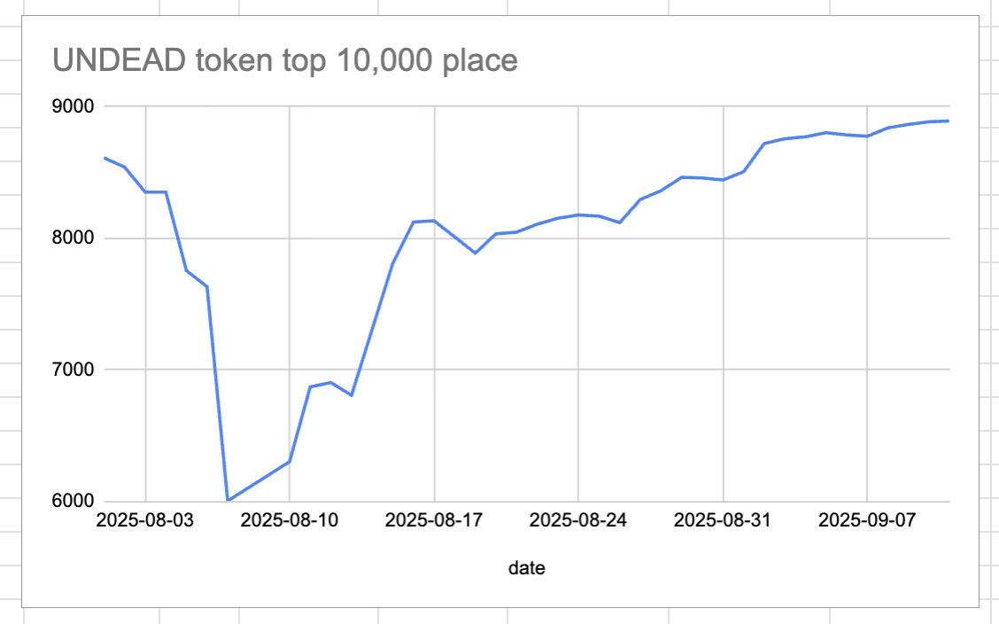
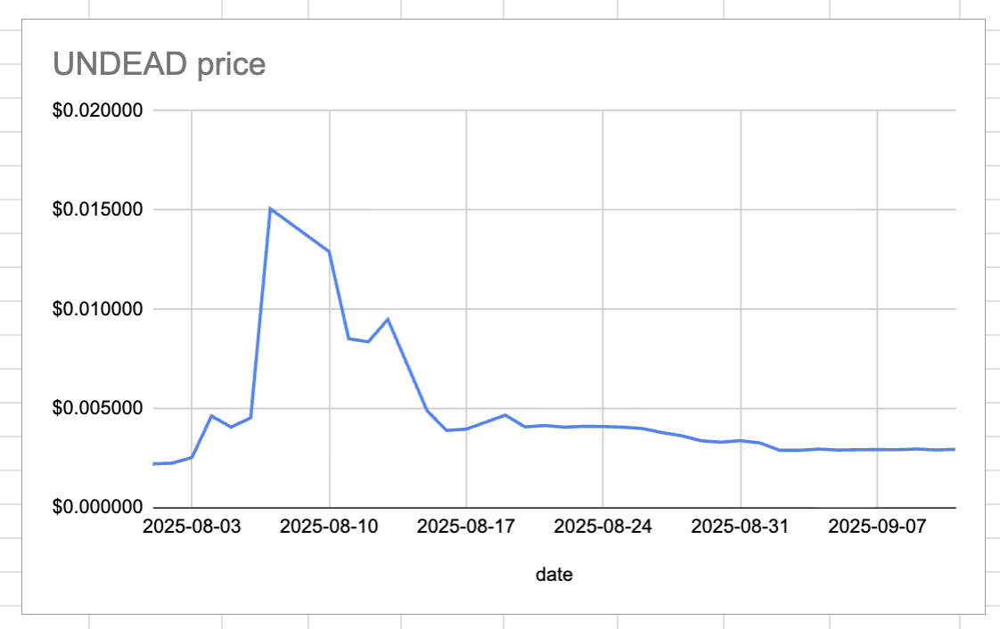
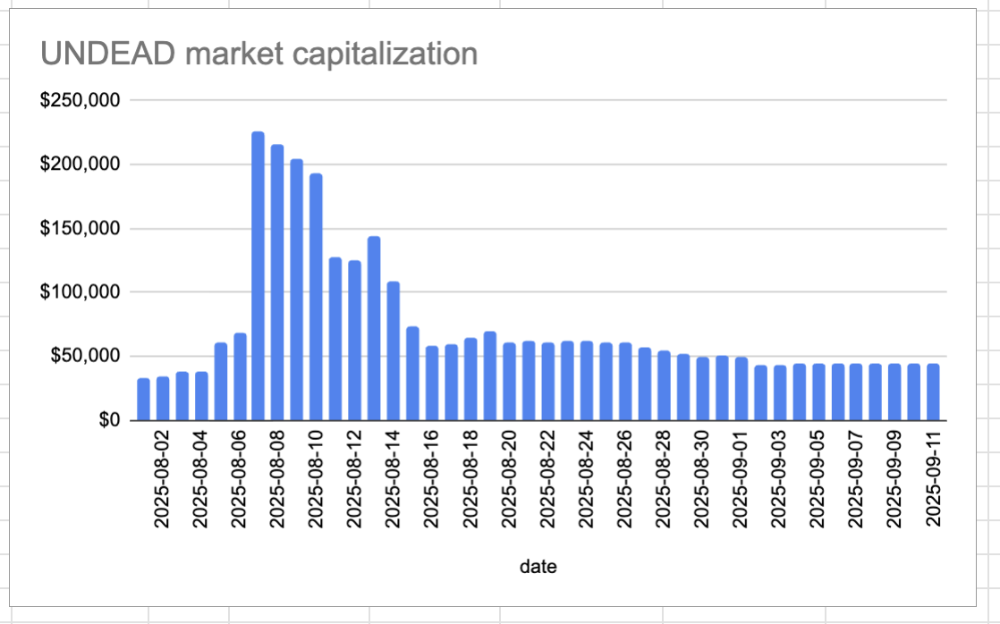
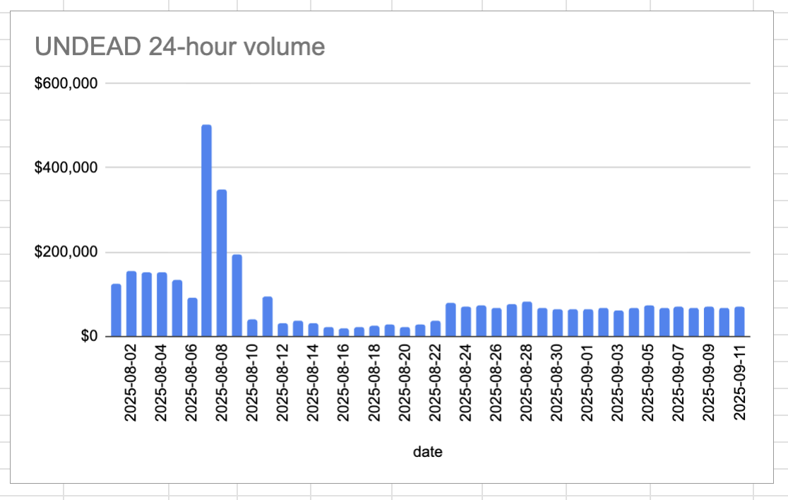

# 2025-09-11 Status of @UndeadBlocks / $UNDEAD 

 
 
 
 

* rank: 8892 
* quote: $0.002948 
* market cap: $44,216 
* 24-hr volume: $71,337 (δ: $5,133 ) 

[UNDEAD data source](https://www.coingecko.com/en/coins/undead-blocks) 

When we get LPs funded on multiple blockchains, the game released, and the Pivot protocol launched, what will $UNDEAD look like? 

## $UNDEAD performance analysis, 2025-09-11 

* "δ" indicates change since 2025-07-17 
* "α" is annualized since 2025-07-17 

 
 
 
 

* rank: 8892 (δ: -4.86% ) , α: -31.67% 
* quote: $0.002948 (δ: 33.33% ) , α: 217.26% 
* market cap: $44,216 (δ: 33.23% ) , α: 216.60% 
* 24-hr volume: $71,337 (δ: -24.61% ) , α: -160.37% 

[2025-07-17 $UNDEAD report (archived)](https://github.com/pivoteur/biz/tree/main/blog/snapshot) 

