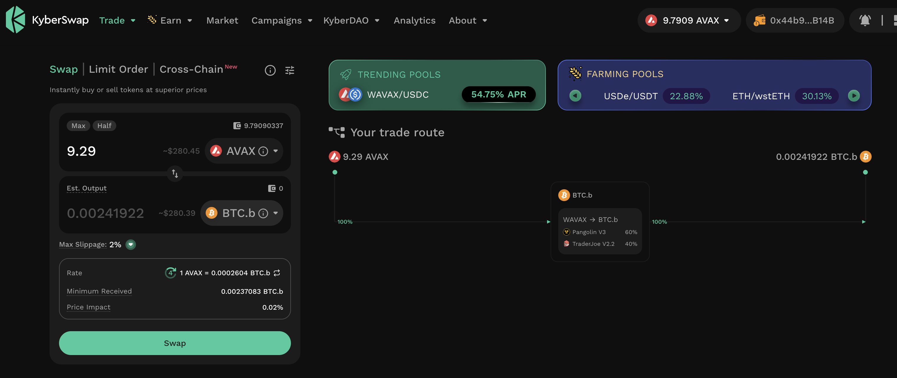
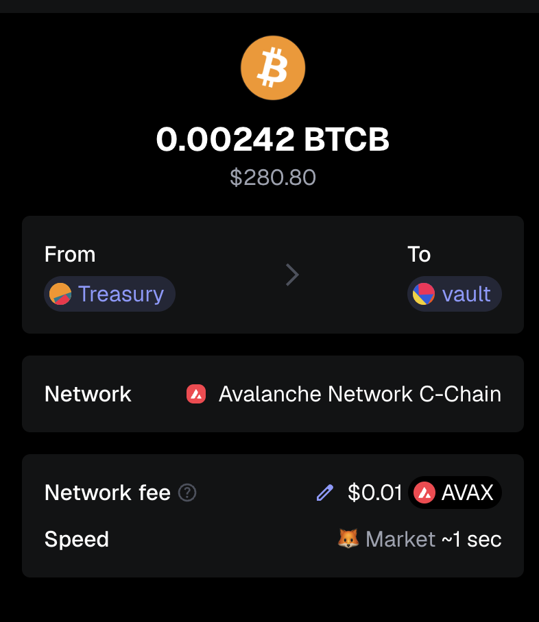
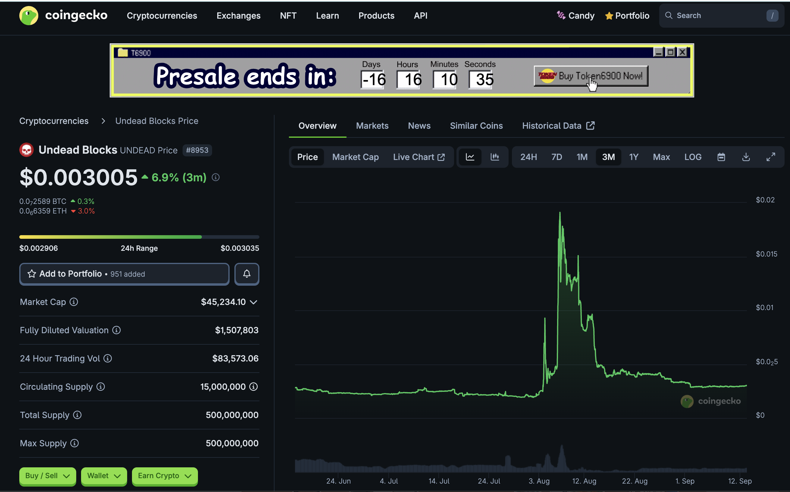
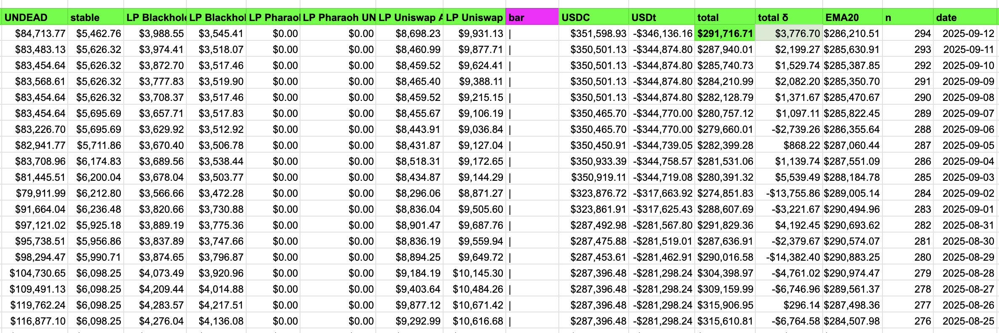
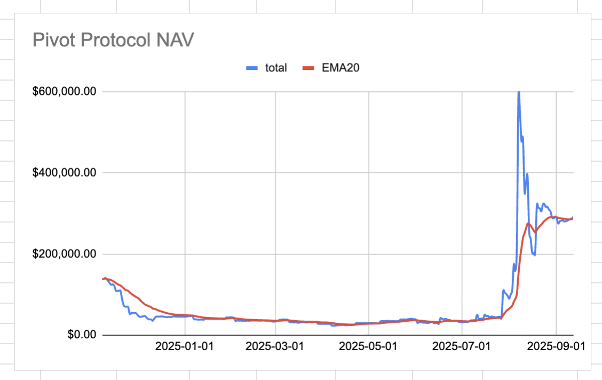
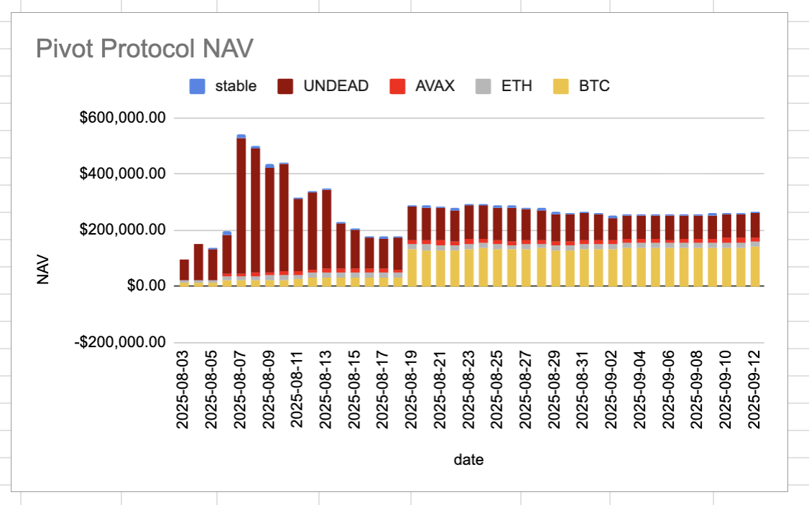
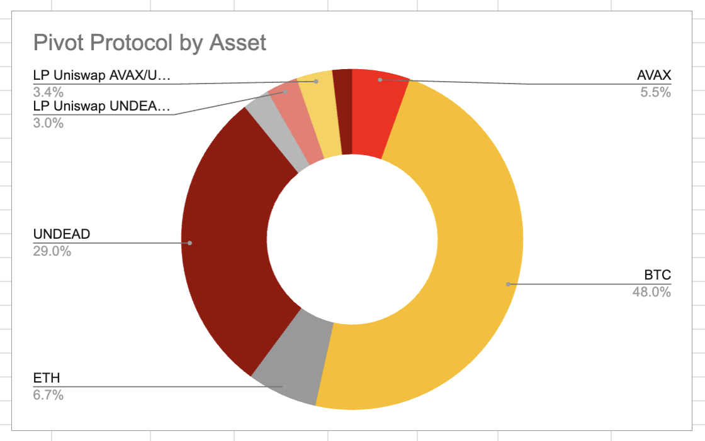
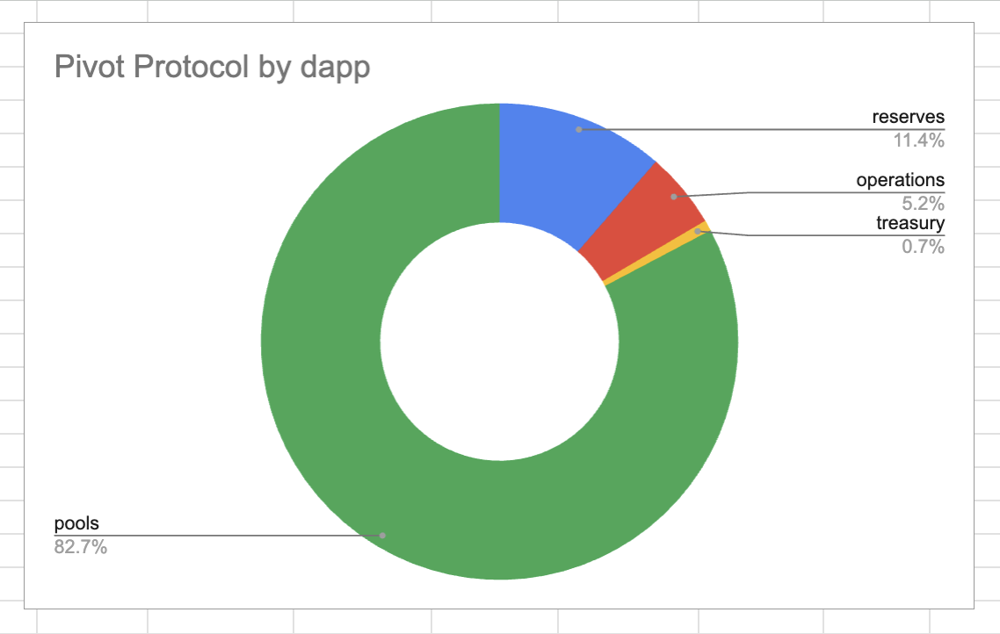

# 2025-09-12 Status of @UndeadBlocks / $UNDEAD 

 
 
 
 

* rank: 8943 
* quote: $0.002961 
* market cap: $44,637 
* 24-hr volume: $66,183 (δ: -$5,154 ) 

[UNDEAD data source](https://www.coingecko.com/en/coins/undead-blocks) 

When we get LPs funded on multiple blockchains, the game released, and the Pivot protocol launched, what will $UNDEAD look like? 

## $UNDEAD performance analysis, 2025-09-12 

* "δ" indicates change since 2025-07-17 
* "α" is annualized since 2025-07-17 

 
 
 
 

* rank: 8943 (δ: -5.46% ) , α: -34.96% 
* quote: $0.002961 (δ: 33.92% ) , α: 217.22% 
* market cap: $44,637 (δ: 34.50% ) , α: 220.94% 
* 24-hr volume: $66,183 (δ: -30.05% ) , α: -192.44% 

[2025-07-17 $UNDEAD report (archived)](https://github.com/pivoteur/biz/tree/main/blog/snapshot) 

# Vote for $UNDEAD LPs on Blackhole 

2025-09-12 

Good day, pivoteurs! 

A new day; a new Epoch on @BlackholeDex. 

Reminder to go [vote](https://blackhole.xyz/vote) for the @UndeadBlocks $UNDEAD liquidity pools on that DEX. 

 
 

[HOWTO vote instructions](https://x.com/pivocateur/status/1945637734682341791) 

#IVotedForUNDEAD 

# DEX UNDEAD/USDC-swap Race 

Same swap; 3 DEX, 2025-09-12 

I swap 167000 $UNDEAD for: 

1. 488.88 $USDC on @BlackholeDex 

 

2. 498.99 $USDC on @KyberNetwork 

 

3. 499.50 $USDC on @LFJ_gg 💥 

 

Winner: @LFJ_gg (17-day streak) 

# Liquidity Pools 

@BlackholeDex $BLACK price: 

 

* I harvest the yields from the LPs on @BlackholeDex and @Uniswap 

 

* swap the yields to $USDC, 

 

* then provide liquidity to the @Uniswap LP UNDEAD/USDC. 

 
## Liquidity Pool Positions 

 
 

The Blackhole and Uniswap $UNDEAD LPs are as shown. 

# Bitcoin vault 

* I swap some accumulated $AVAX to $BTC.b 

 

* I send this $BTC.b to the vault 

 

# State of the Pivot Protocol, 2025-09-12 

 
 
 

Good day, pivoteurs! 

News: Rounding out the day. $UNDEAD gains slightly with the pivot tokens gaining, as well. A good day to be in crypto! 
## Pivot Protocol Snapshot 

 
 
 

### Custody 

* 50M $UNDEAD = $148,800 

### Investments 

* 1 $BTC = $115,222 
* 3500999 $UNDEAD = $10,419 

total: $274,441 

### Pivot Protocol 

* NAV = $291,717 
* reinvestments/distributions = $16,158 

This shows the protocol has generated $33,434 in value. 

