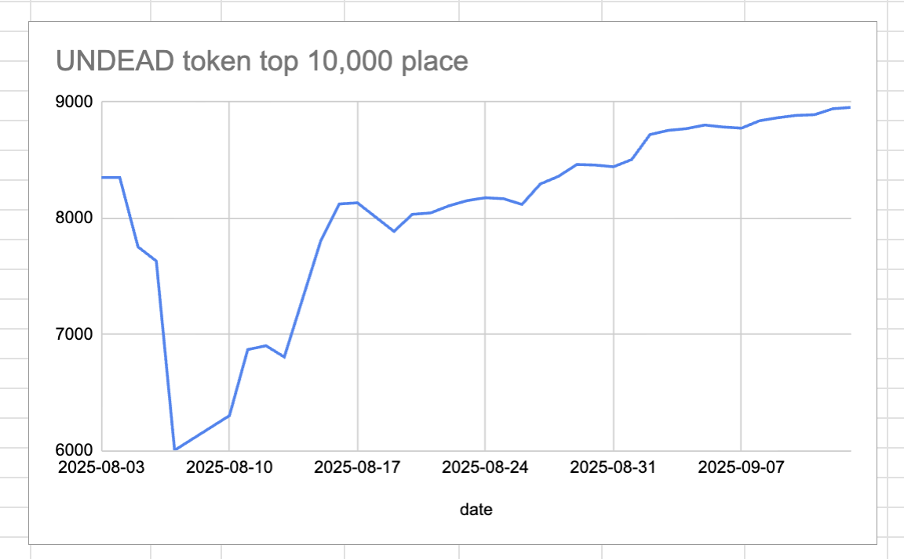
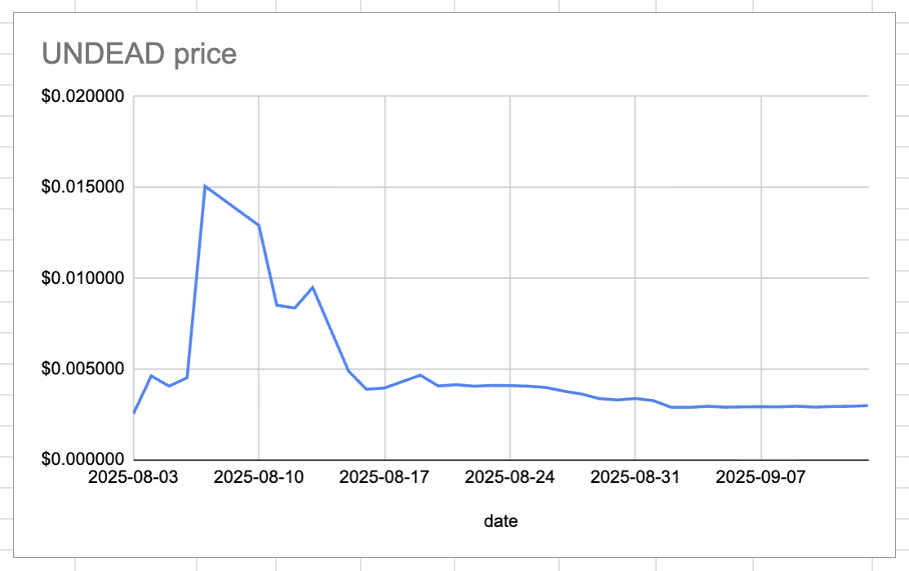
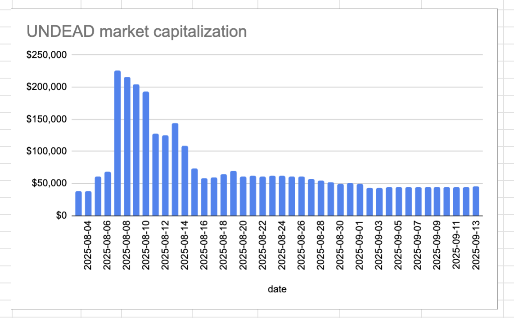
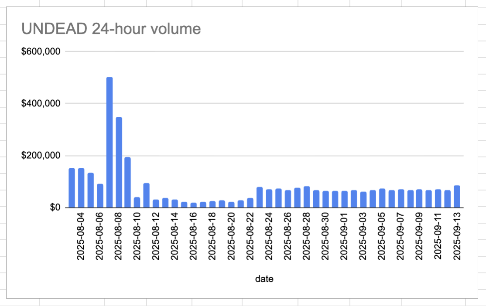

# 2025-09-13 Status of @UndeadBlocks / $UNDEAD 

 
 
 
 

* rank: 8955 
* quote: $0.003001 
* market cap: $45,011 
* 24-hr volume: $84,402 (δ: $18,219 ) 

[UNDEAD data source](https://www.coingecko.com/en/coins/undead-blocks) 

When we get LPs funded on multiple blockchains, the game released, and the Pivot protocol launched, what will $UNDEAD look like? 

## $UNDEAD performance analysis, 2025-09-13 

* "δ" indicates change since 2025-07-17 
* "α" is annualized since 2025-07-17 

 
 
 
 

* rank: 8955 (δ: -5.60% ) , α: -35.25% 
* quote: $0.003001 (δ: 35.73% ) , α: 224.86% 
* market cap: $45,011 (δ: 35.63% ) , α: 224.22% 
* 24-hr volume: $84,402 (δ: -10.80% ) , α: -67.95% 

[2025-07-17 $UNDEAD report (archived)](https://github.com/pivoteur/biz/tree/main/blog/snapshot) 

