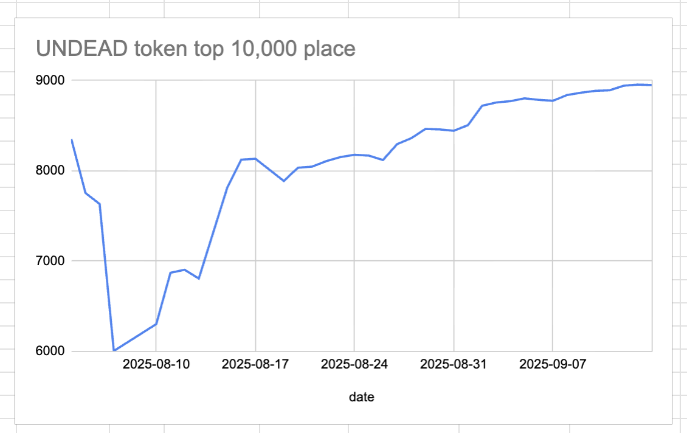
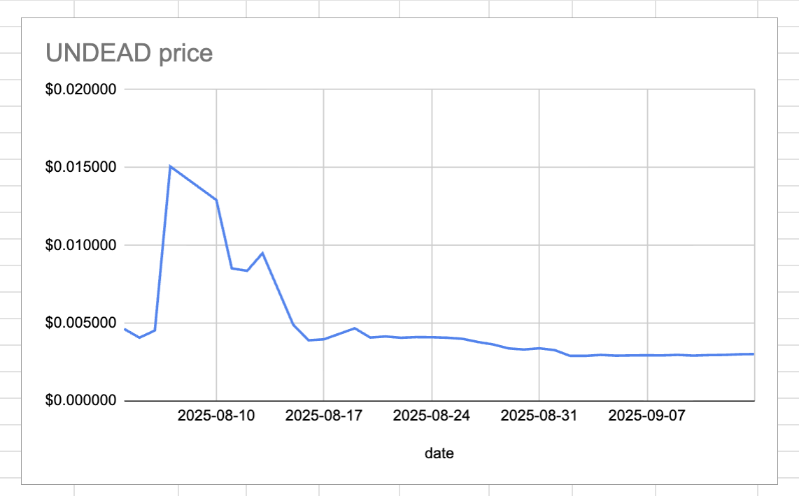
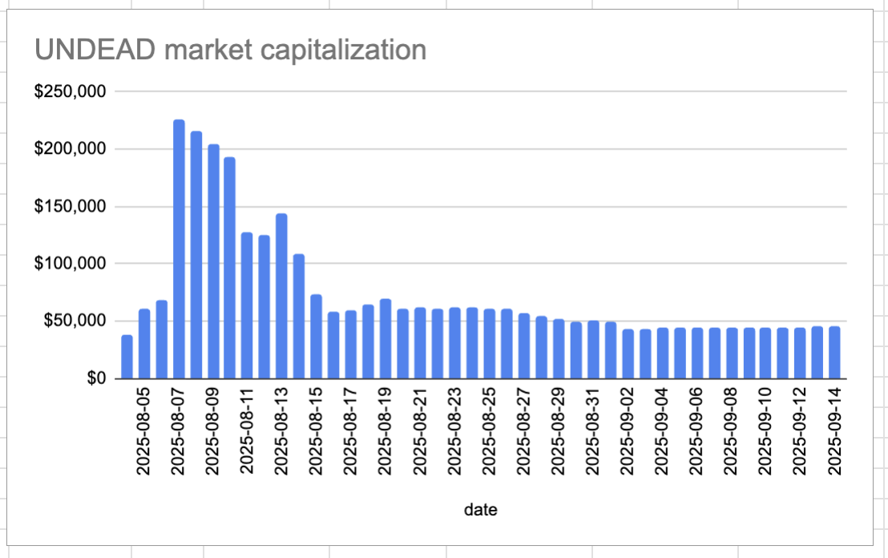
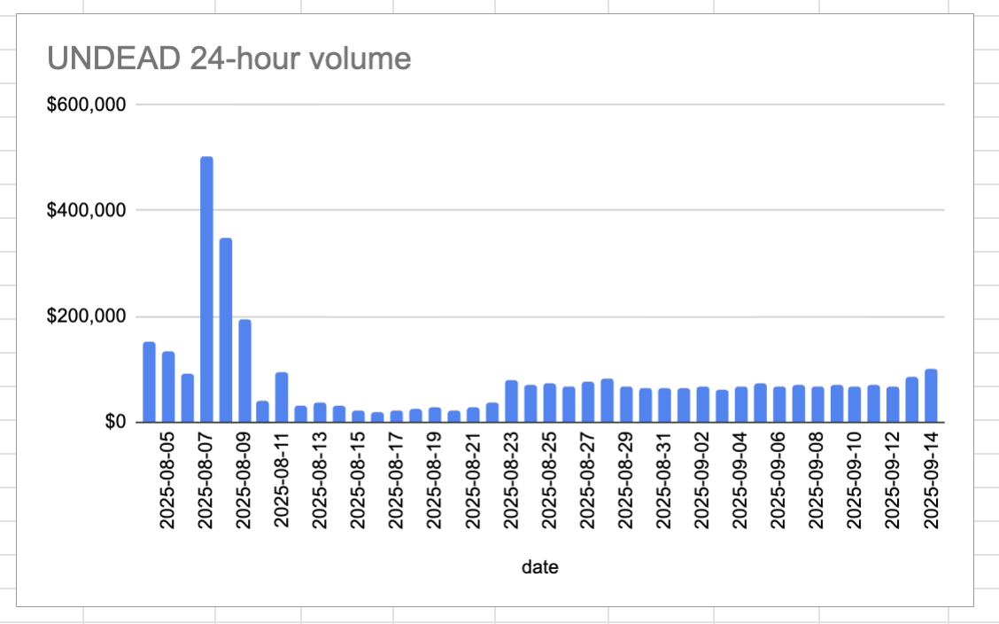

# 2025-09-14 Status of @UndeadBlocks / $UNDEAD 

 
 
 
 

* rank: 8950 
* quote: $0.003017 
* market cap: $45,421 
* 24-hr volume: $100,442 (δ: $16,040 ) 

[UNDEAD data source](https://www.coingecko.com/en/coins/undead-blocks) 

When we get LPs funded on multiple blockchains, the game released, and the Pivot protocol launched, what will $UNDEAD look like? 

You see that $UNDEAD's price is rising, but so is its rank (not going down the ranks, as it should). This shows a lot of competing crypto is entering or rising in the markets. $UNDEAD just has to beat them all now, is all. 😎

