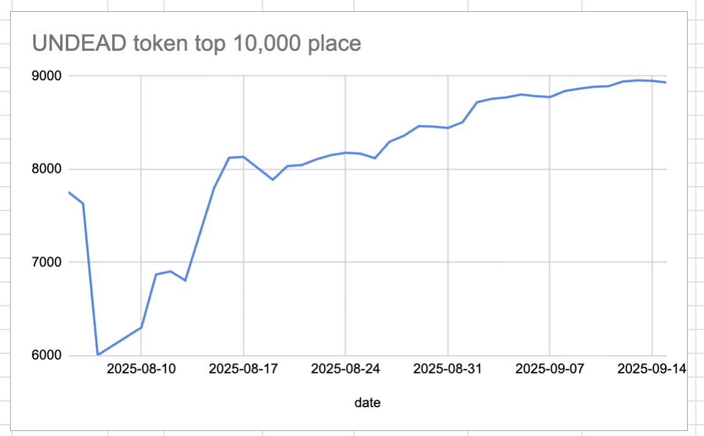
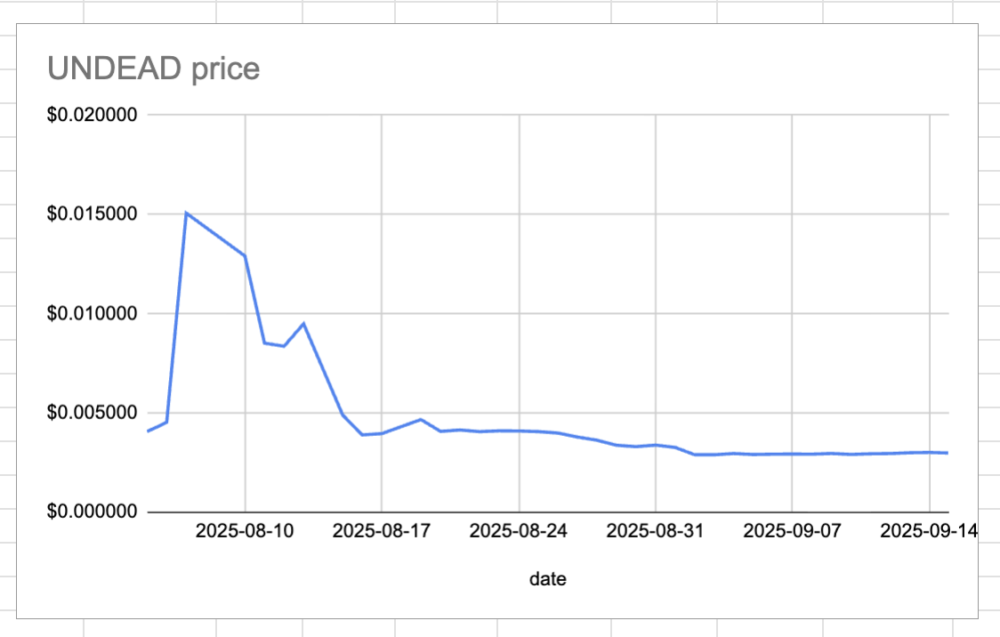
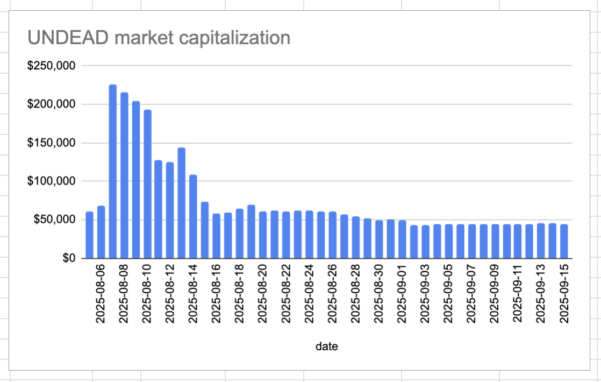
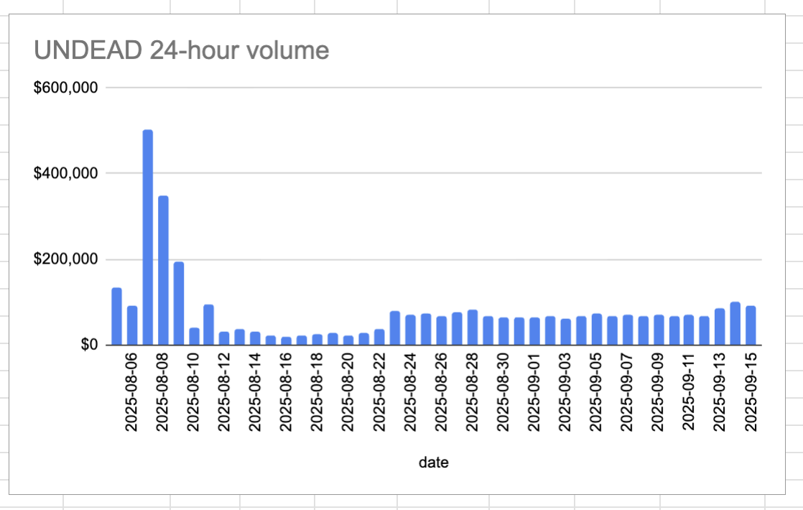

# 2025-09-15 Status of @UndeadBlocks / $UNDEAD 

 
 
 
 

* rank: 8932 
* quote: $0.002987 
* market cap: $44,809 
* 24-hr volume: $91,401 (δ: -$9,041 ) 

[UNDEAD data source](https://www.coingecko.com/en/coins/undead-blocks) 

When we get LPs funded on multiple blockchains, the game released, and the Pivot protocol launched, what will $UNDEAD look like? 

## $UNDEAD performance analysis, 2025-09-15 

* "δ" indicates change since 2025-07-17 
* "α" is annualized since 2025-07-17 

 
 
 
 

* rank: 8932 (δ: -5.33% ) , α: -32.43% 
* quote: $0.002987 (δ: 35.10% ) , α: 213.51% 
* market cap: $44,809 (δ: 35.02% ) , α: 213.05% 
* 24-hr volume: $91,401 (δ: -3.40% ) , α: -20.68% 

[2025-07-17 $UNDEAD report (archived)](https://github.com/pivoteur/biz/tree/main/blog/snapshot) 

