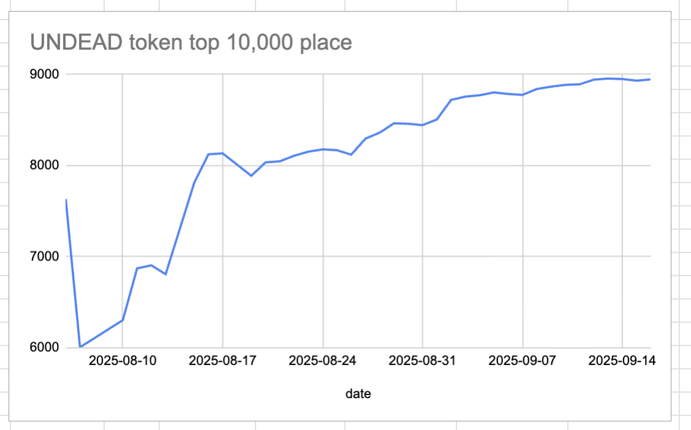
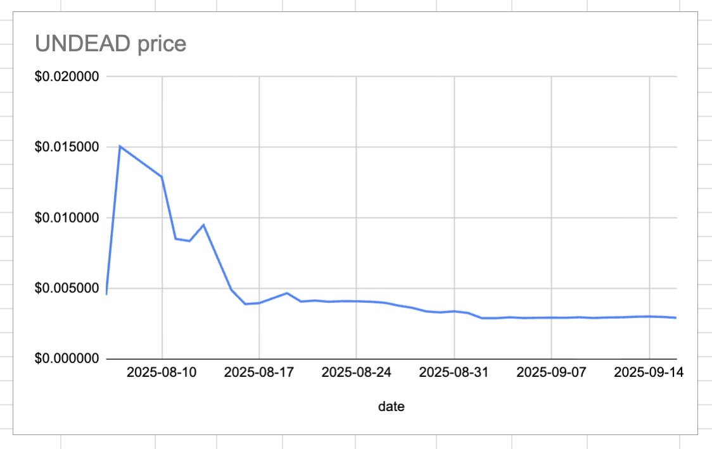
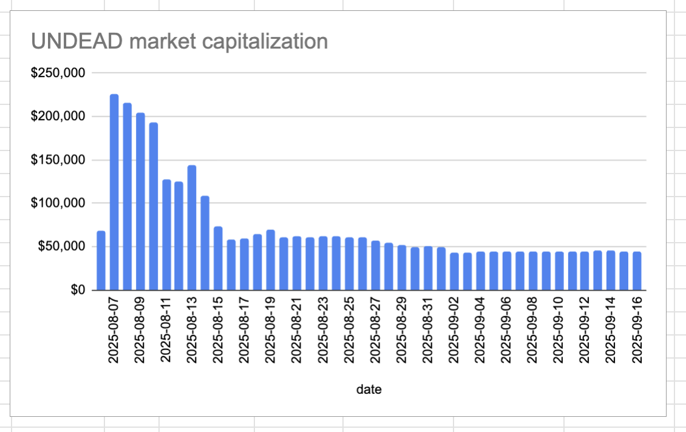
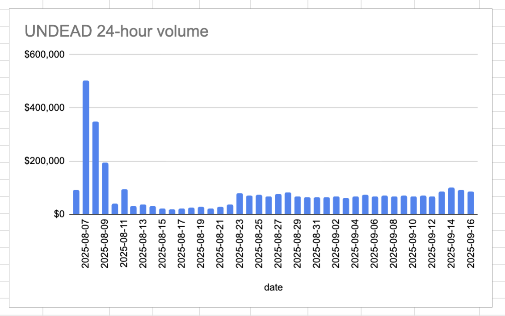

# 2025-09-16 Status of @UndeadBlocks / $UNDEAD 

 
 
 
 

* rank: 8946 
* quote: $0.002926 
* market cap: $43,897 
* 24-hr volume: $86,457 (δ: -$4,944 ) 

[UNDEAD data source](https://www.coingecko.com/en/coins/undead-blocks) 

When we get LPs funded on multiple blockchains, the game released, and the Pivot protocol launched, what will $UNDEAD look like? 

## $UNDEAD performance analysis, 2025-09-16 

* "δ" indicates change since 2025-07-17 
* "α" is annualized since 2025-07-17 

 
 
 
 

* rank: 8946 (δ: -5.50% ) , α: -32.88% 
* quote: $0.002926 (δ: 32.34% ) , α: 193.50% 
* market cap: $43,897 (δ: 32.27% ) , α: 193.11% 
* 24-hr volume: $86,457 (δ: -8.63% ) , α: -51.61% 

[2025-07-17 $UNDEAD report (archived)](https://github.com/pivoteur/biz/tree/main/blog/snapshot) 

