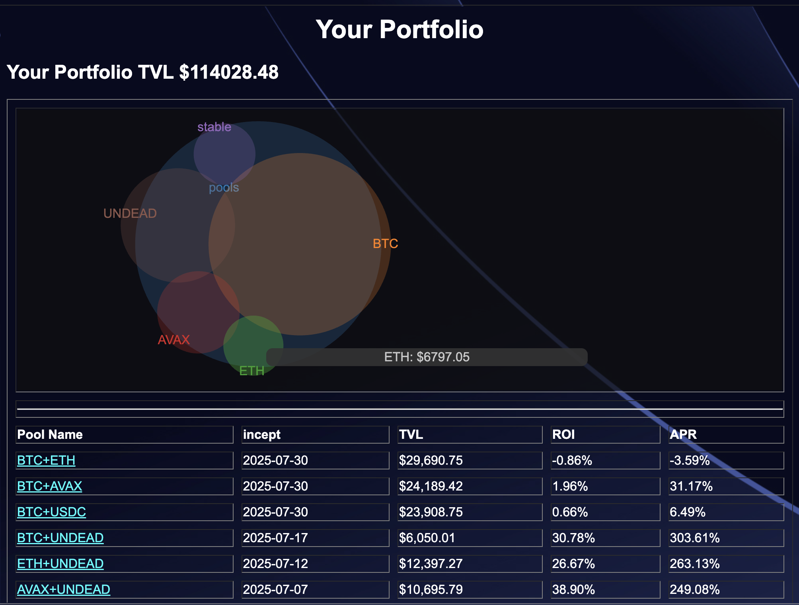

# DECLARATION, 2025-09-18

Okay, I just upgraded the OS on my laptop. I've sketched a plan for backend-automation for closing pivots across the board (now I need simply to code it, eheh 😅)

Brothers and sisters: LET'S GO!

Also, happy 86th birthday, Dad! I love you.
cap

# ANNOUNCEMENT!

New article posted on LinkedIn: "[Dimensionality and Interactivity of Data Visualizations](https://www.linkedin.com/feed/update/urn:li:activity:7374490948791324672/)" discussing how we use charts to give our investors useful information to make decisions regarding their investments into our pivot pools.

!]Stacked Bar chart (2-dimensional)](imgs/01c-stacked.png)

# 💥💥💥NEWSFLASH💥💥💥

The newest revision of the [Pivot Protocol](https://pivoteur.github.io/#), pre-release α, revision 8,  has an $UNDEAD-tab that automates the metrics report and the analysis report.

Not only that, but these reports are now interactive: you can choose the span and basis for these reports.
