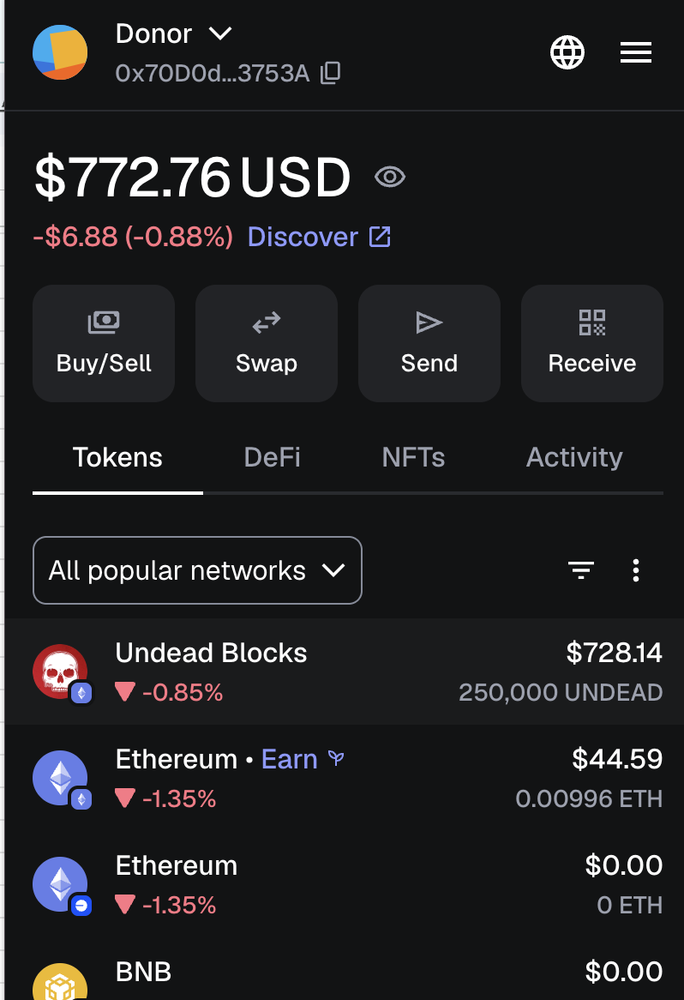
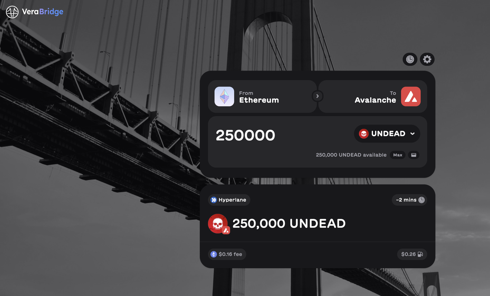
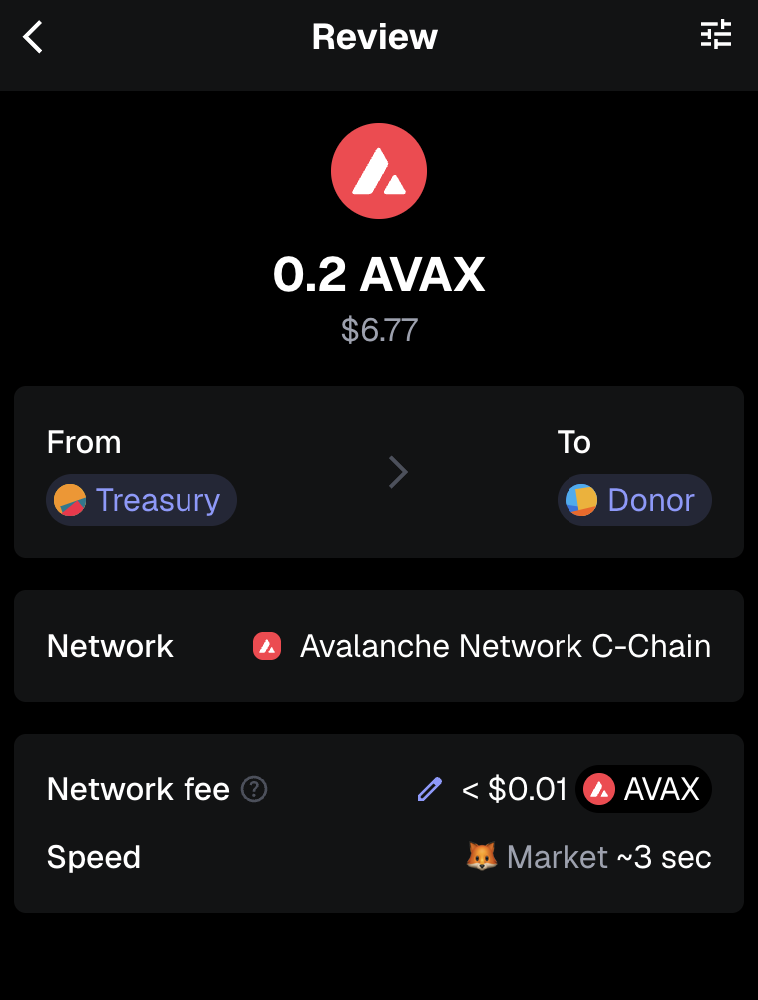
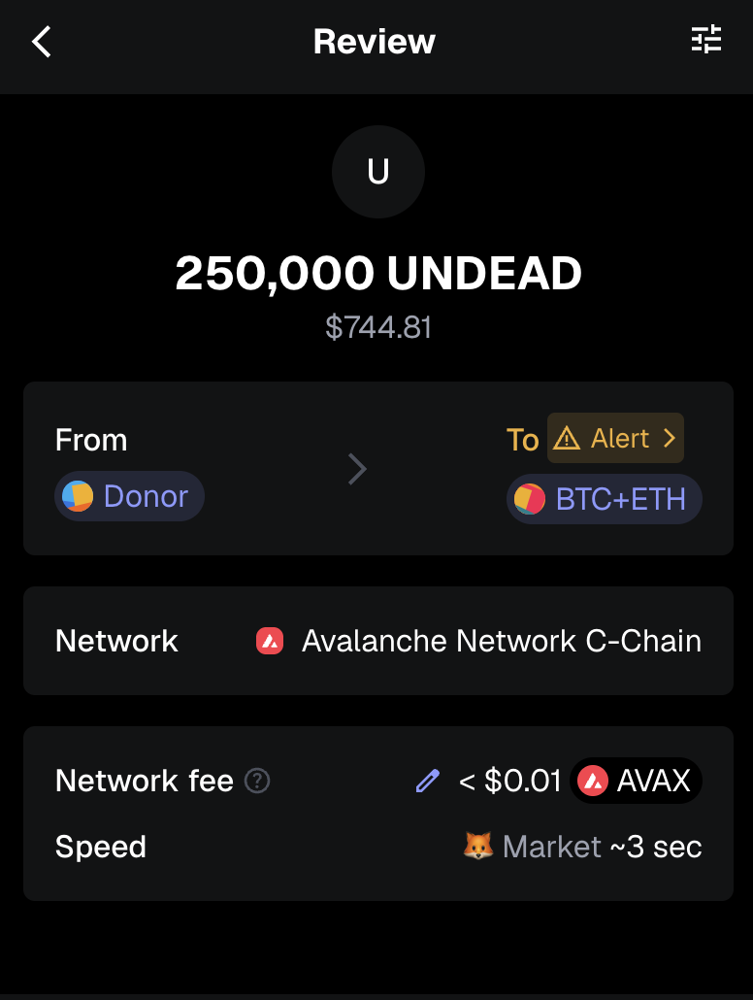

2025-09-19

Hello, all! Investor τ just increased his position, staking $UNDEAD, designated for the BTC+ETH pivot pool.

I bridge the liquidity from @ethereum to @avax using the @veraswapio bridge. 
