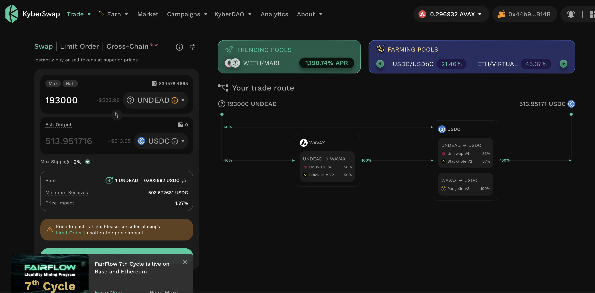

2025-09-20

Two pieces of news for the Pivot Protocol (and for $UNDEAD-HODLrs):

1. Investor τ has increased their stake to 750k $UNDEAD in pivot-pools on the protocol.

2. $UNDEAD's 24-hour volume is back up around 90k $UNDEAD.

[Full article on LinkedIn](https://www.linkedin.com/feed/update/urn:li:activity:7375204029817180160/)

# Vote for $UNDEAD LPs on Blackhole 

2025-09-20 

Good day, pivoteurs! 

A new day; a new Epoch on @BlackholeDex. 

Reminder to go [vote](https://blackhole.xyz/vote) for the @UndeadBlocks $UNDEAD liquidity pools on that DEX. 

 
 

[HOWTO vote instructions](https://x.com/pivocateur/status/1945637734682341791) 

#IVotedForUNDEAD 

# DEX UNDEAD/USDC-swap Race 

Same swap; 3 DEX, 2025-09-20 

I swap 193000 $UNDEAD for: 

1. 499.19 $USDC on @BlackholeDex 

 

2. 513.95 $USDC on @KyberNetwork 

 

3. 513.95 $USDC on @LFJ_gg 💥 

 

Winner: @LFJ_gg (25-day streak) 

# Liquidity Pools 

@BlackholeDex $BLACK price-chart on @coingecko 

 

* I harvest the yields from the LPs on @BlackholeDex and @Uniswap 

 

* swap the yields to $USDC, 

 

* then provide liquidity to the @Uniswap LP UNDEAD/USDC. 

 
## Liquidity Pool Positions 

 
 

The Blackhole and Uniswap $UNDEAD LPs are as shown. 

# Bitcoin vault 

* I swap some accumulated $AVAX to $BTC.b 

 

* I send this $BTC.b to the vault 

 

# State of the Pivot Protocol, 2025-09-20 

 
 

Good day, pivoteurs! 

News: Good progress since the last report: both $UNDEAD metrics and the profile portal are up. I am now working on automating which pivots to close on the backend. 
## Pivot Protocol Snapshot 

 
 
 

### Custody 

* 50M $UNDEAD = $145,550 

### Investments 

* 1 $BTC = $116,074 
* 3750999 $UNDEAD = $10,919 

total: $272,543 

### Pivot Protocol 

* NAV = $295,446 
* reinvestments/distributions = $16,158 

This shows the protocol has generated $39,061 in value. 

