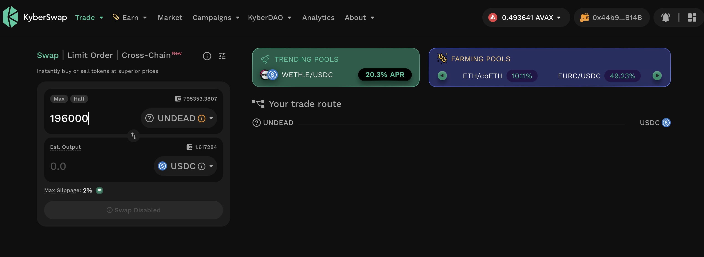
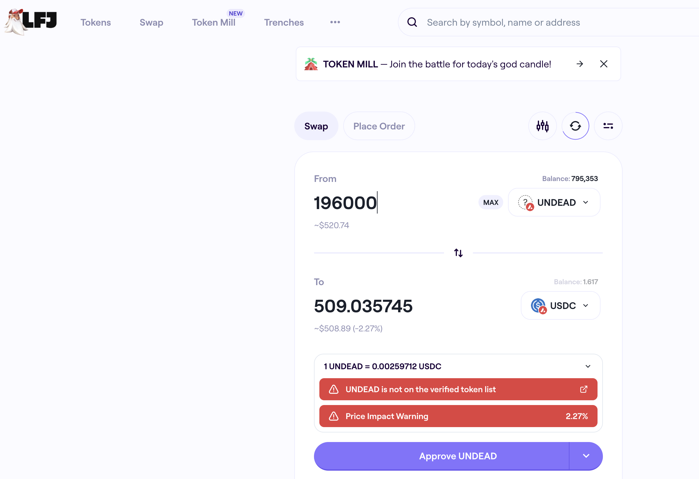

# DEX UNDEAD/USDC-swap Race 

Same swap; 3 DEX, 2025-09-21 

I swap 196000 $UNDEAD for: 

1. 498.85 $USDC on @BlackholeDex 

 

2. no trade $USDC on @KyberNetwork 

 

3. 509.04 $USDC on @LFJ_gg 💥 

 

Winner: @LFJ_gg (26-day streak) 

## Liquidity Pool Positions 

 
 

The Blackhole and Uniswap $UNDEAD LPs are as shown. 

# Bitcoin vault 

* I swap some accumulated $AVAX to $BTC.b 

 

* I send this $BTC.b to the vault 

 

# State of the Pivot Protocol, 2025-09-21 

 
 

Good day, pivoteurs! 

News: "How does losing $3k in a day feel?" It feels like a 1% price-fluctuation. This is where we seize pivot arbitrage opportunities. You do not lose money if you have pre-existing (short) sales from open pivots. 
## Pivot Protocol Snapshot 

 
 
 

### Custody 

* 50M $UNDEAD = $142,250 

### Investments 

* 1 $BTC = $115,755 
* 3750999 $UNDEAD = $10,672 

total: $268,677 

### Pivot Protocol 

* NAV = $292,094 
* reinvestments/distributions = $16,158 

This shows the protocol has generated $39,576 in value. 

