# DEX UNDEAD/USDC-swap Race 

Same swap; 3 DEX, 2025-09-22 

I swap 200000 $UNDEAD for: 

1. 500.23 $USDC on @BlackholeDex 

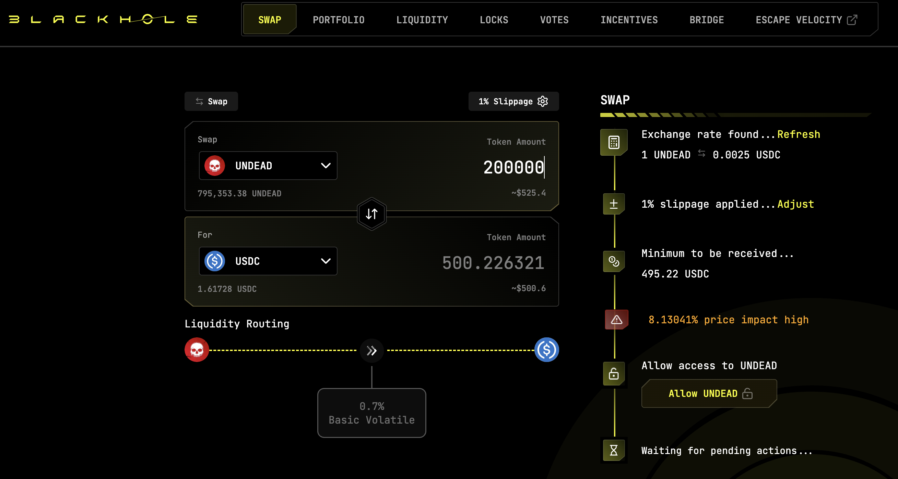 

2. no trade $USDC on @KyberNetwork 

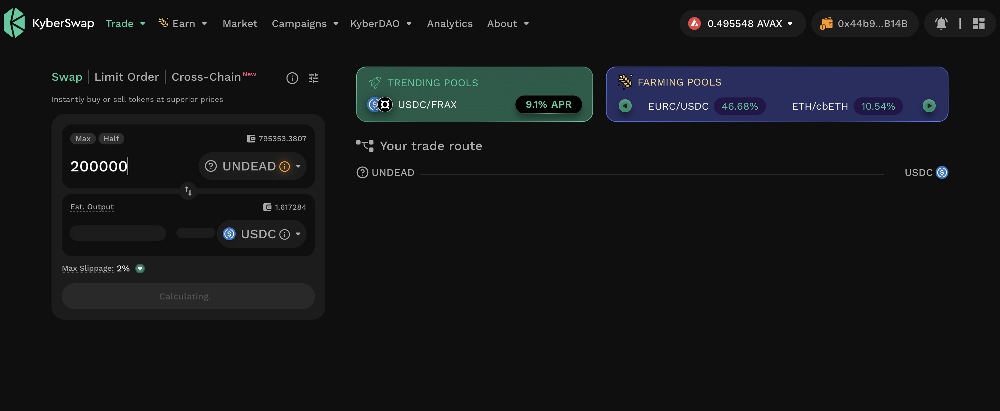 

3. 513.95 $USDC on @LFJ_gg 💥 

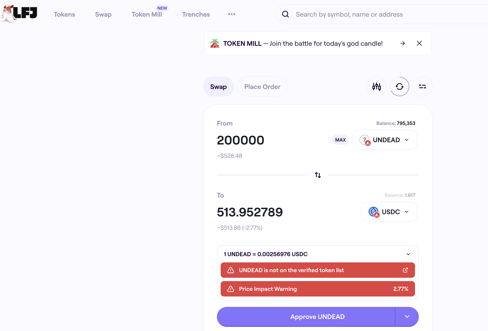 

Winner: @LFJ_gg (27-day streak) 

## Liquidity Pool Positions 

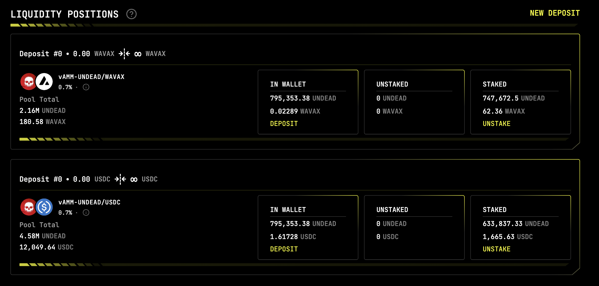 
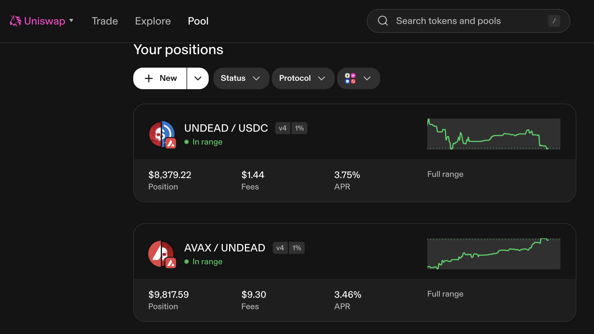 

The Blackhole and Uniswap $UNDEAD LPs are as shown. 

# Bitcoin vault 

* I swap some accumulated $AVAX to $BTC.b 

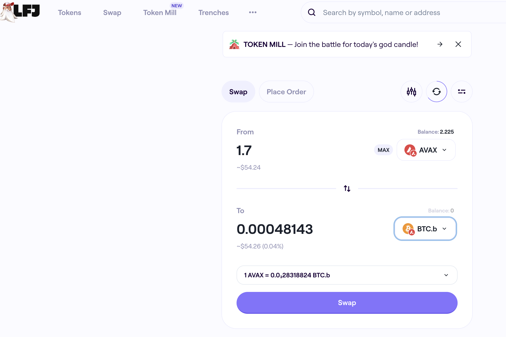 

* I send this $BTC.b to the vault 

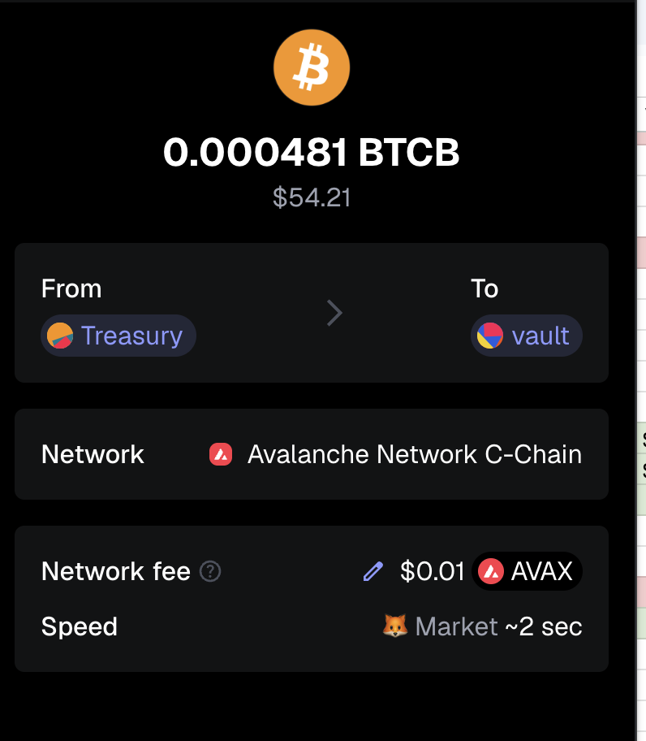 

# PIVOTS

Let's get right to it.

## HBAR+USDC

First off, I'm opening pivot pools on @hedera. 

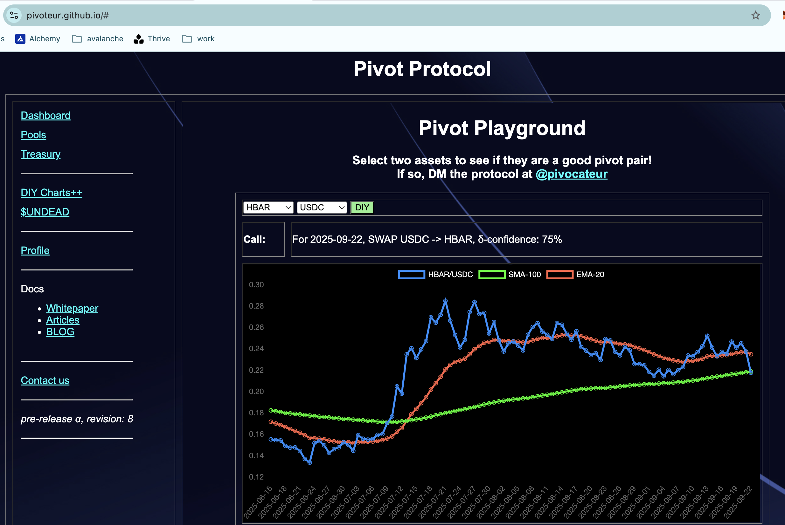 
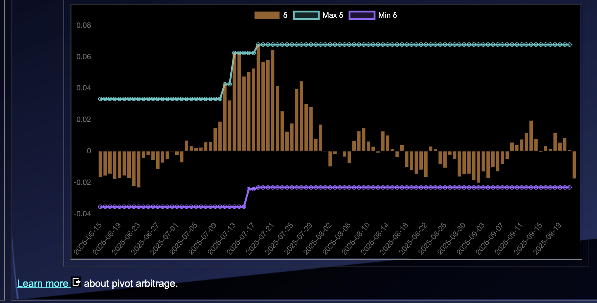 

The HBAR/USDC ratio and δ show a strong

* USDC-on-HBAR pivot

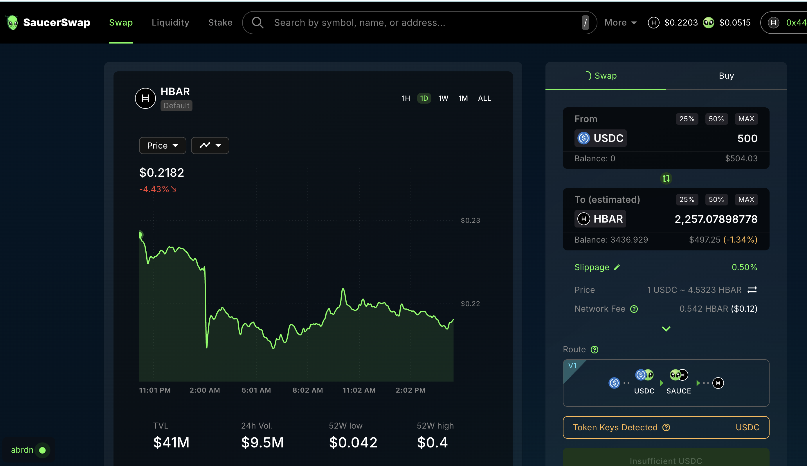 

So I open that, and also open a 

* HBAR-on-USDC hedge

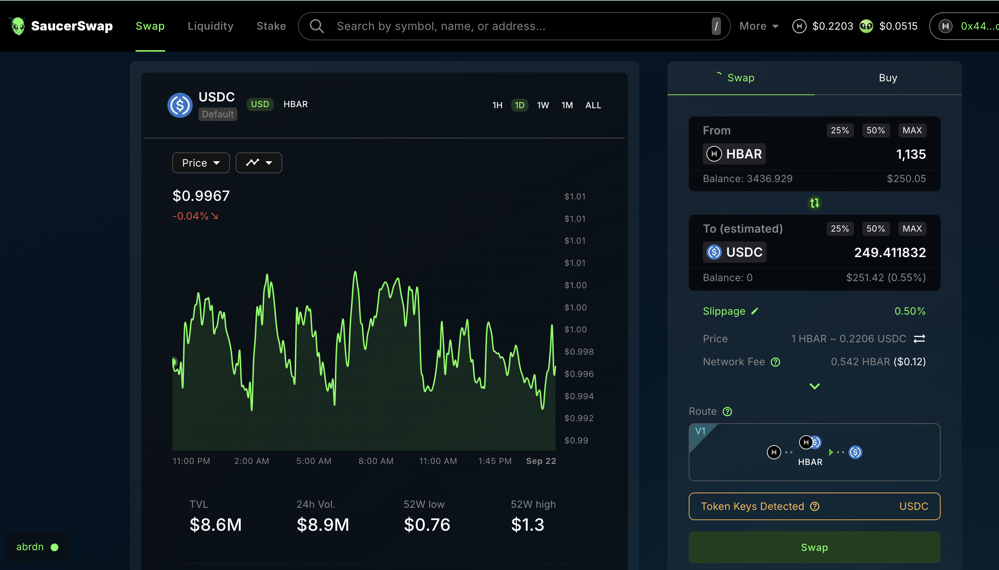 

to create the HBAR+USDC pivot pool

This pivot pool is experimental-only for now.

The HBAR+USDC pivot pool composition and γ-apportionment are as charted. 

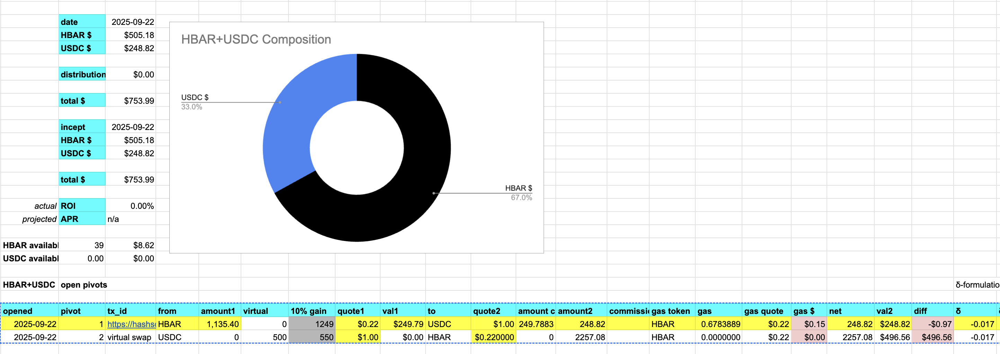 
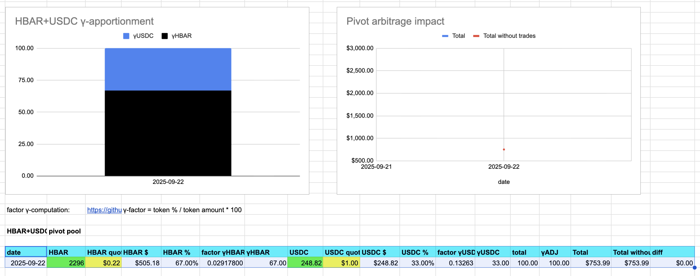 

