# Vote for $UNDEAD LPs on Blackhole 

2025-09-30 

Good day, pivoteurs! 

A new day; a new Epoch on @BlackholeDex. 

Reminder to go [vote](https://blackhole.xyz/vote) for the @UndeadBlocks $UNDEAD liquidity pools on that DEX. 

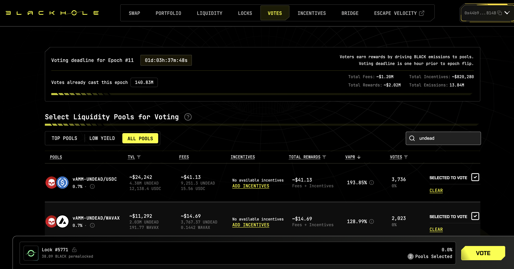 
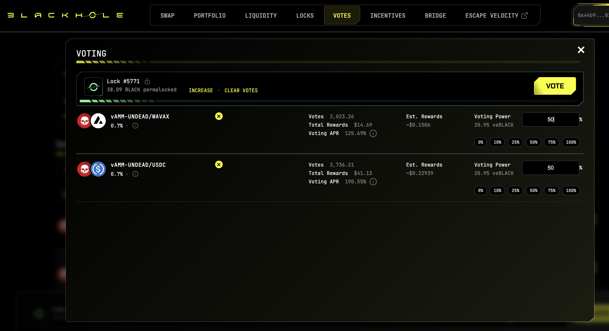 

[HOWTO vote instructions](https://x.com/pivocateur/status/1945637734682341791) 

#IVotedForUNDEAD 

# DEX UNDEAD/USDC-swap Race 

Same swap; 3 DEX, 2025-09-30 

I swap 188000 $UNDEAD for: 

1. 499.34 $USDC on @BlackholeDex 

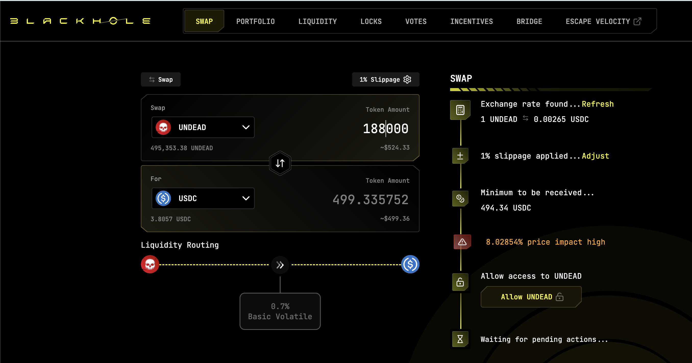 

2. 510.26 $USDC on @KyberNetwork 

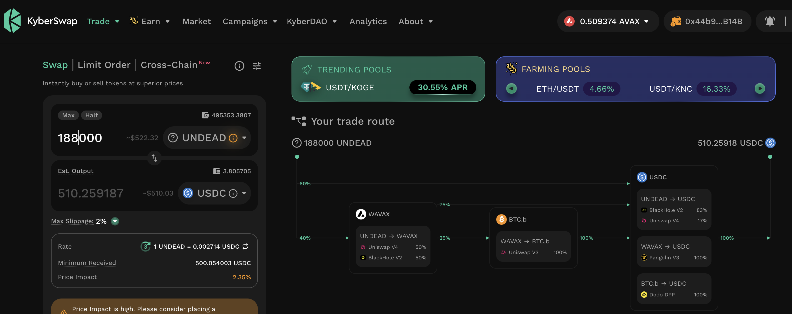 

3. 510.47 $USDC on @LFJ_gg 💥 

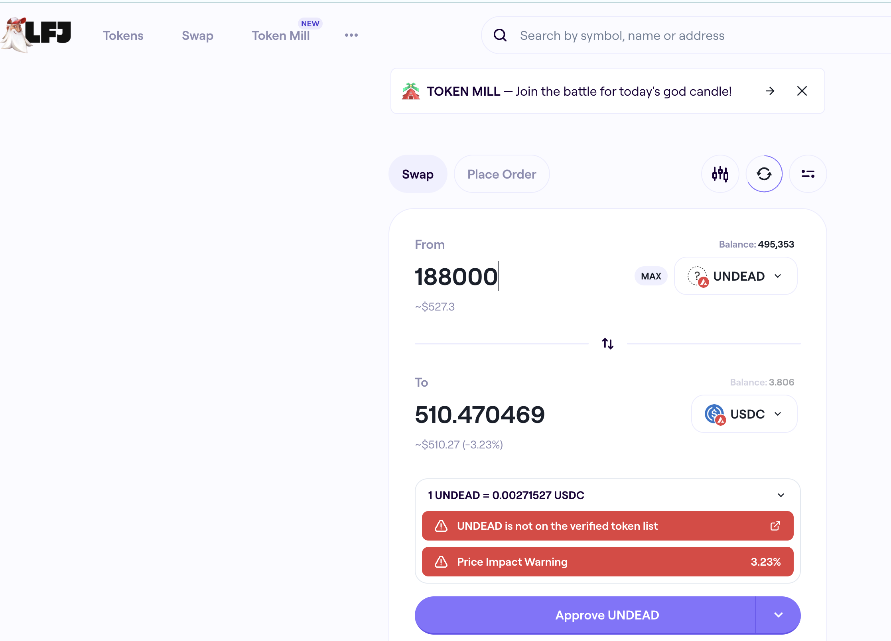 

Winner: @LFJ_gg (35-day streak) 

# Liquidity Pools 

@BlackholeDex $BLACK price-chart on @coingecko 

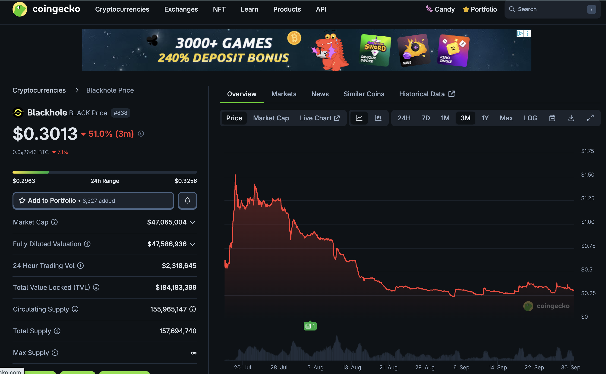 

* I harvest the yields from the LPs on @BlackholeDex and @Uniswap 

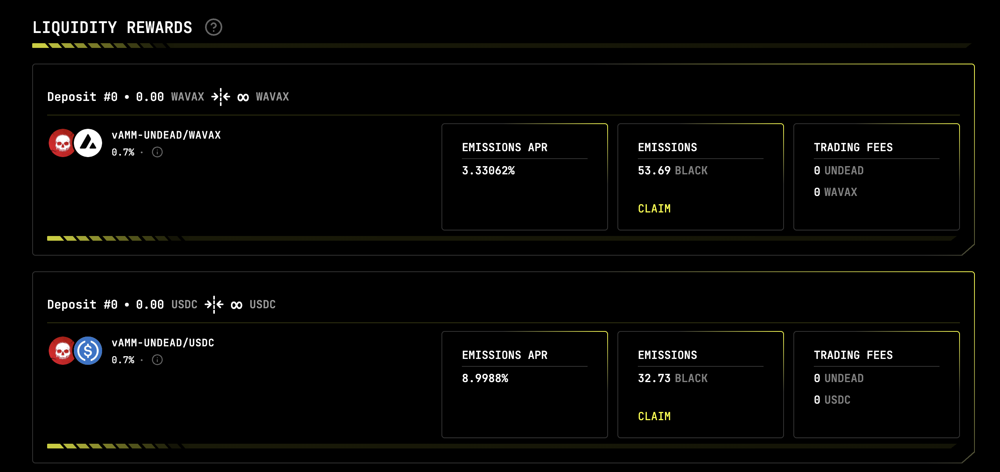 

* swap the yields to $USDC, 

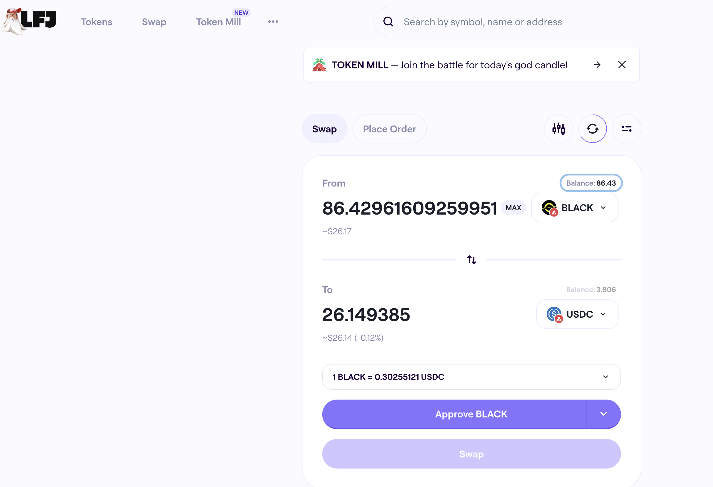 

* then provide liquidity to the @Uniswap LP UNDEAD/USDC. 

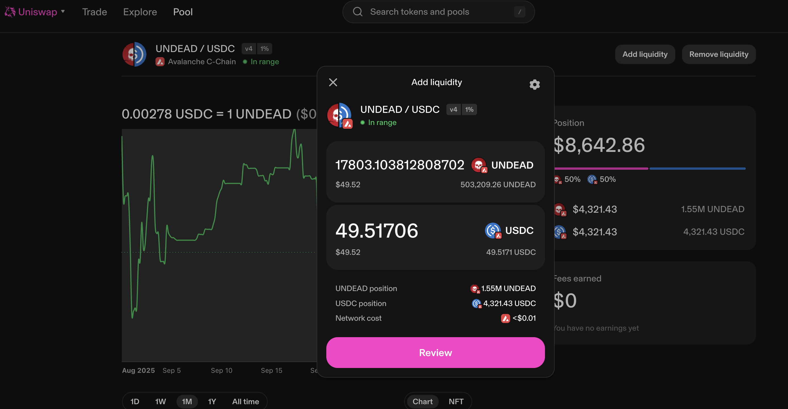 
## Liquidity Pool Positions 

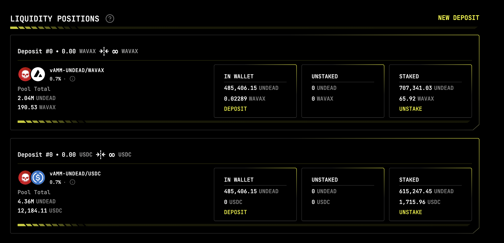 
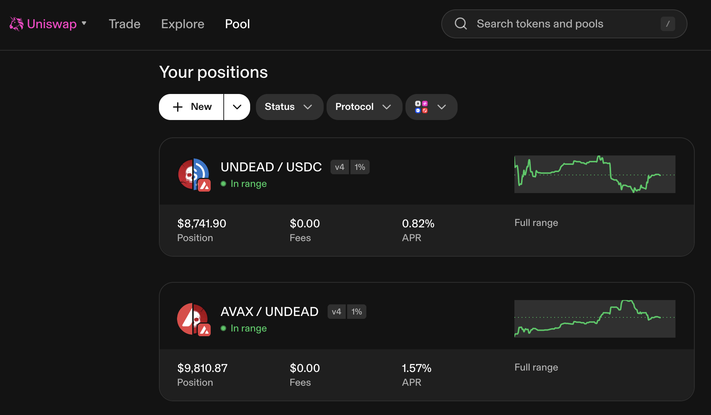 

The Blackhole and Uniswap $UNDEAD LPs are as shown. 

# Bitcoin vault 

* I swap some accumulated $AVAX to $BTC.b 

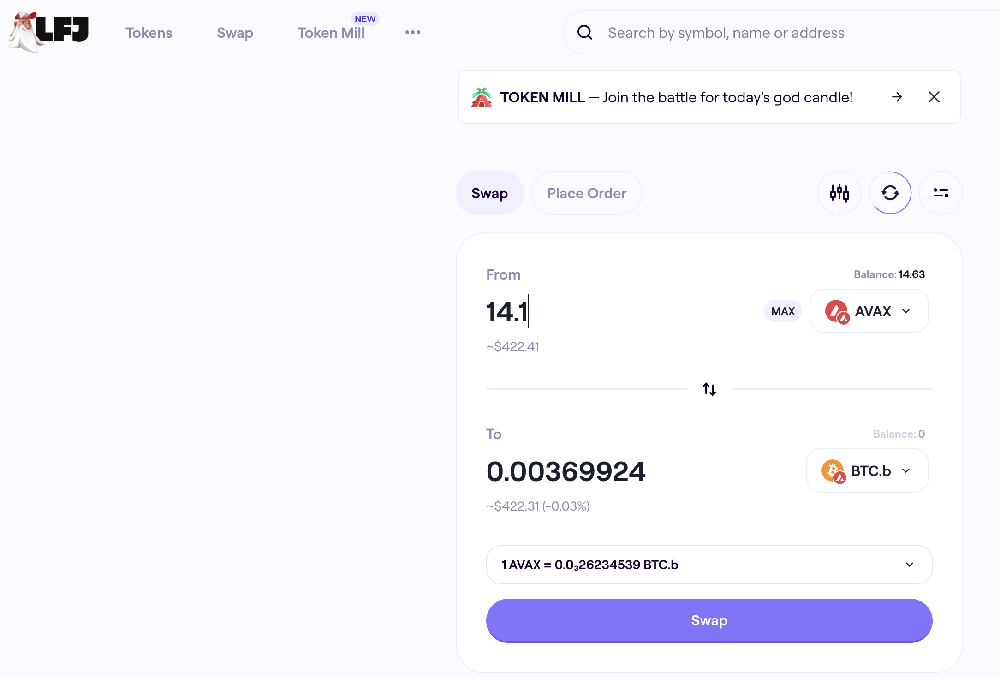 

* I send this $BTC.b to the vault 

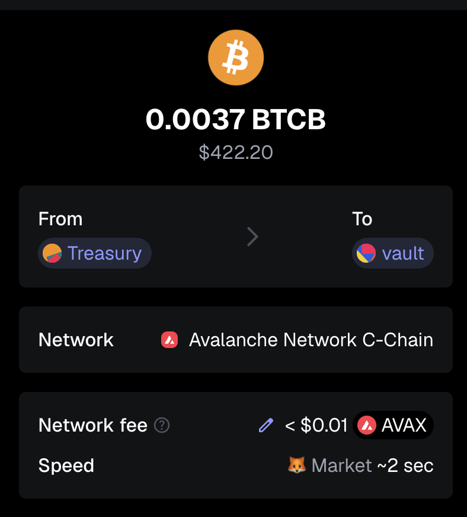 

# PIVOTS 

## BTC+ETH 

 

I close 1 ETH-on-BTC pivot for gains of: 

* actual ROI: 14.70% / 145.04% APR projected 
* or: 0.64 $ETH -> $BTC -> 0.7295 $ETH 
* or: $389.21 gain on a pivot totalling $3,059.53 

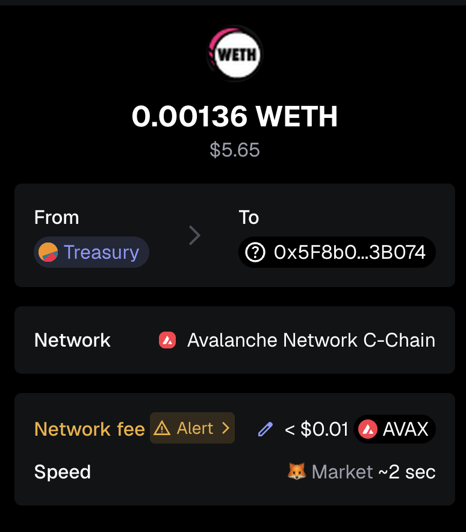 

I reinvest the gains or distribute 80% to stakers. 

