# DEX UNDEAD/USDC-swap Race 

Same swap; 3 DEX, 2025-10-02 

I swap 191000 $UNDEAD for: 

1. 500.76 $USDC on @BlackholeDex 

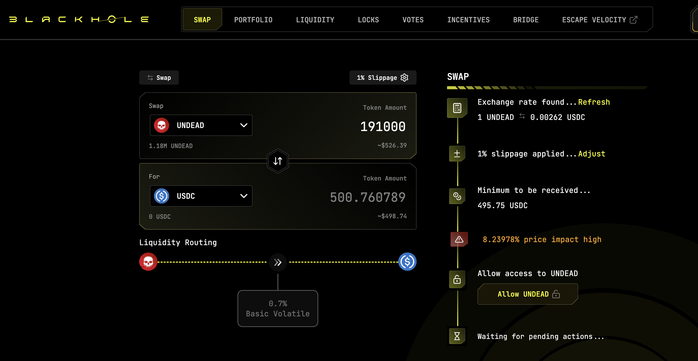 

2. 509.55 $USDC on @KyberNetwork 

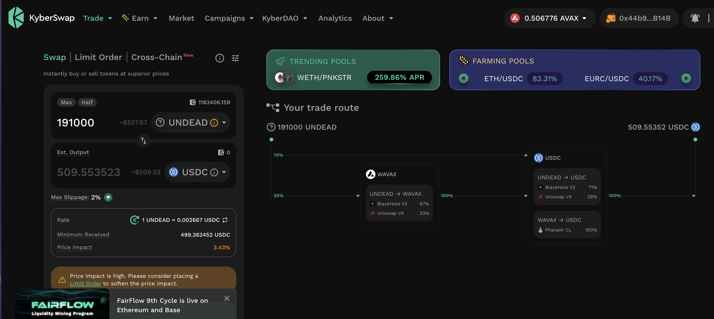 

3. 510.14 $USDC on @LFJ_gg 💥 

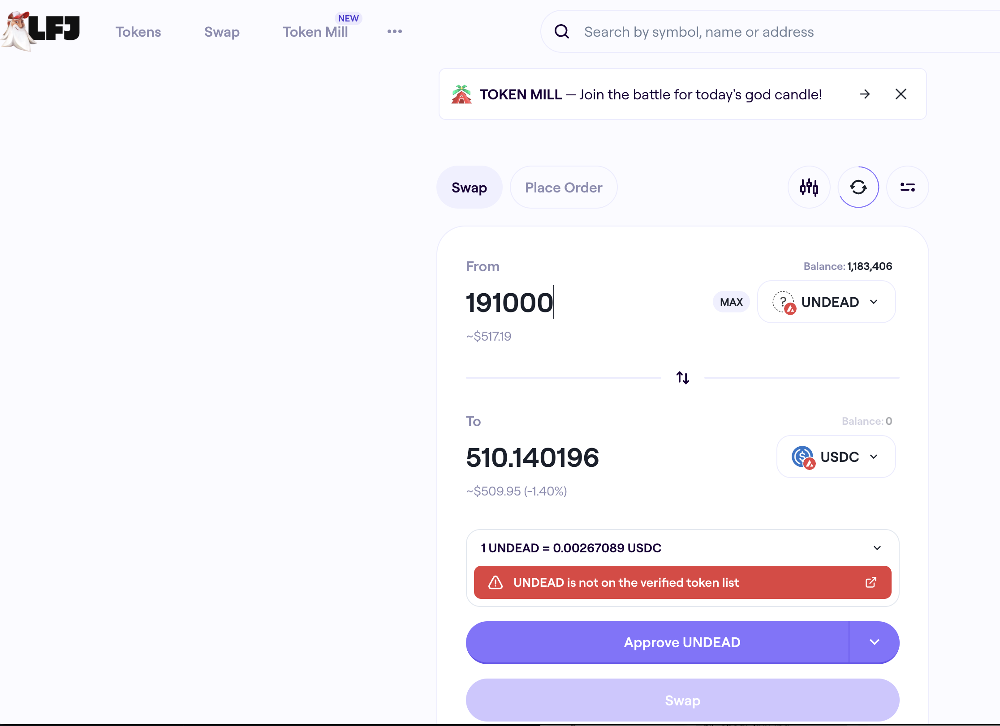 

Winner: @LFJ_gg (37-day streak) 

# Liquidity Pools 

## Liquidity Pool Positions 

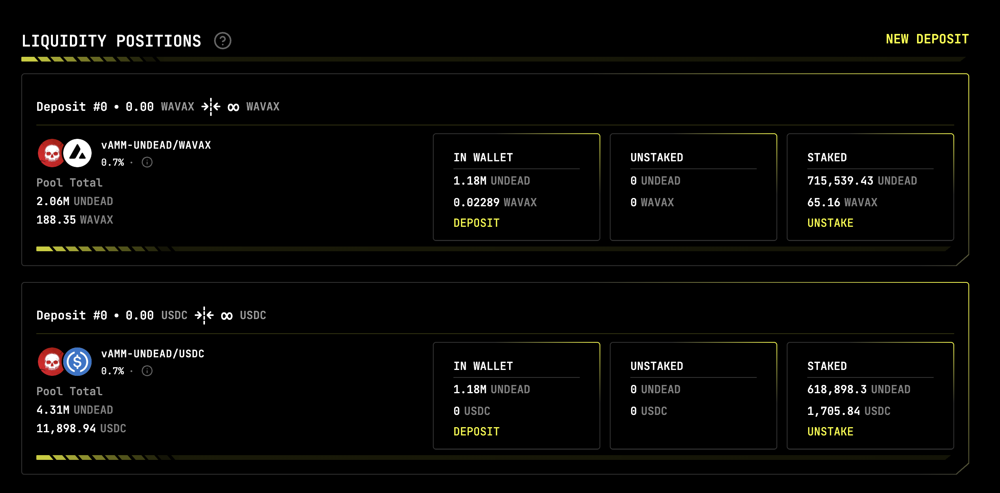 
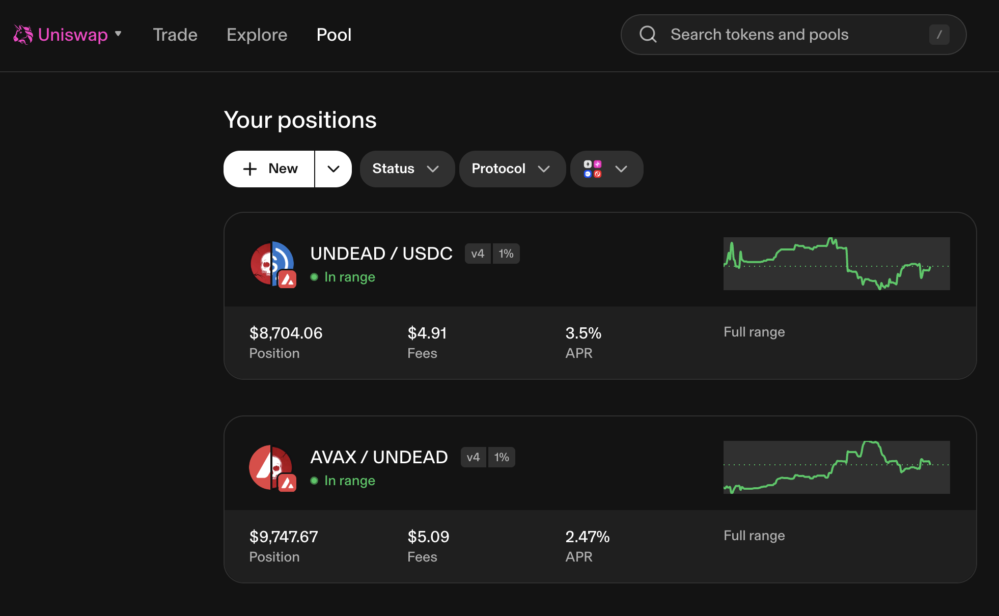 

The Blackhole and Uniswap $UNDEAD LPs are as shown. 

# Bitcoin vault 

* I swap some accumulated $AVAX to $BTC.b 

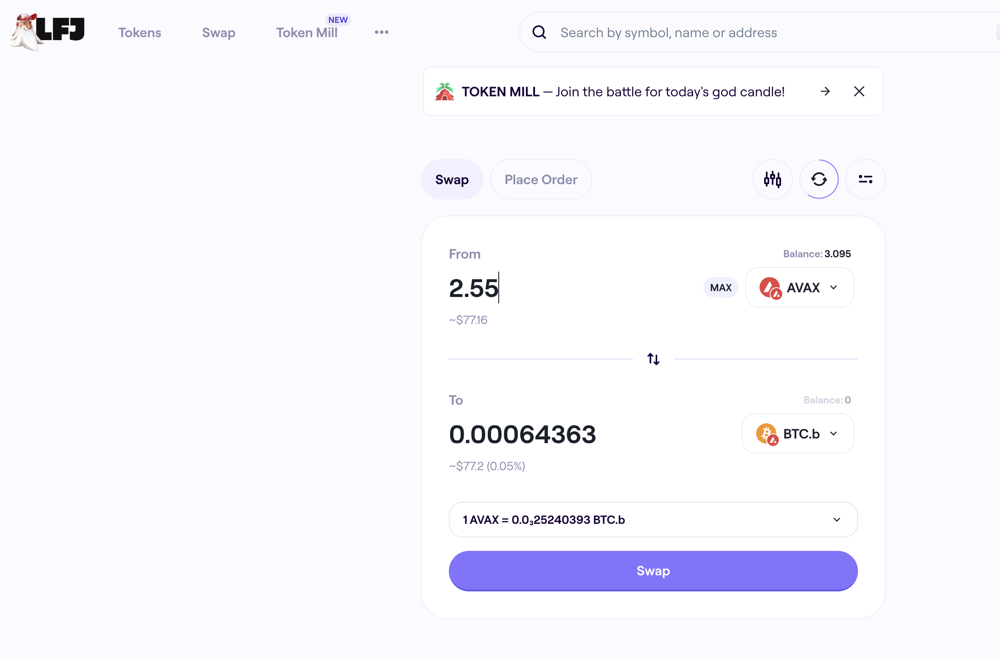 

* I send this $BTC.b to the vault 

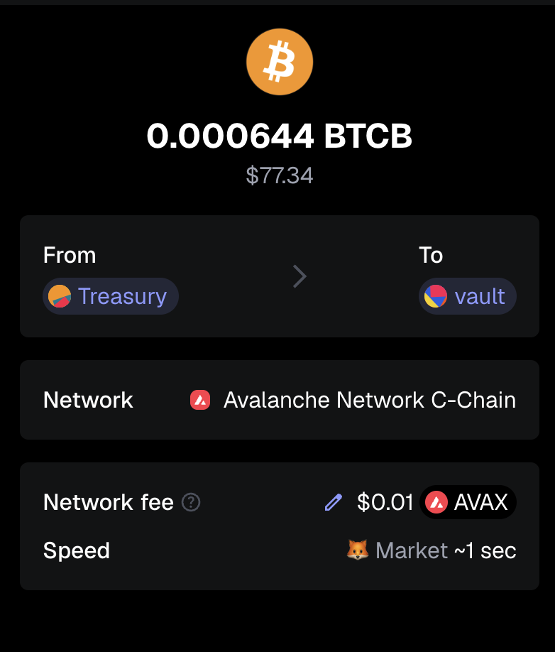 

# State of the Pivot Protocol, 2025-10-02 

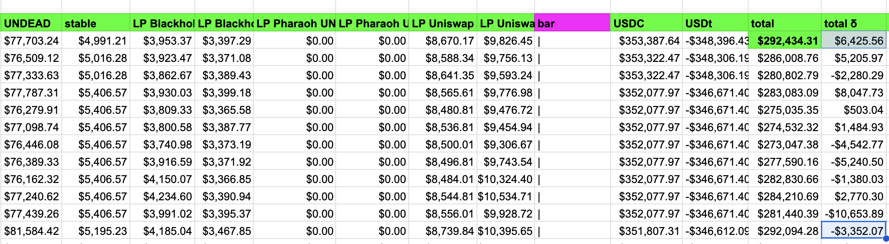 
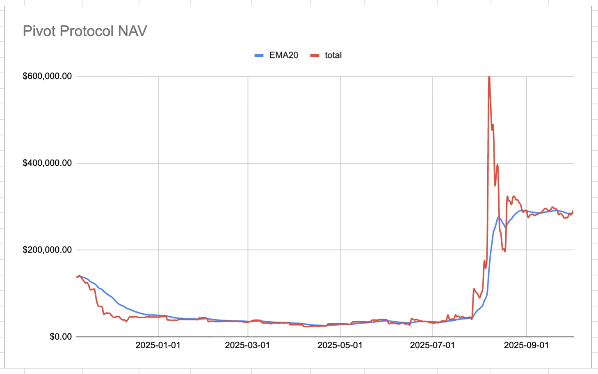 

Good day, pivoteurs! 

News: In my last report, market fluctuations lost me $3k. Now the protocol is near its ATH, ... and growing. Sticking to a plan that work, ... works. 
## Pivot Protocol Snapshot 

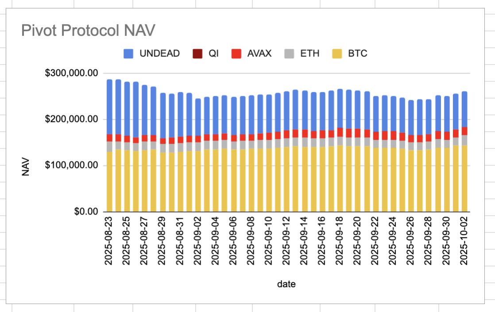 
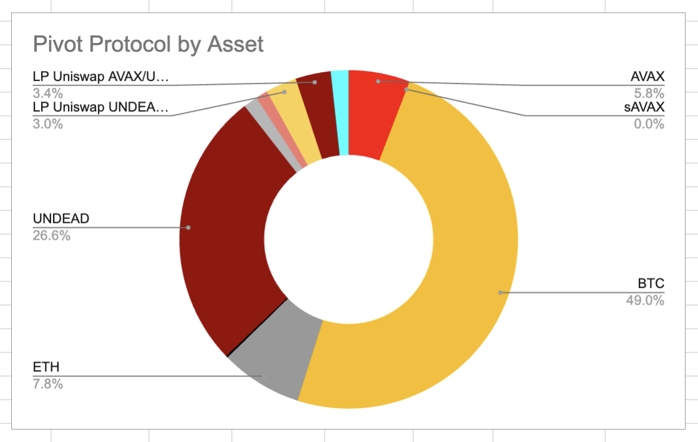 
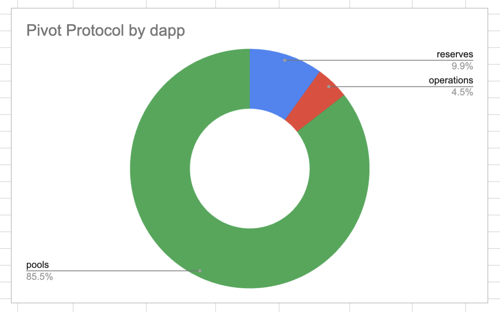 

### Custody 

* 50M $UNDEAD = $136,650 

### Investments 

* 1 $BTC = $119,321 
* 3750999 $UNDEAD = $10,251 

total: $266,222 

### Pivot Protocol 

* NAV = $292,434 
* reinvestments/distributions = $16,469 

This shows the protocol has generated $42,681 in value. 

