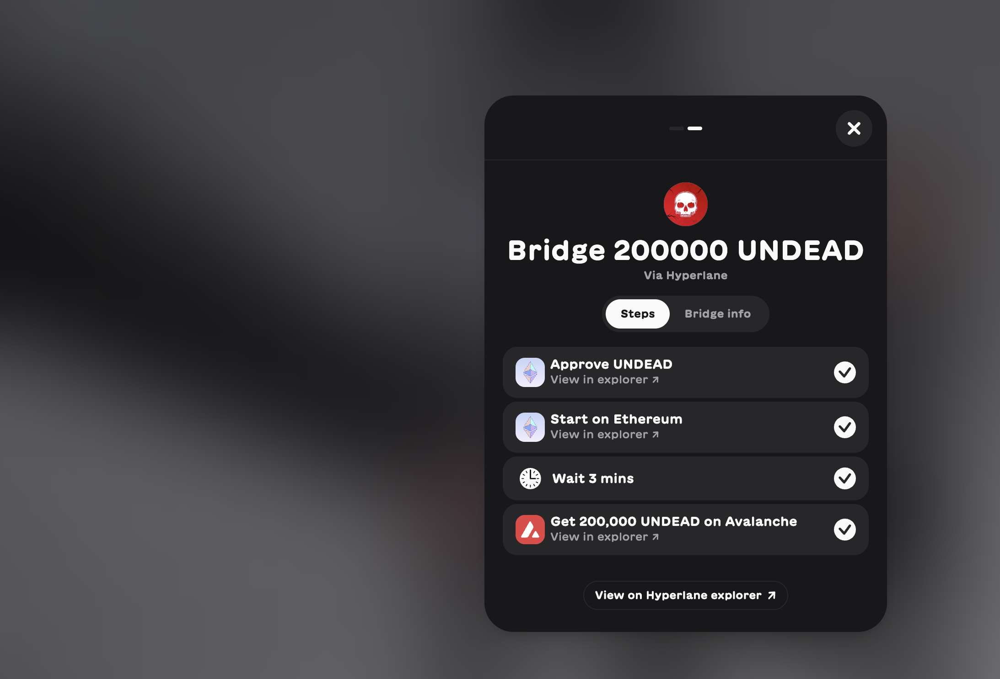

# Pivot Protocol, 2025-10-03

Good morning, pivoteurs!

I have a new investor, investor δ, who has staked some $UNDEAD into the BTC+ETH pivot pool.

![Bridge $UNDEAD using VeraSwap](imgs/01a-vera-bridge.png]

![Transfer liquidity to distributor](imgs/01c-sned.png]

So, I bridge their liquidity from @ethereum to @avax via @veraswapio, then send that liquidity to my distributor address that will invest into that pivot pool.

