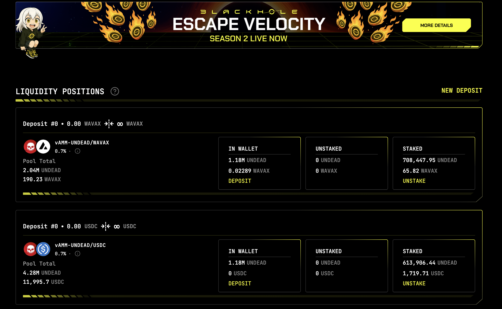
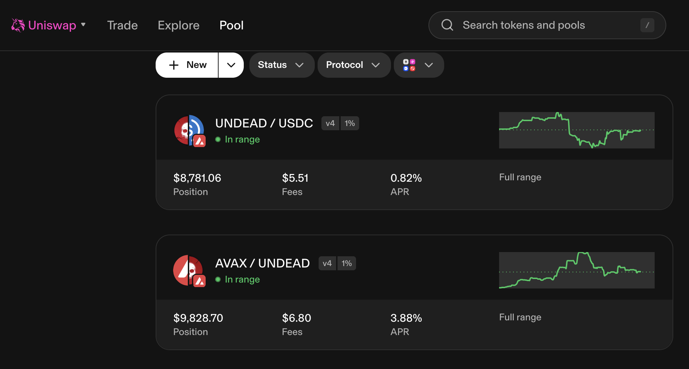
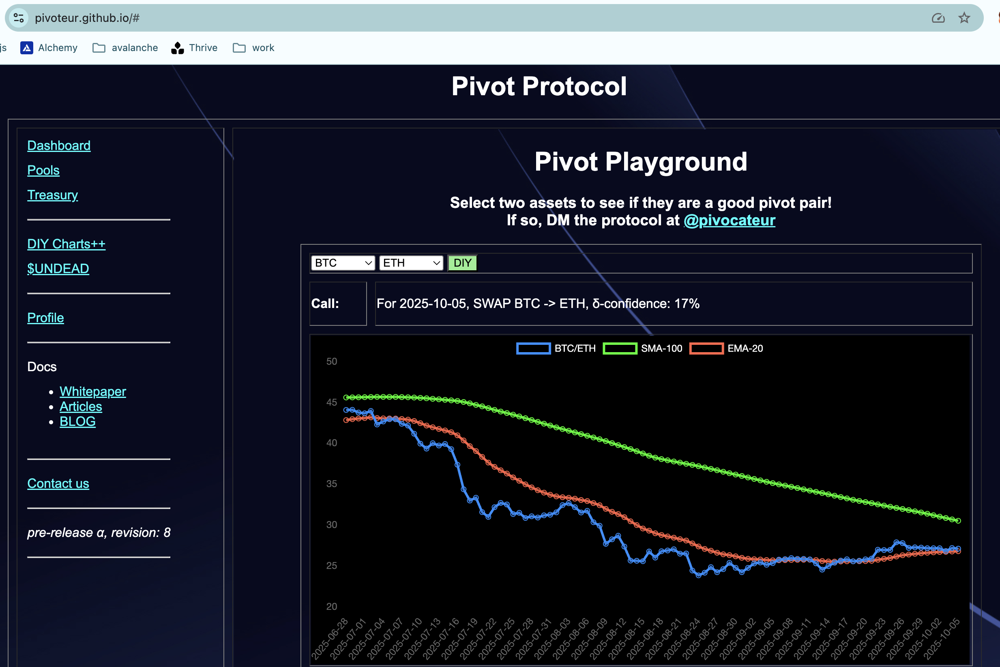
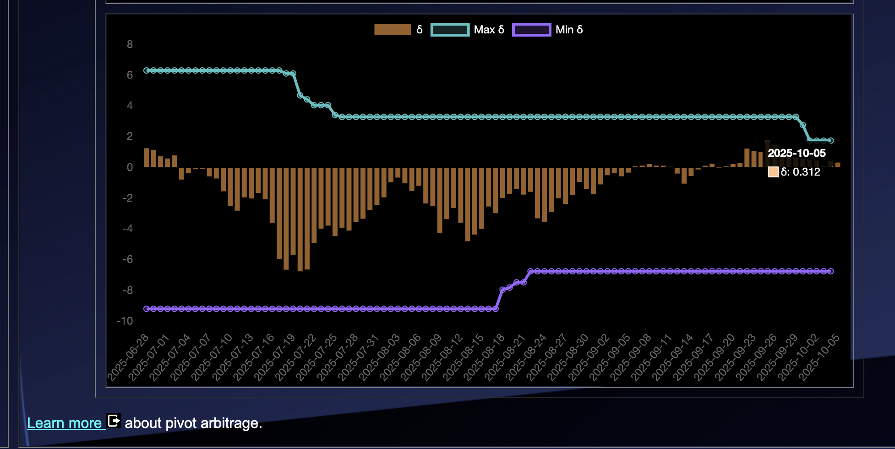
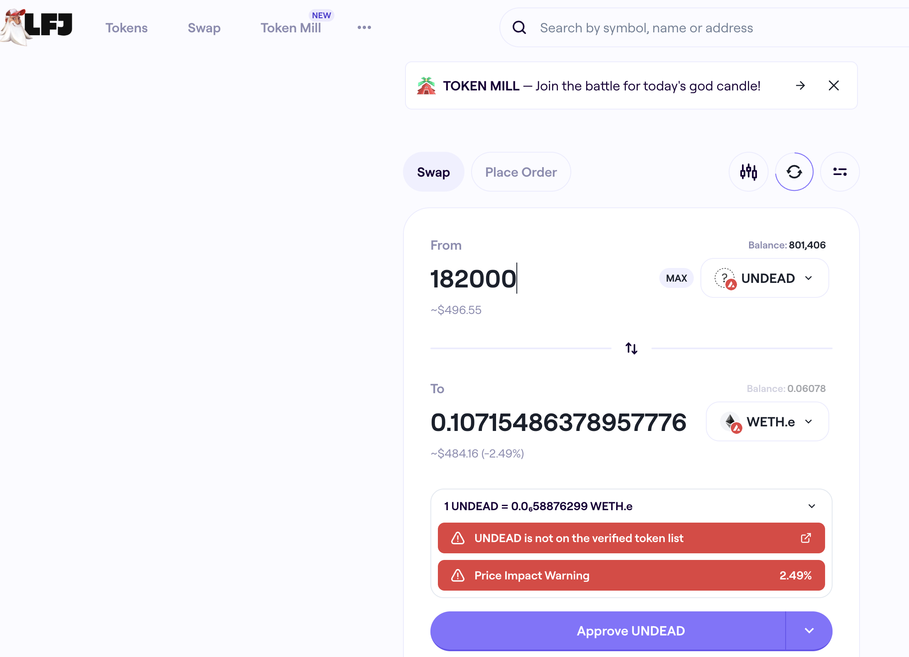
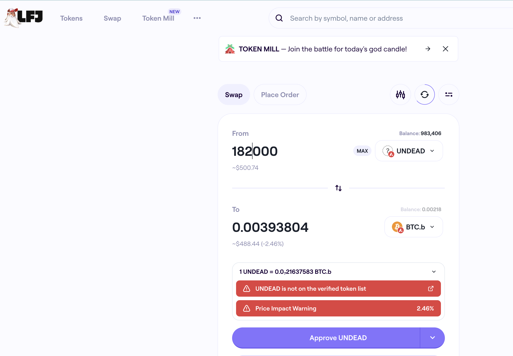
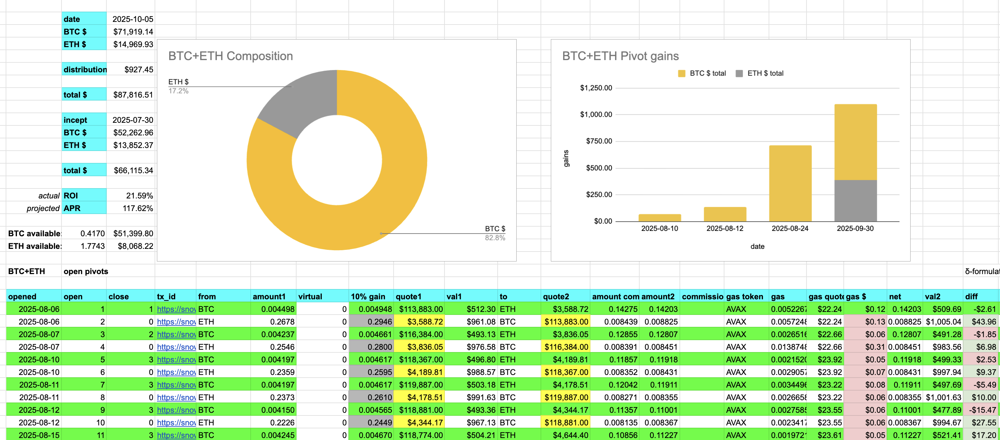
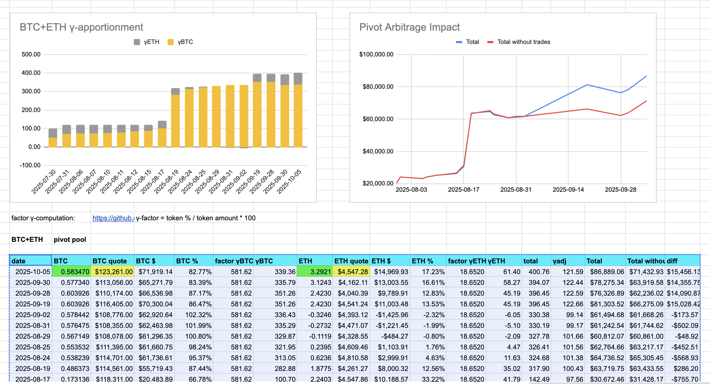

# DEX UNDEAD/USDC-swap Race 

Same swap; 3 DEX, 2025-10-05 

I swap 187000 $UNDEAD for: 

1. 498.55 $USDC on @BlackholeDex 

 

2. 508.20 $USDC on @KyberNetwork 

 

3. 508.33 $USDC on @LFJ_gg 💥 

 

Winner: @LFJ_gg (40-day streak) 

# Liquidity Pools 

## Liquidity Pool Positions 

 
 

The Blackhole and Uniswap $UNDEAD LPs are as shown. 

# PIVOTS 

## BTC+ETH 

No close pivots. 

### Open BTC+ETH pivots 

 
 

The meh δ makes no call, but I open an BTC-on-ETH pivot, anyway. 

 

I also open an ETH-on-BTC pivot. 

 

The BTC+ETH pivot pool composition and γ-apportionment are as charted. 

 
 

