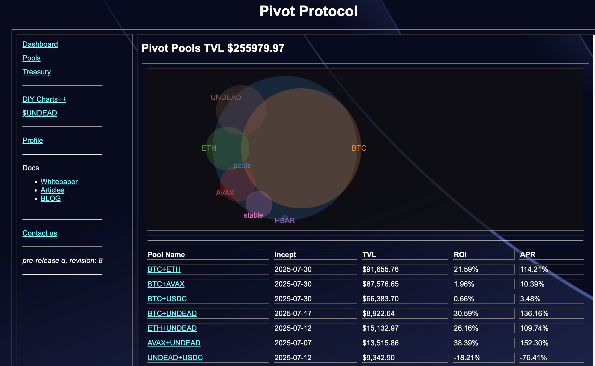
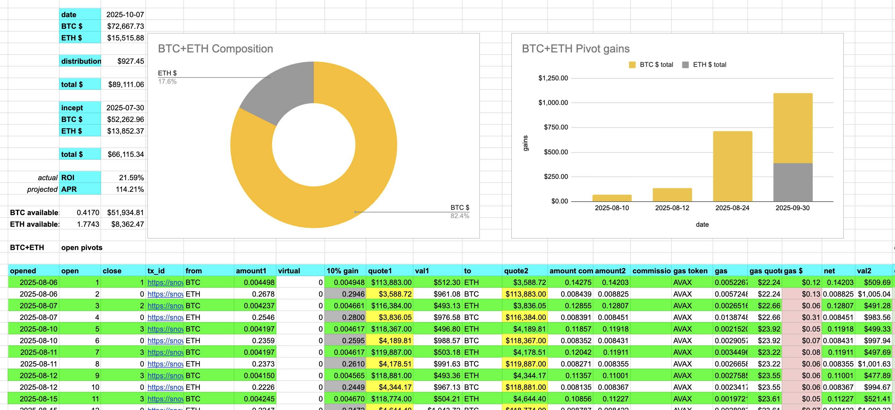
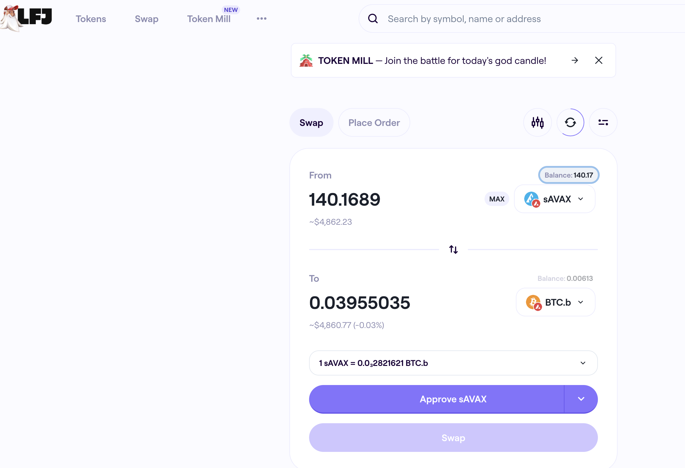
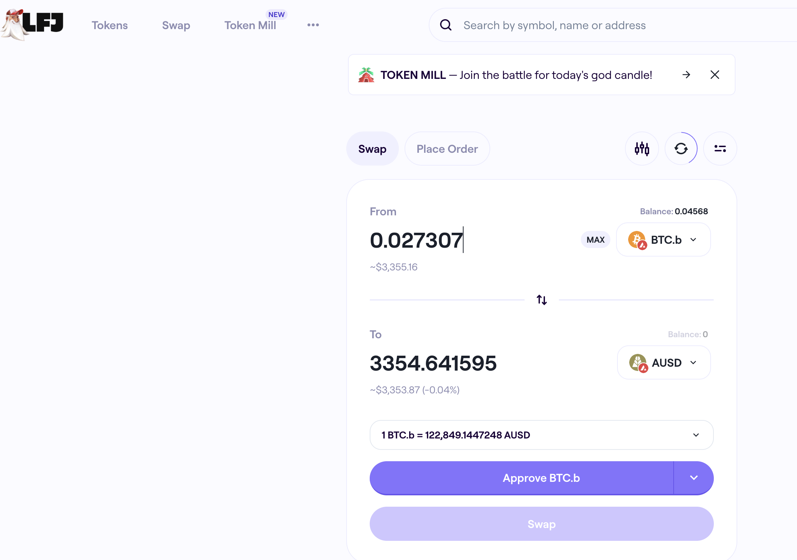

Cadenza, 2025-10-07

🎵
Now. let's. have. a. lit. tle. fun.
Now. let's. do. a. speed. run.
🎶

1 blockchain. 7 pivot pools.
Let's see how many we can do pivot arbitrage on in 1 hour.

Ready. Steady. GO!

# PIVOTS

Time: 7:29 am, end-time: 8:29 am. Alarm: set

## BTC+ETH

No pivots. Next.
## BTC+AVAX 

 

I close 6 BTC-on-AVAX pivots for gains of: 

* actual ROI: 14.87% / 417.58% APR projected 
* or: 0.034430 $BTC -> $AVAX -> 0.039550 $BTC 
* or: $637.75 gain on 6 pivots totalling $3,984.11 

I will distribute gains and open new pivots after the speed-run. 

## BTC+USDC 

 

I close 1 USDC-on-BTC pivot for gains of: 

* actual ROI: 11.77% / 99.89% APR projected 
* or: 3000.00 $USDC -> $BTC -> 3353.03 $USDC 
* or: $353.05 gain on a pivot totalling $3,000.00 

I will distribute gains and open new pivots after the speed-run. 

