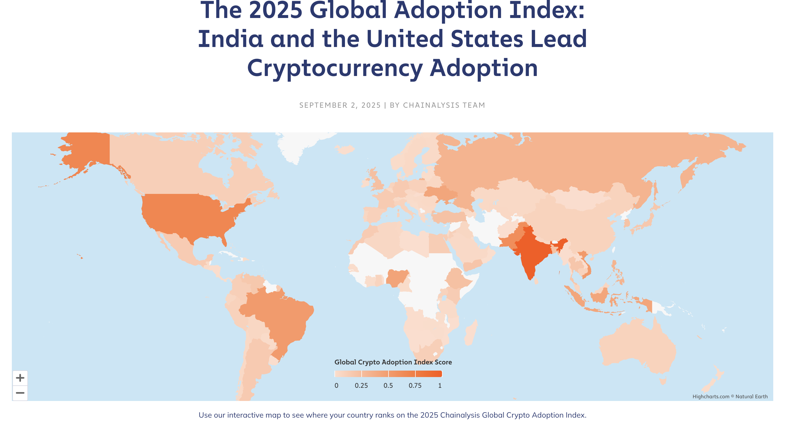
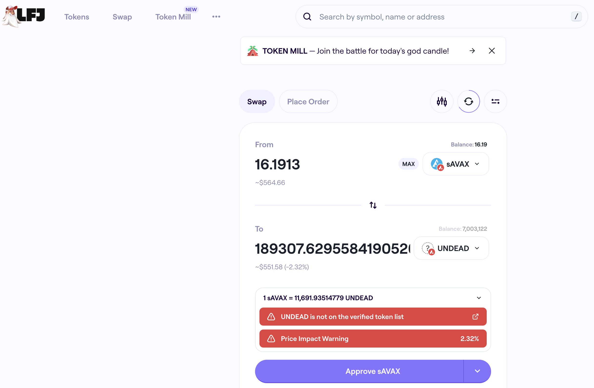
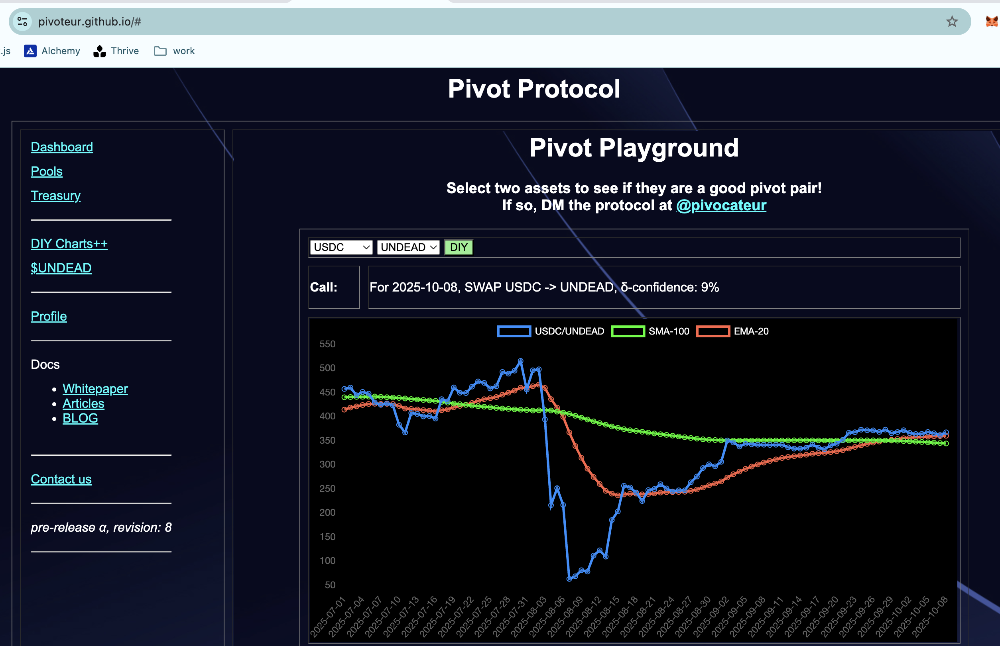
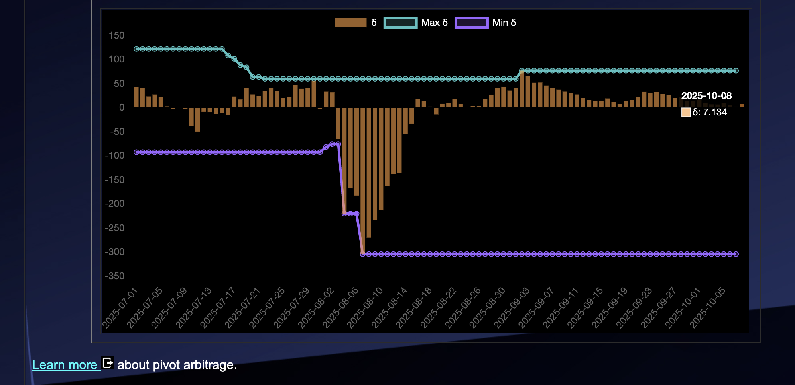
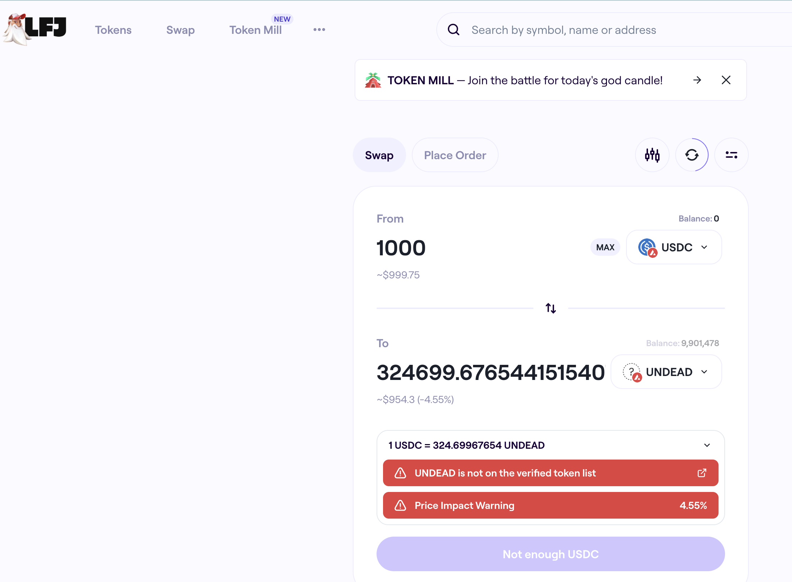
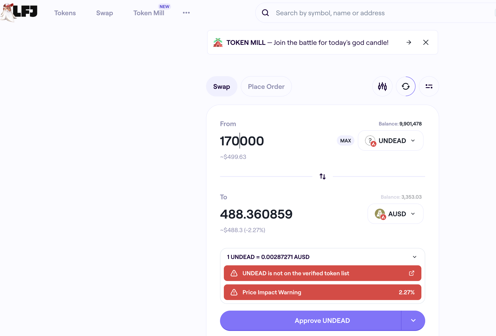
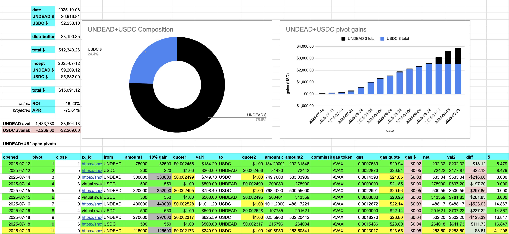
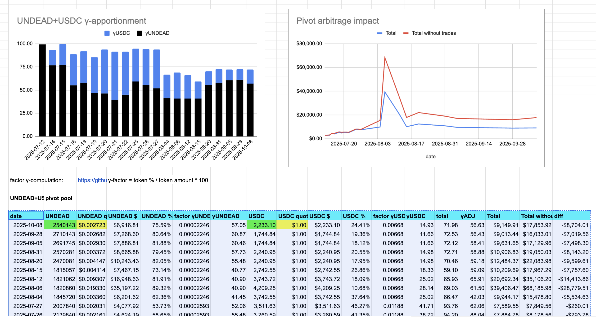
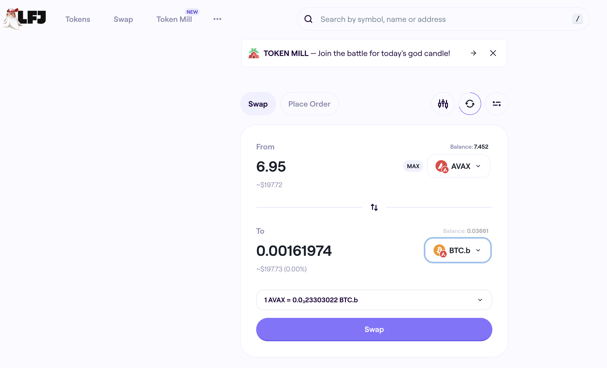
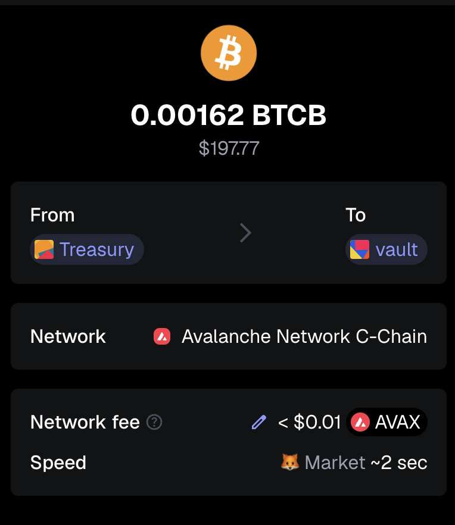

Pivoteurs! G'day! 2025-10-08

[@cz_binance says](https://x.com/cz_binance/status/1975280864595746911) we're in the "I wish I bought ___ early"-stage of #cryptocurrency.

Are we still early? Is it too late?

I've published an article on @LinkedIn: "[It's Still Early ... Yet!](https://www.linkedin.com/feed/update/urn:li:activity:7381824484632104962/)" for you FOMO'rs out there. 

# PIVOTS

Finishing up pivot arbitrage from [the speed-run from earlier today](https://github.com/pivoteur/biz/tree/main/blog/2025/10/07) ...

## AVAX+UNDEAD 

 

I close 1 UNDEAD-on-AVAX hedge for gains of: 

* actual ROI: 9.43% / 101.19% APR projected 
* or: 172000 $UNDEAD -> $AVAX -> 188,212 $UNDEAD 
* or: $44.84 gain on a hedge totalling $485.10 

I will distribute gains and open new pivots after all close-pivots are finalized. 

## UNDEAD+USDC 

No close pivots. 

### Open UNDEAD+USDC pivots 

 
 

The negative δ calls to open an USDC-on-UNDEAD pivot, which I do. 

 

I also open an UNDEAD-on-USDC hedge. 

 

The UNDEAD+USDC pivot pool composition and γ-apportionment are as charted. 

 
 

## Done with pivoting for today

It's past the stroke of midnight. Enough pivoting for today, ... welllllll: yesterday.

# Bitcoin vault 

* I swap some accumulated $AVAX to $BTC.b 

 

* I send this $BTC.b to the vault 

 

