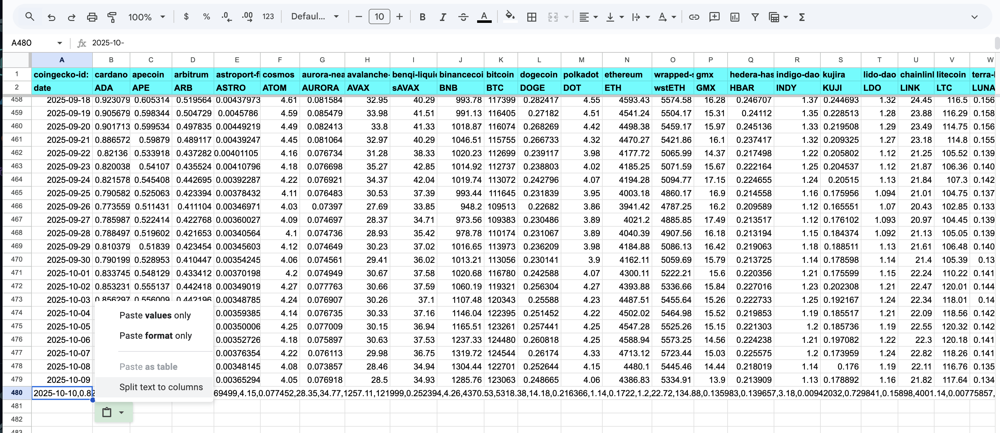
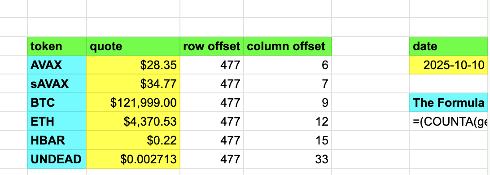
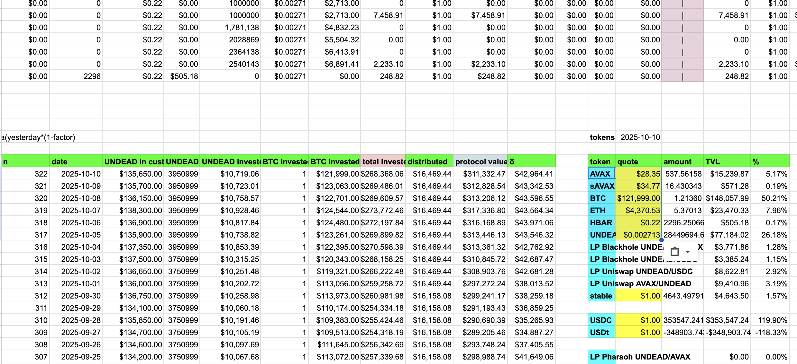

G'day, pivoteurs! 2025-10-10

Another speed-run today? Nupe!

Today, I'm not doing the 50'-sprint. Today, we're doing the Marathon:

* All pivot pools, all pivot-actions, including:

1. close pivots
2. distributions
3. open pivots
4. assessments

Let's go.

# bae

## price-quote data collection

Before I do pivots, I get price-quotes from around the Blockaverse.

I use my Rust-app: bae

This quote-collection automation saves me hours per day from before!

Collating these quotes into the protocol for analysis is still a manual process, relying on 12 spreadsheets.

