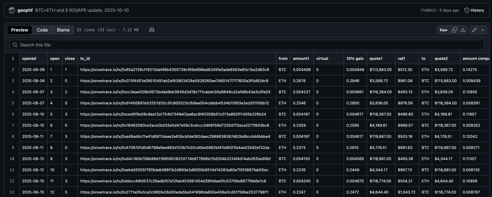

# An Exercise

It's time for me to get serious about automation on the backend. I need to know all pivots viable to close.

To do that, I need to know all open pivots

I have an example [here for BTC+ETH](https://raw.githubusercontent.com/pivoteur/pivoteur.github.io/refs/heads/main/data/pivots/open/raw/btc-eth.tsv).

Exercise 1: read this data set and parse all open pivots.
