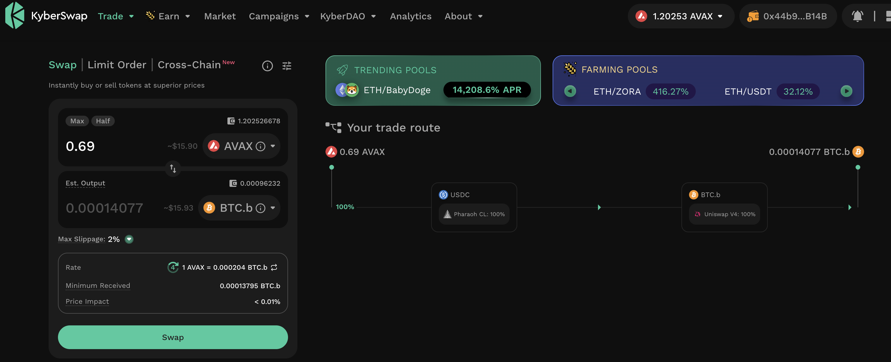
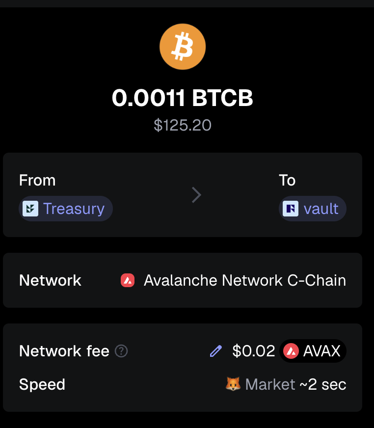
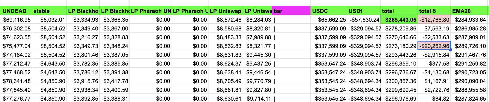
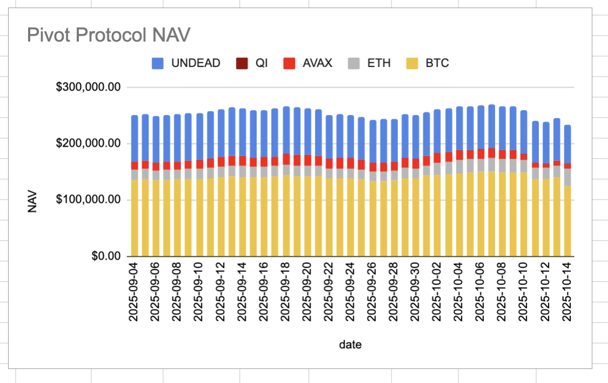
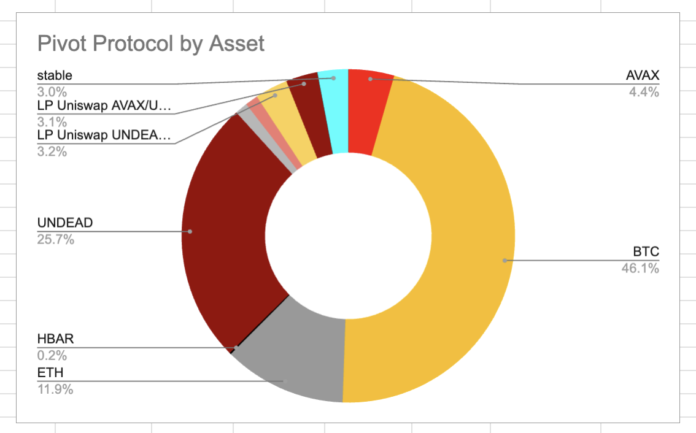
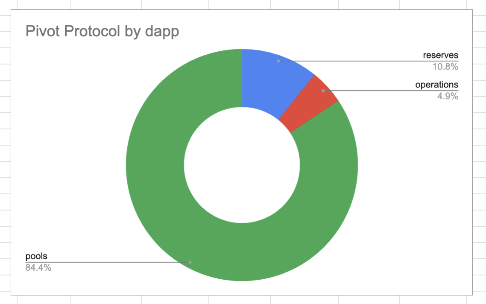

# DEX UNDEAD/USDC-swap Race 

Same swap; 3 DEX, 2025-10-14 

I swap 187000 $UNDEAD for: 

1. 490.87 $USDC on @BlackholeDex 

 

2. 501.01 $USDC on @KyberNetwork 

 

3. 501.35 $USDC on @LFJ_gg 💥 

 

Winner: @LFJ_gg (3-day streak) 

# Liquidity Pools 

@BlackholeDex $BLACK price-chart on @coingecko 

 

* I harvest the yields from the LPs on @BlackholeDex and @Uniswap; the LPs have reached parity. 

 

* swap half the yields to $BTC, 

 

* then I will move the $UNDEAD and $BTC liquidity to the vault 

## Liquidity Pool Positions 

 
 

The Blackhole and Uniswap $UNDEAD LPs are as shown. 

# Bitcoin vault 

* I swap some accumulated $AVAX to $BTC.b 

 

* I send this $BTC.b to the vault 

 

# State of the Pivot Protocol, 2025-10-14 

 
 

Good day, pivoteurs! 

News: Many got hit, hard, by the last scare. We did, too. Sometimes there is no protection against a massive price movement. BUT we did make some gains and distributed/reinvested for our investors. We remain strong, operational, and are generating value in the market. 

## Pivot Protocol Snapshot 

 
 
 

### Custody 

* 50M $UNDEAD = $134,050 

### Investments 

* 1 $BTC = $111,080 
* 3950999 $UNDEAD = $10,593 

total: $255,723 

### Pivot Protocol 

* NAV = $265,443 
* reinvestments/distributions = $17,932 

This shows the protocol has generated $27,652 in value. 

