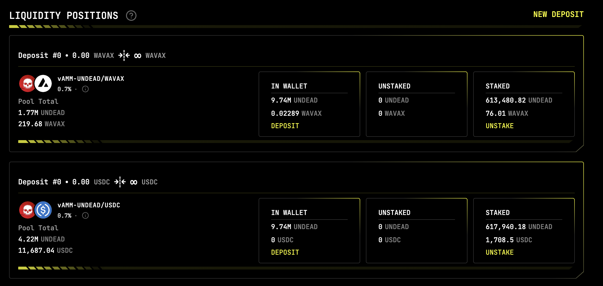

# DEX UNDEAD/USDC-swap Race 

Same swap; 3 DEX, 2025-10-14 

I swap 187000 $UNDEAD for: 

1. 490.87 $USDC on @BlackholeDex 

 

2. 501.01 $USDC on @KyberNetwork 

 

3. 501.35 $USDC on @LFJ_gg 💥 

 

Winner: @LFJ_gg (3-day streak) 

# Liquidity Pools 

@BlackholeDex $BLACK price-chart on @coingecko 

 

* I harvest the yields from the LPs on @BlackholeDex and @Uniswap; the LPs have reached parity. 

 

* swap half the yields to $BTC, 

 

* then I will move the $UNDEAD and $BTC liquidity to the vault 

## Liquidity Pool Positions 

 
 

The Blackhole and Uniswap $UNDEAD LPs are as shown. 

