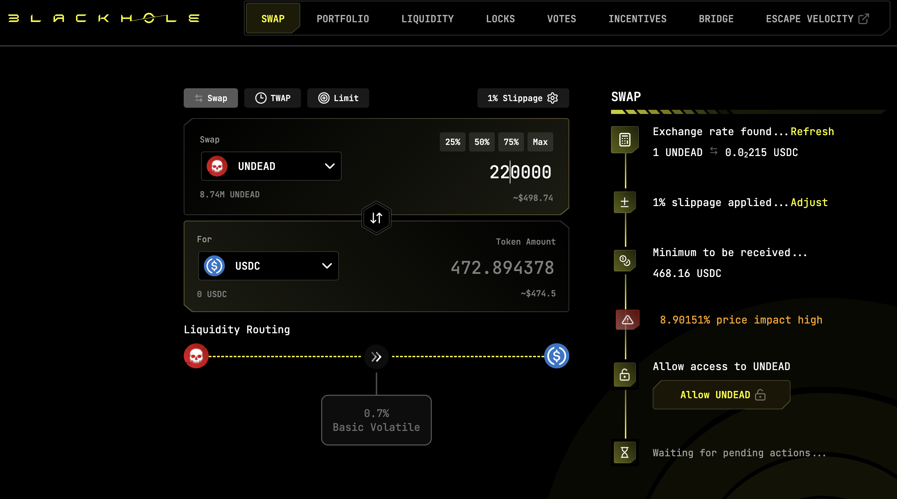

2025-10-21

Good morning!

Which way, pivoteurs?

- [ ] $UNDEAD
- [ ] $AVAX
- [ ] both
- [ ] nupe!

# DEX UNDEAD/USDC-swap Race 

Same swap; 3 DEX, 2025-10-21 

I swap 220000 $UNDEAD for: 

1. 472.89 $USDC on @BlackholeDex 

 

2. 484.89 $USDC on @KyberNetwork 

 

3. 485.31 $USDC on @LFJ_gg 💥 

 

Winner: @LFJ_gg (2-day streak) 

# Liquidity Pool Positions 

 
 

The Blackhole and Uniswap $UNDEAD LPs are as shown. 

# State of the Pivot Protocol, 2025-10-21 

 
 

Good day, pivoteurs! 

News: A couple of good days for pivot arbitrage: even with market-turbulence, the protocol distributed $1k then $600 from the BTC+AVAX pivot pool the last two days. Operations are manual and much too slow, but once I build and test pivot automation, workflow will proceed much more efficiently when automation is inlined in production. 

## Pivot Protocol Snapshot 

 
 
 
 

### Custody 

* 50M $UNDEAD = $131,700 

### Investments 

* 1 $BTC = $108,555 
* 3950999 $UNDEAD = $10,407 

total: $250,662 

### Pivot Protocol 

* NAV = $281,912 
* reinvestments/distributions = $18,546 

This shows the protocol has generated $49,797 in value. 

# PIVOTS 

## BTC+USDC 

No close pivots. 

## Open BTC+USDC pivots 

 
 

The negative δ calls to open an USDC-on-BTC pivot, which I do. 

 

I also open an BTC-on-USDC hedge. 

 

The BTC+USDC pivot pool composition and γ-apportionment are as charted. 

 
 

