2025-10-28

# Transition to Hedera

Good morning, pivoteurs!

The Pivot Protocol is making a transition to the @hedera  blockchain/hashgraph.

The protocol has added a document on how to add Hedera to your EVM wallet (mm, particularly).

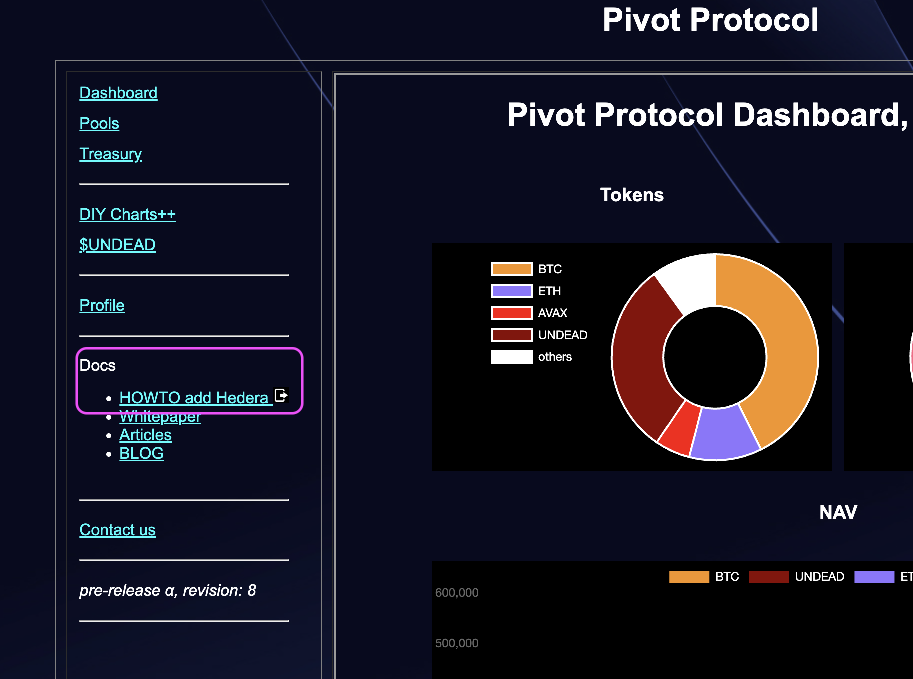

Document thanks to @wagyugames.

## Finding your Hedera Hash

Once you've added the Hedera network, how do you find your Hedera hash?

Simple!

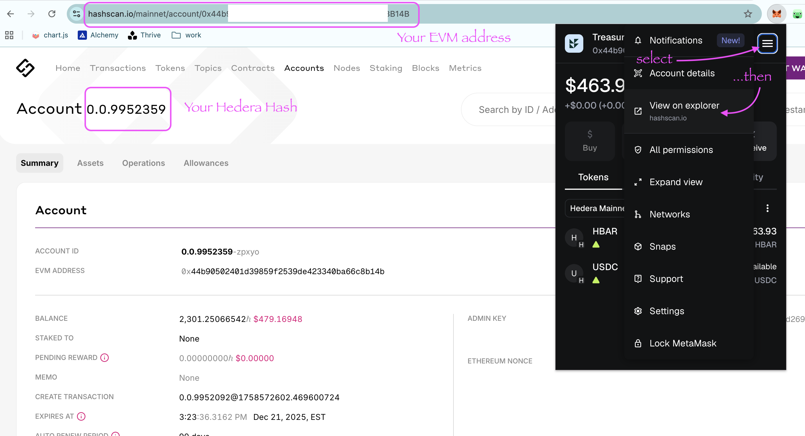

1. While having 'Hedera' selected as your blockchain, select the 'hamburger'-menu-dropdown on your wallet
2. Select 'view on explorer.'

Your EVM address will be displayed as a Hedera hash.
# Vote for $UNDEAD LPs on Blackhole 

2025-10-28 

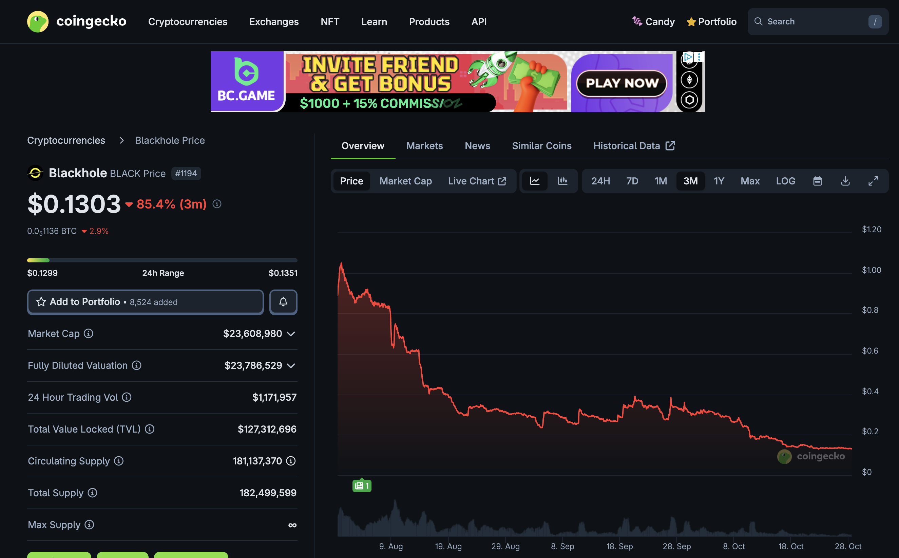 Good day, pivoteurs! 

A new day; a new Epoch on @BlackholeDex. 

Reminder to go [vote](https://blackhole.xyz/vote) for the @UndeadBlocks $UNDEAD liquidity pools on that DEX. 

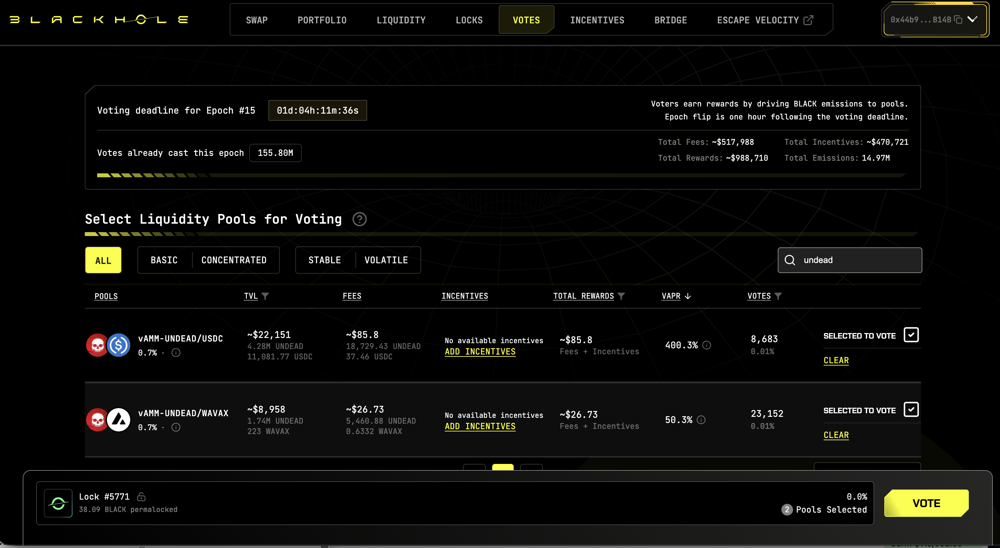 
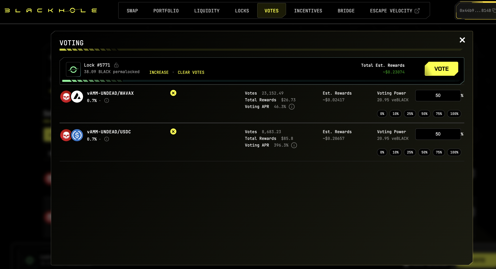 

[HOWTO vote instructions](https://x.com/pivocateur/status/1945637734682341791) 

#IVotedForUNDEAD 

# Pivot Arbitrage 

2025-10-28 Good day! 

Which way, pivoteurs? 

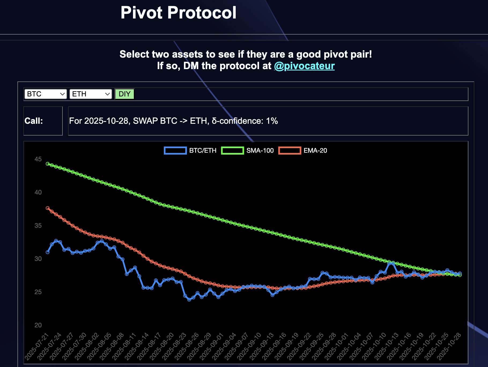 
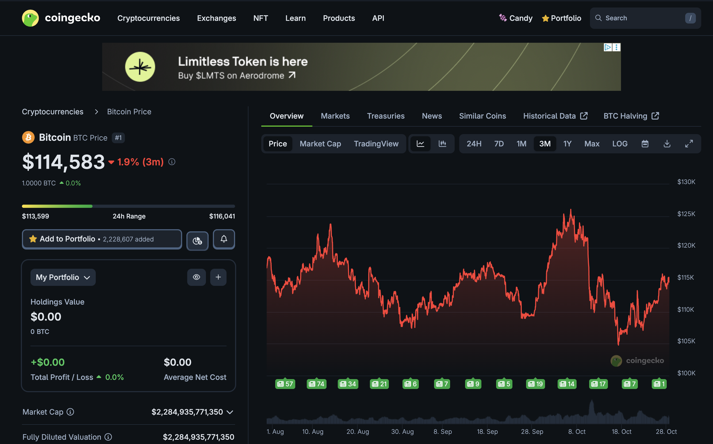 
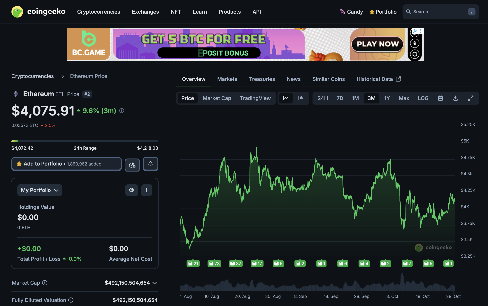 

- [ ] $BTC 
- [ ] $ETH 
- [ ] both 
- [ ] Can you do the pivot arbitrage for me, al geophf?* 

*yes. [Yes, I can](https://pivoteur.github.io/diy.html?t1=BTC&t2=ETH). 😎 

# DEX UNDEAD/USDC-swap Race 

Same swap; 3 DEX, 2025-10-28 

I swap 194000 $UNDEAD for: 

1. 474.79 $USDC on @BlackholeDex 

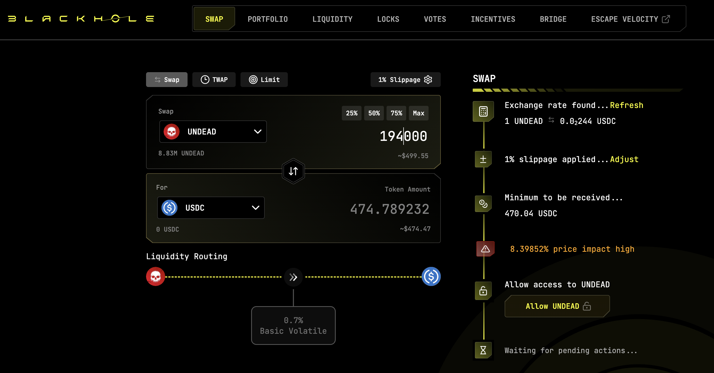 

2. 483.51 $USDC on @KyberNetwork 

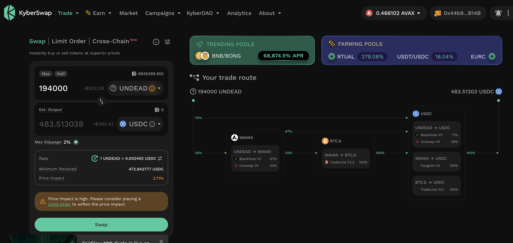 

3. 483.69 $USDC on @LFJ_gg 💥 

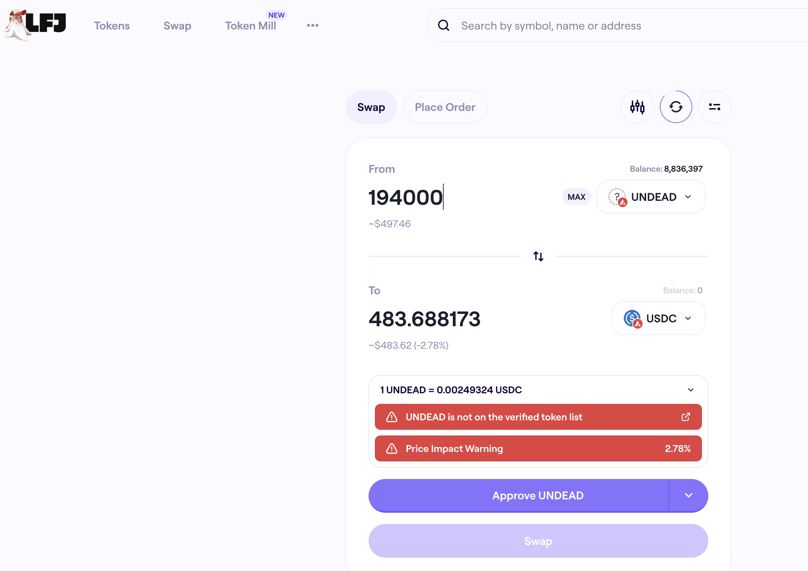 

Winner: @LFJ_gg (9-day streak) 

# Liquidity Pools 

@BlackholeDex $BLACK price-chart on @coingecko 

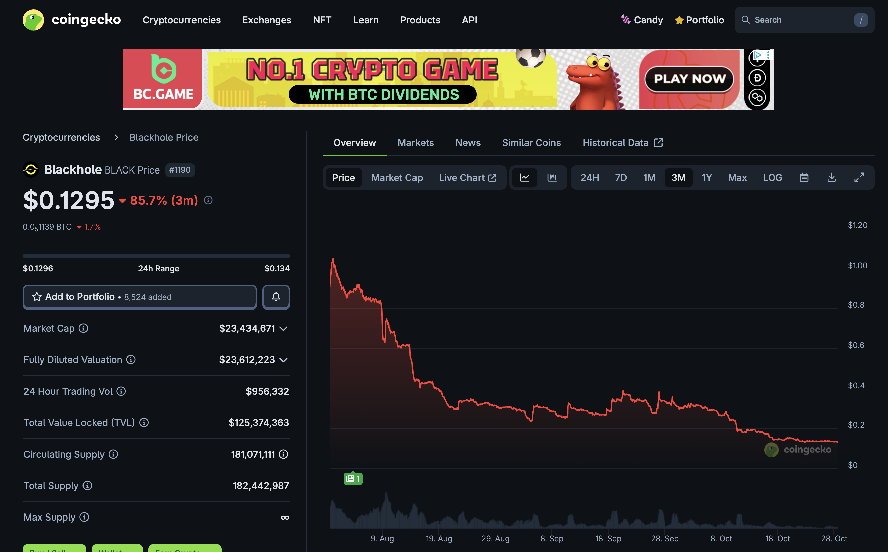 

* I harvest the yields from the LPs on @BlackholeDex and @Uniswap; the LPs have reached parity. 

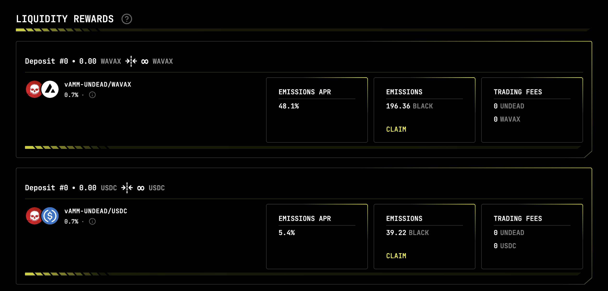 

* swap half the yields to $BTC, 

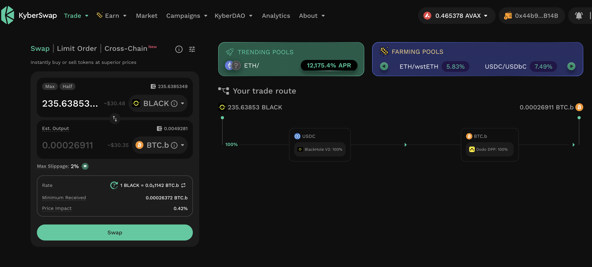 

* then I will move the $UNDEAD and $BTC liquidity to the vault 

## Liquidity Pool Positions 

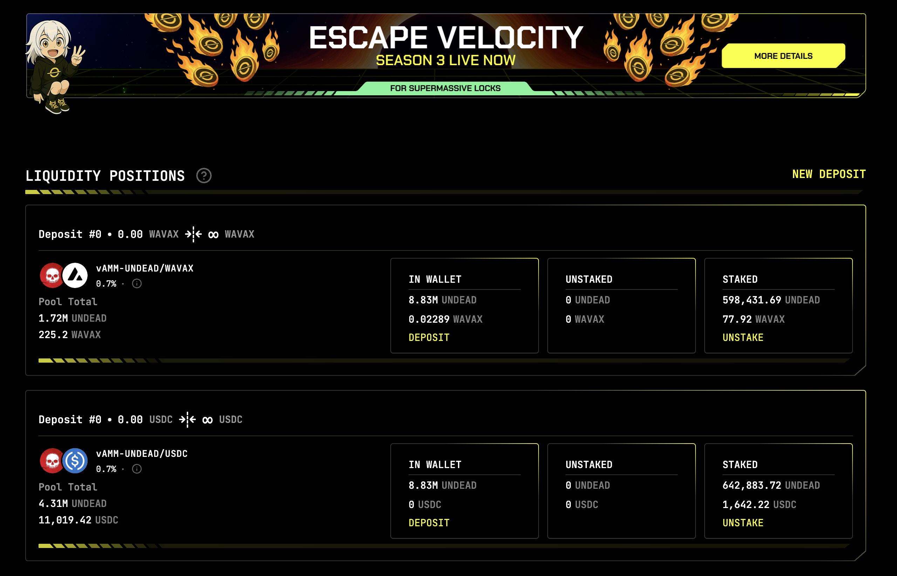 
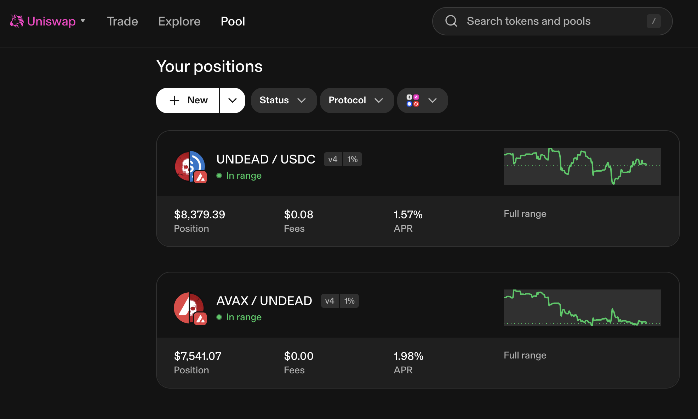 

The Blackhole and Uniswap $UNDEAD LPs are as shown. 

