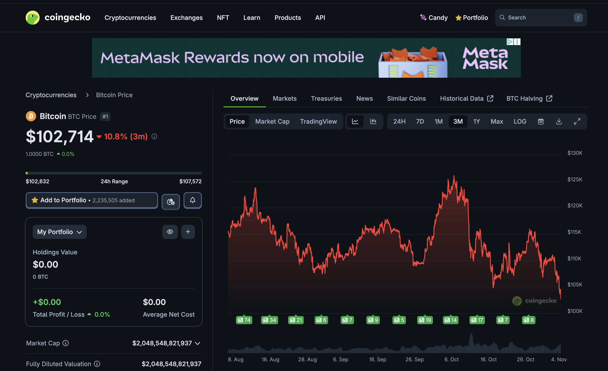
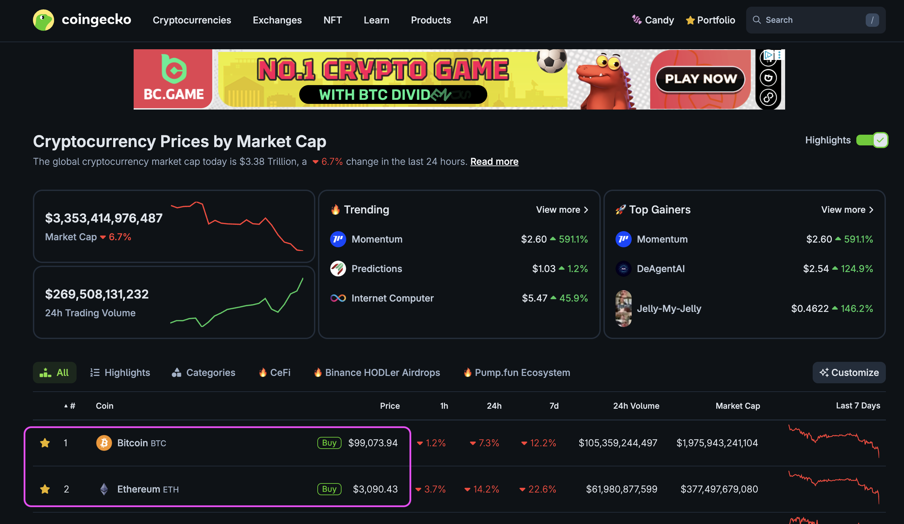
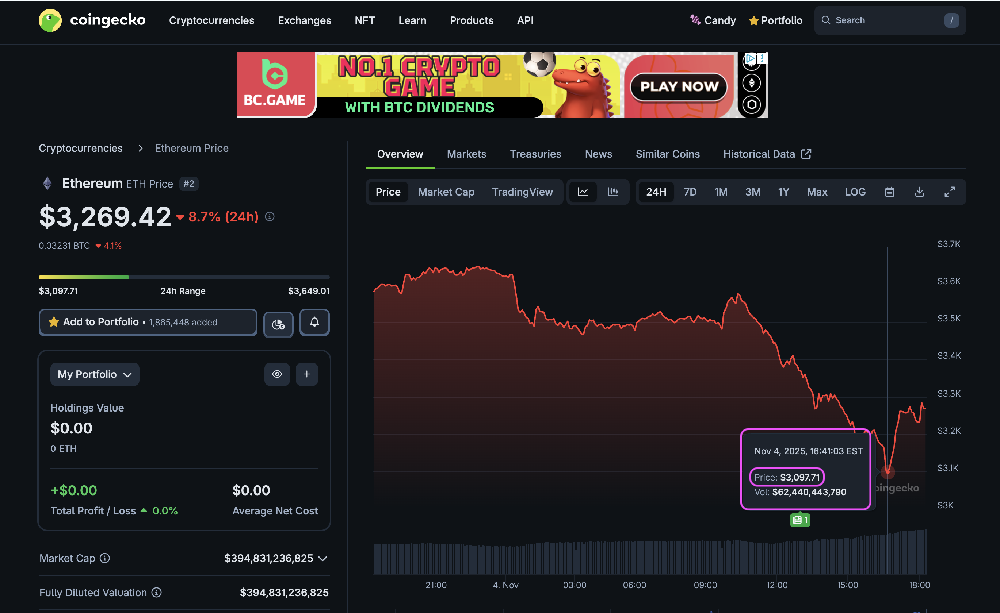

# Market "crash"?

Are we going to see $BTC fall below $100k today?

Hm, my answer: I don't care.

Some see tragedy and panic-sell: this happens every cycle.

Me: I see an interesting pivot arbitrage opportunity here.

So I guess it all depends on how you see things, eh?

# $BTC below $100k

YES! CALLED IT! $BTC below $100k! WOOT! 🎉

Now, can we get $ETH below $3k? I think we can if we all hold hands and squeeze really hard! 

# $ETH stays above $3k, ... durn it!

Awww, shucks!

Welp, we did our best.

Next time, let's hold hands harder for that sub-$3k $ETH, eh?

