# Pivot Arbitrage 

2025-11-05 Good day! 

Which way, pivoteurs? 

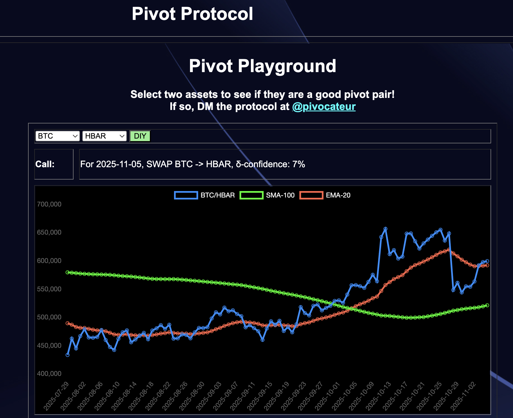 
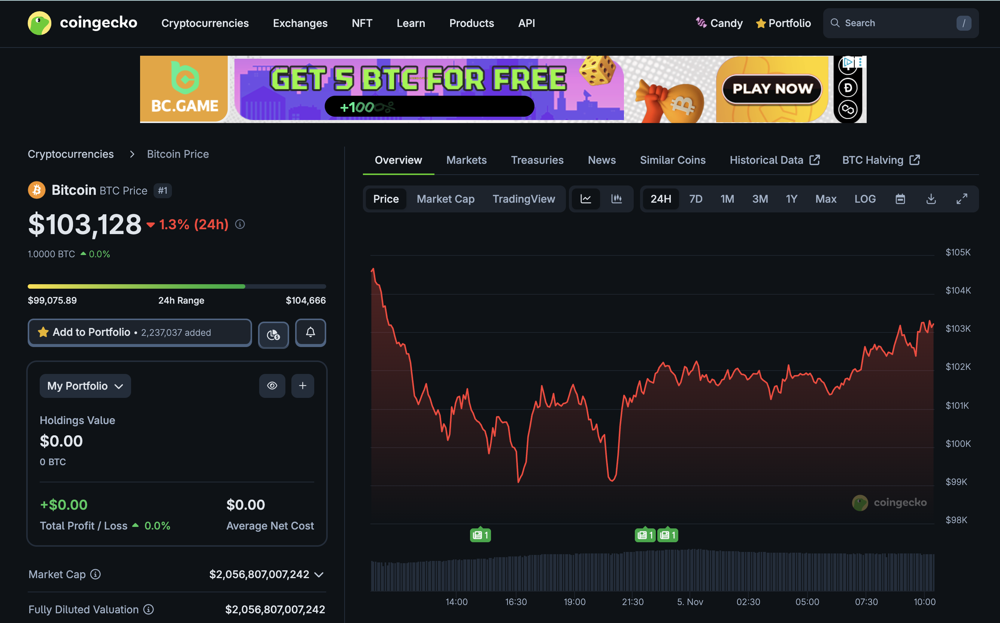 
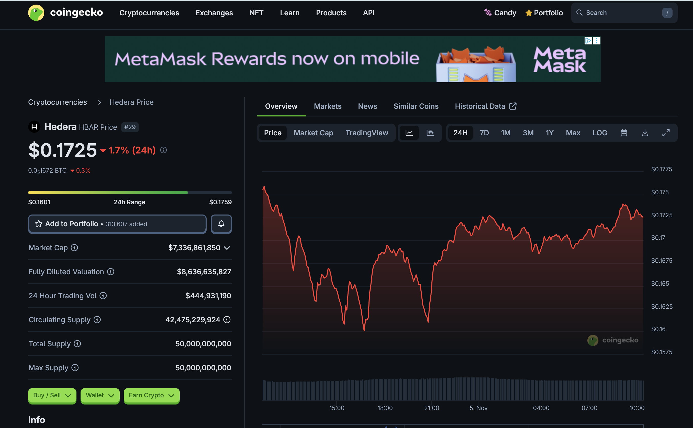 

- [ ] $BTC 
- [ ] $HBAR 
- [ ] both 
- [ ] Can you do the pivot arbitrage for me, al geophf?* 

*yes. Yes, I can. 😎 

https://pivoteur.github.io/diy.html?t1=BTC&t2=HBAR 

# DEX UNDEAD/USDC-swap Race 

Same swap; 3 DEX, 2025-11-05 

I swap 208000 $UNDEAD for: 

1. 473.61 $USDC on @BlackholeDex 

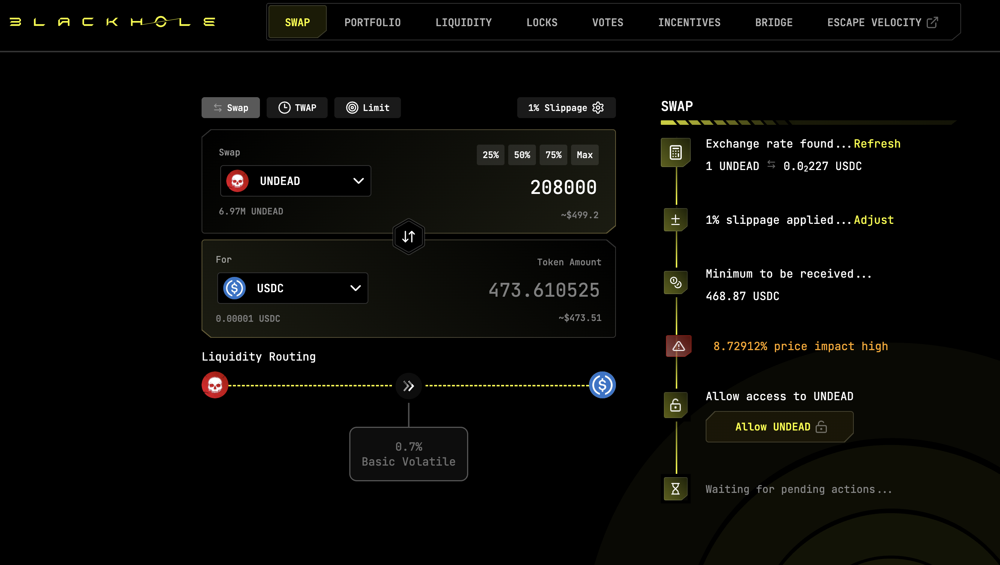 

2. 486.12 $USDC on @KyberNetwork 

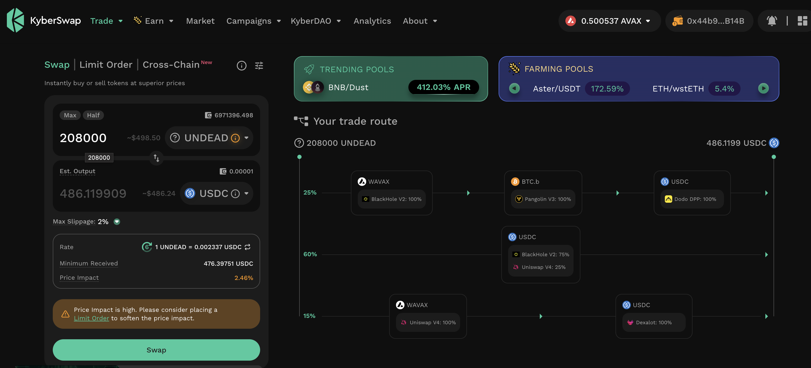 

3. 486.24 $USDC on @LFJ_gg 💥 

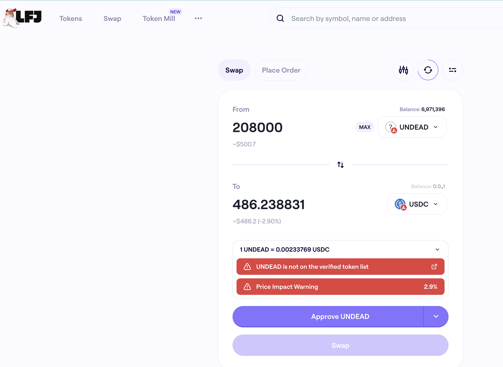 

Winner: @LFJ_gg (17-day streak) 

# Liquidity Pools 

@BlackholeDex $BLACK price-chart on @coingecko 

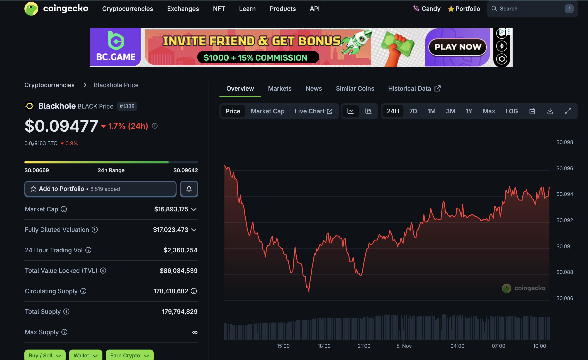 

* I harvest the yields from the LPs on @BlackholeDex and @Uniswap; the LPs have reached parity. 

 
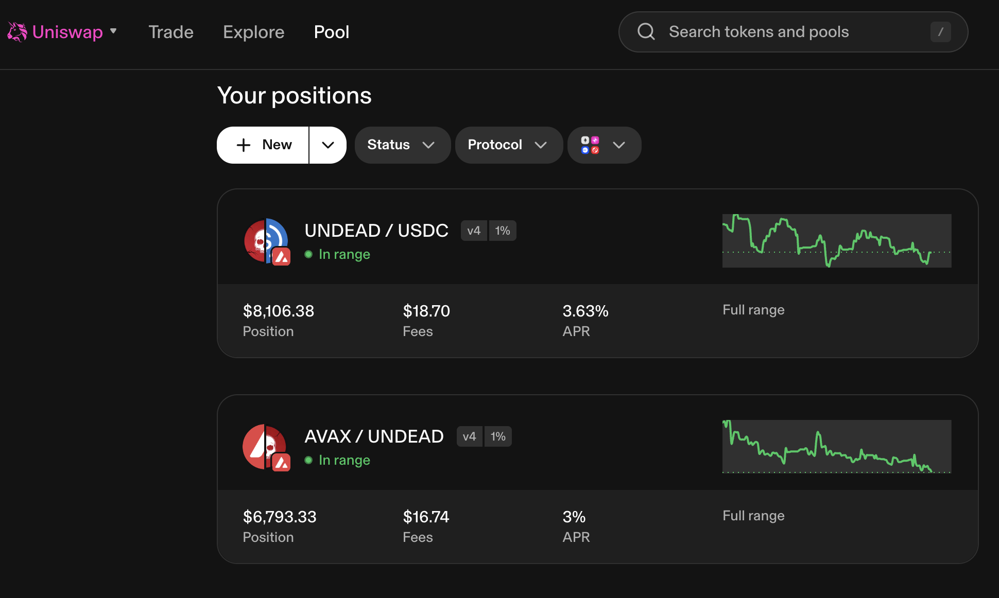 

* swap the yields to $BTC 

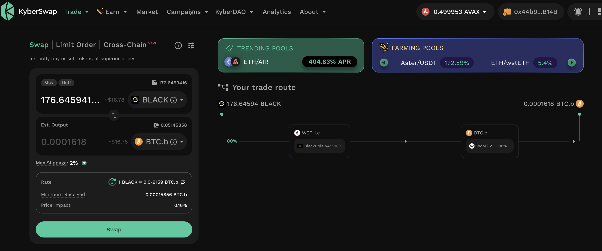 

* then I will move the $UNDEAD and $BTC liquidity to the vault 

## Liquidity Pool Positions 

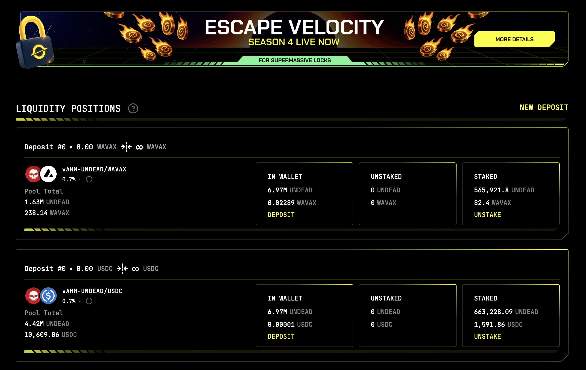 
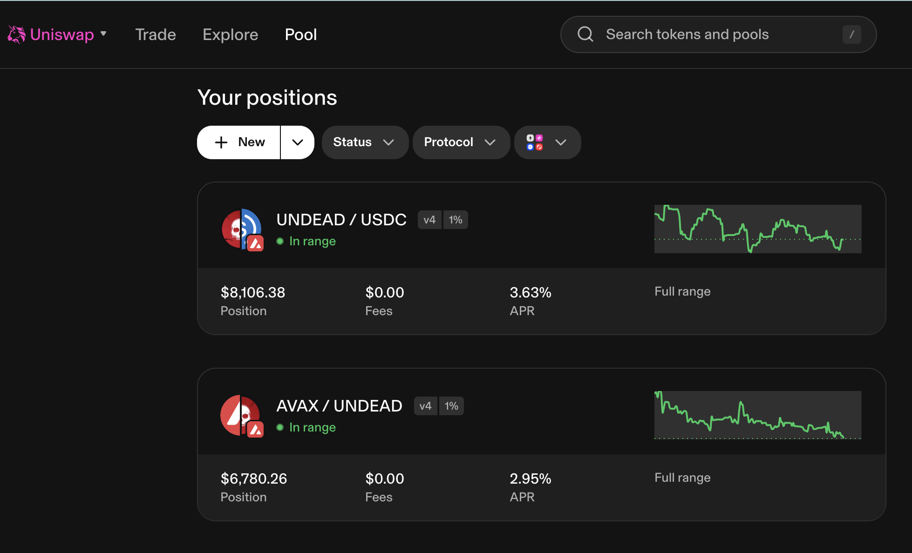 

The Blackhole and Uniswap $UNDEAD LPs are as shown. 

