2025-11-14

# UNDEAD market trend

Do you know what I find weird, @UndeadBlocks-iers?

Everything in the Crypto-markets is crashing, but $UNDEAD is actually rising in the ranks.

It's not a lot, and it has a long way to go, but why are we going up when the markets are tanking? 

Me: I'll take it. 📈

# Vote for $UNDEAD LPs on Blackhole 

2025-11-14 

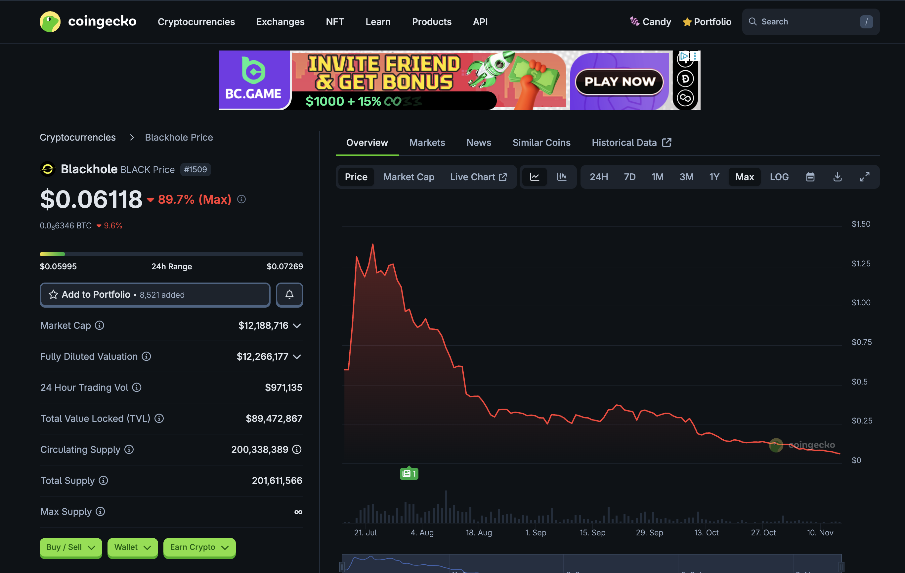 

A new day; a new Epoch on @BlackholeDex. 

Reminder to go [vote](https://blackhole.xyz/vote) for the @UndeadBlocks $UNDEAD liquidity pools on that DEX. 

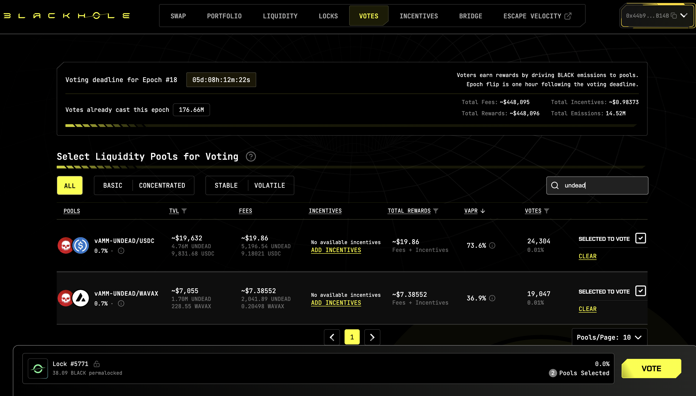 
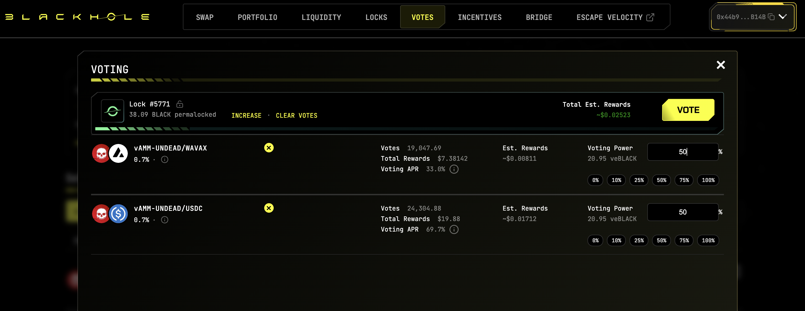 

[HOWTO vote instructions](https://x.com/pivocateur/status/1945637734682341791) 

#IVotedForUNDEAD 

# DEX UNDEAD/USDC-swap Race 

Same swap; 3 DEX, 2025-11-14 

I swap 243000 $UNDEAD for: 

1. 473.44 $USDC on @BlackholeDex 

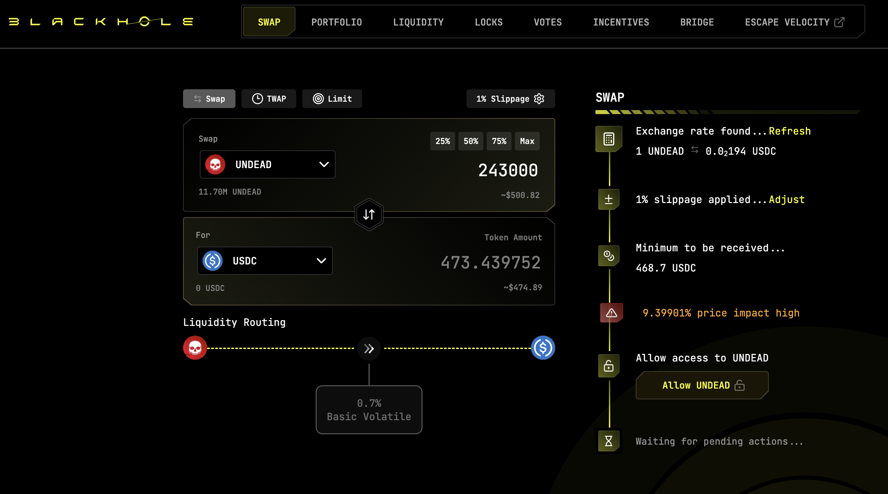 

2. 485.58 $USDC on @KyberNetwork 

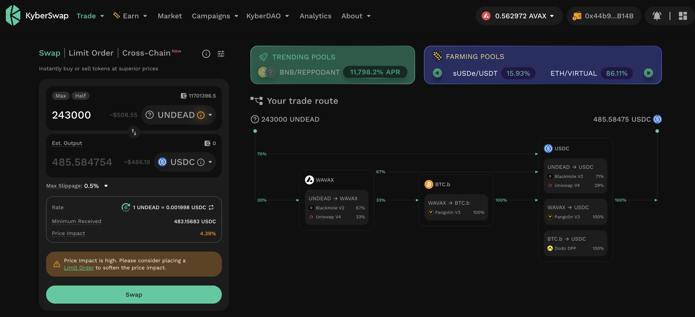 

3. 485.90 $USDC on @LFJ_gg 💥 

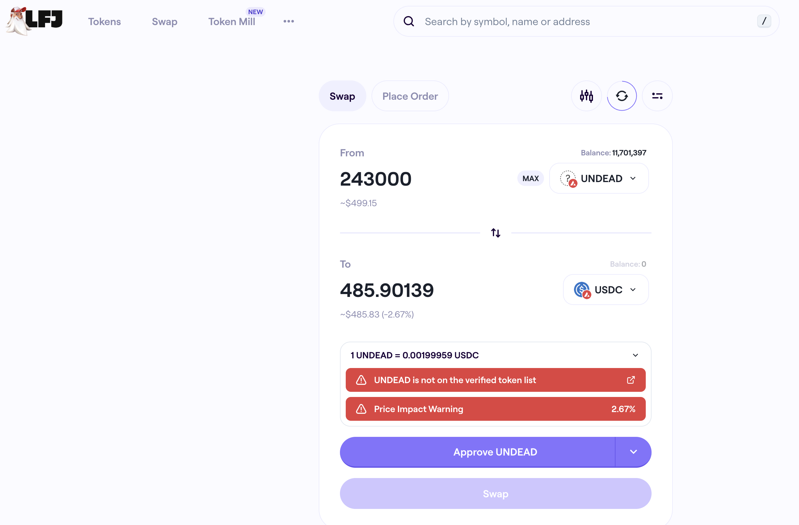 

Winner: @LFJ_gg (26-day streak) 

# Liquidity Pools 

* I harvest the yields from the LPs on @BlackholeDex and @Uniswap; the LPs have reached parity. 

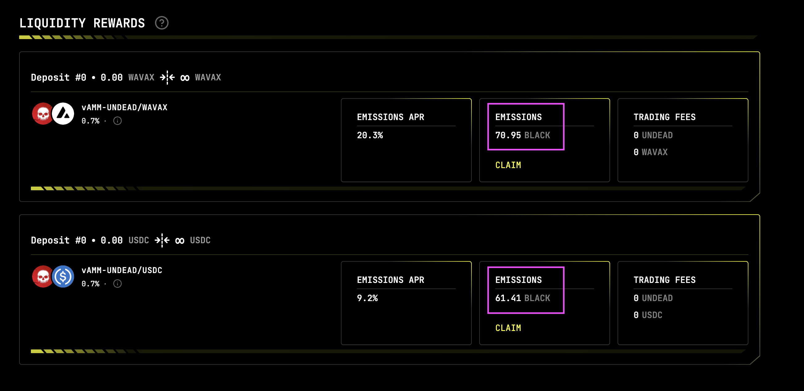 
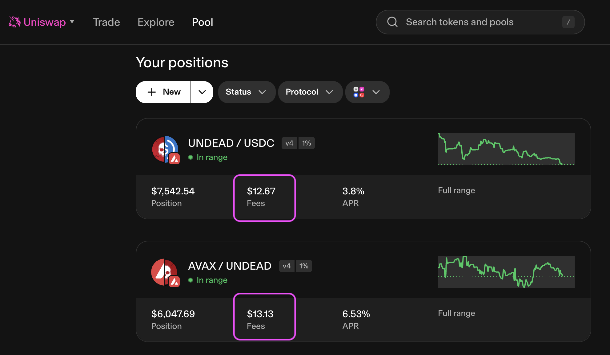 

* swap the yields to $AVAX 

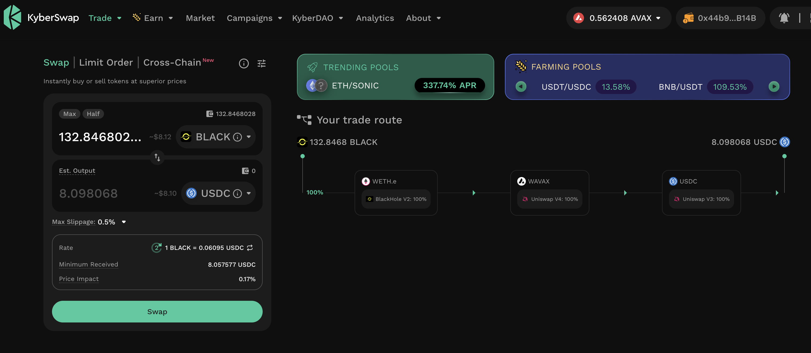 
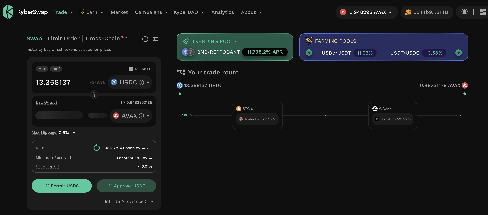 

## Liquidity Pool Positions 

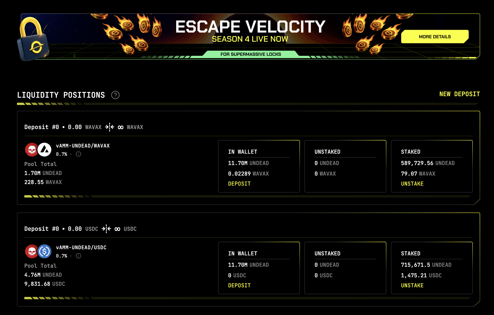 
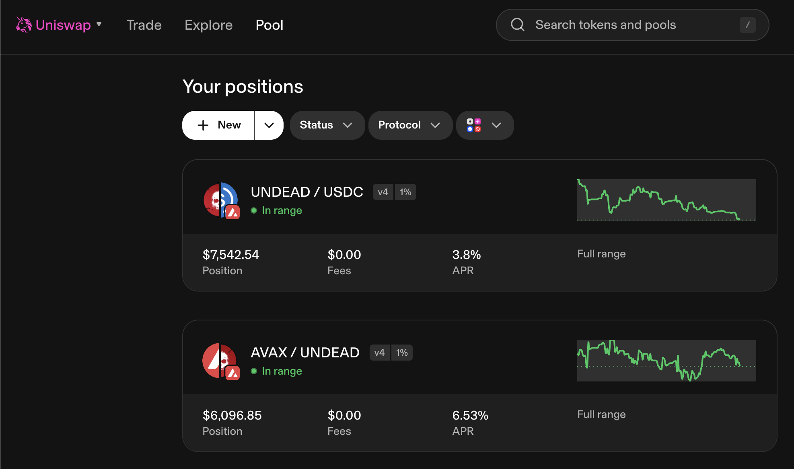 

The Blackhole and Uniswap $UNDEAD LPs are as shown. 

# Vault 

* I swap some accumulated $AVAX to $BTC.b 

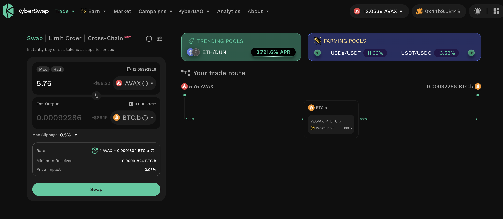 

* I send this $BTC.b and $UNDEAD accumulated from the LP-yields on Uniswap to the vault 

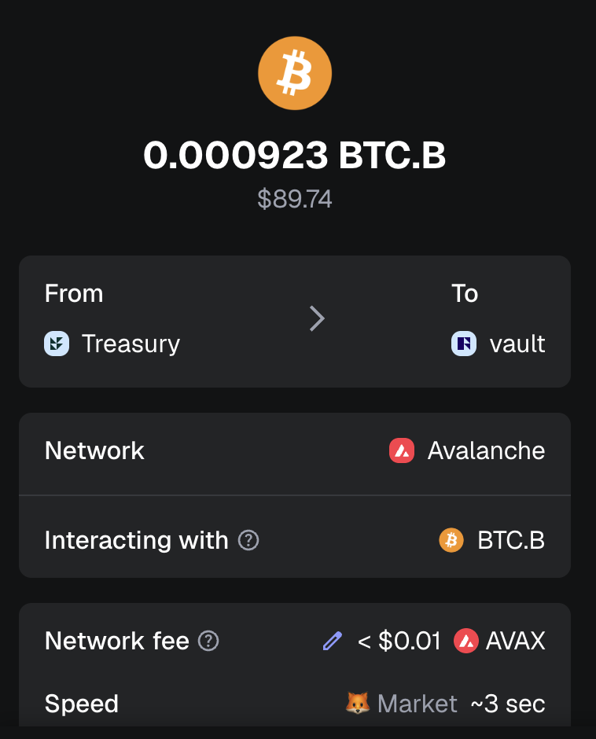 
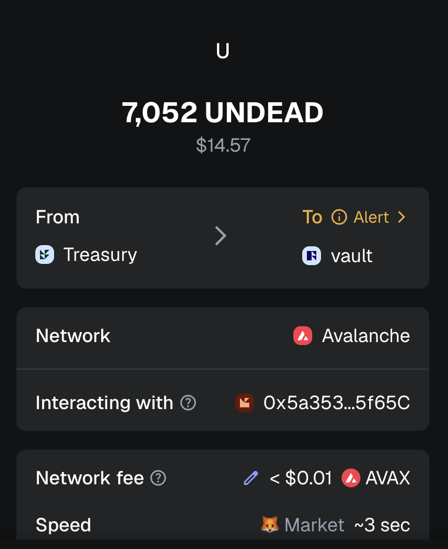 

