# Road to Production

Good morning, pivoteurs!

Onward toward production!

I met with @wagyugames and Encke Tech. We discussed next steps toward 
integrating the Pivot Protocol into the @UndeadBlocks dashboard on-chain.

I also continue work on back-end automation to make pivot arbitrage more 
efficient.

# First backend automation dapp

We present our first dapp in backend automation for the Pivot protocol: 
[chihuahua](https://github.com/pivoteur/protocol/tree/main/dapps/chihuahua)

> `$ chihuahua HBAR USDC $LE_DATE`

* where `$LE_DATE` is my shell-alias to today's date

Makes a close-pivot recommendation in the HBAR+USDC pivot pool on @hedera for a computed ROI of 32%

Not bad! Not bad! 

## multiple recommendations

Making 1 recommendation is all well-and-good, but where the automation really 
shines when it makes multiple recommendations on a pivot pool.

In this case `chihuahua` makes 8 recommendations for the BTC+USDC pivot pool – 
all at once! – saving me a hours of work.

## Future work

The reason why this dapp is called `chihuahua` and not `wulf` (for the backend 
system: `baewulf`, ...GEDDIT?) is because it's very limited (a pre-pre-wulf, 
if you will).

FUTURE WORK: 

* automation across all pivot pools
* consolidation of all recommendations into 1 close pivot

## `chihuahua` rollout

Future work notwithstanding, I am rolling out `chihuahua` into my daily pivot 
arbitrage workflow, starting today, anticipating saving hours each day in my 
daily operations and maintence of the Pivot Protocol.

# PIVOTS

Okay, so! Let's use the automation of the chihuahua dapp to help with pivot 
arbitrage.

The runs on BTC+ETH and BTC+AVAX pivot pools have no recommended close pivots, 
but the BTC+USDC pivot pools has 8 close pivot calls.

Let's look at those recommendations.

## BTC+USDC

Doing the first "semi-automated" close pivot on the BTC+USDC pivot pool was educational.

The repository was out-of-synch with the pool's pivots, so I 'over-pivoted' assets which I had to trade back.

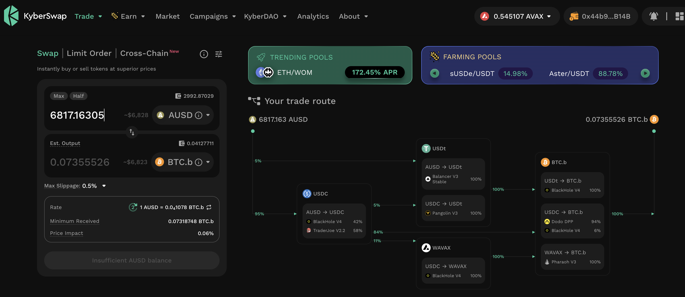
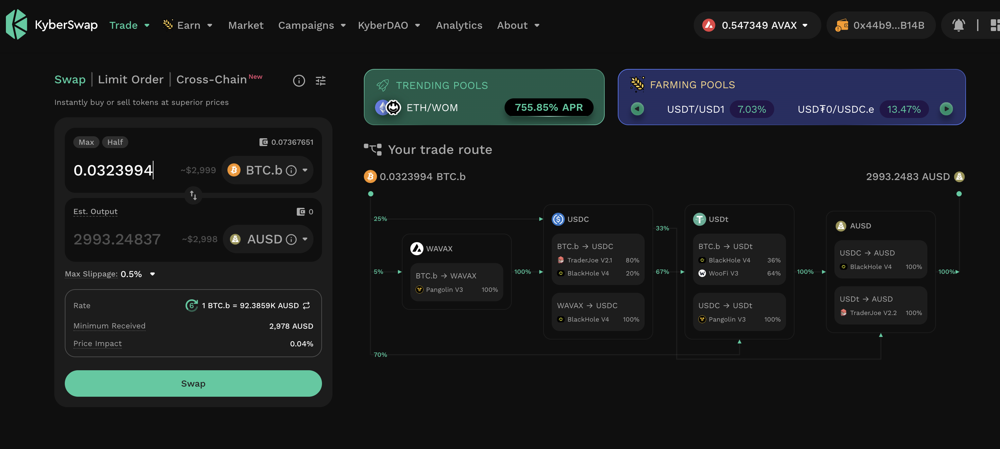

Overall, a good pivot!

* actual ROI: 20.27% / 102.05% APR projected

### Automation missed close pivot call

But this 'out-of-synch' repository got me thinking: did I miss an open pivot that I could close?

The answer turned out to be yes with one more pivot:

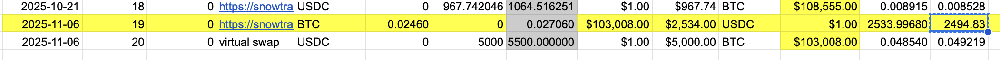
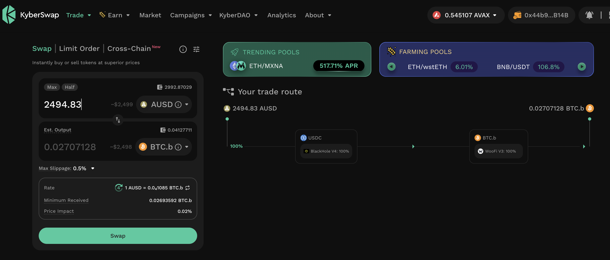

* actual ROI: 10% / 262.37% APR projected 

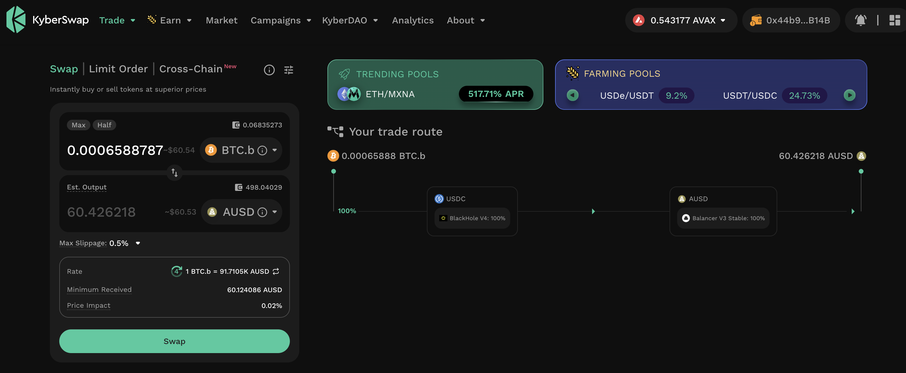
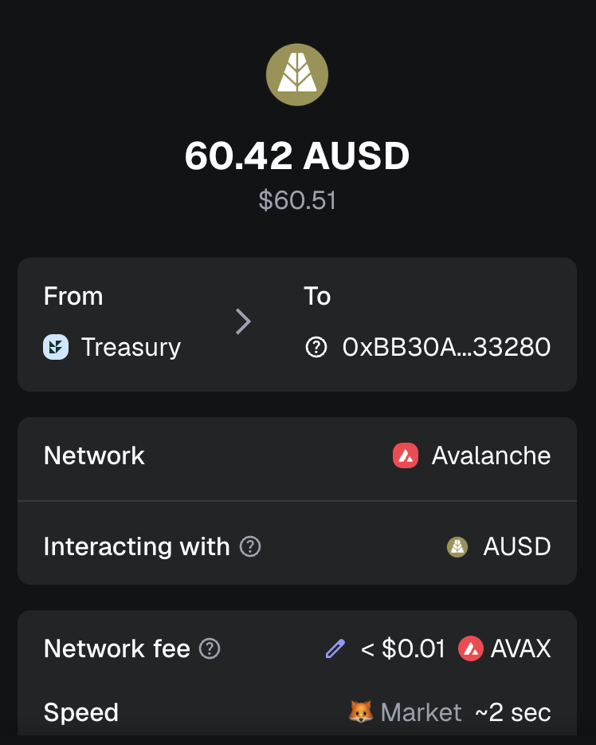

I swap to stable to distribute to stakers and reinvest gained $BTC for other stakers.

## Open BTC+USDC pivots 

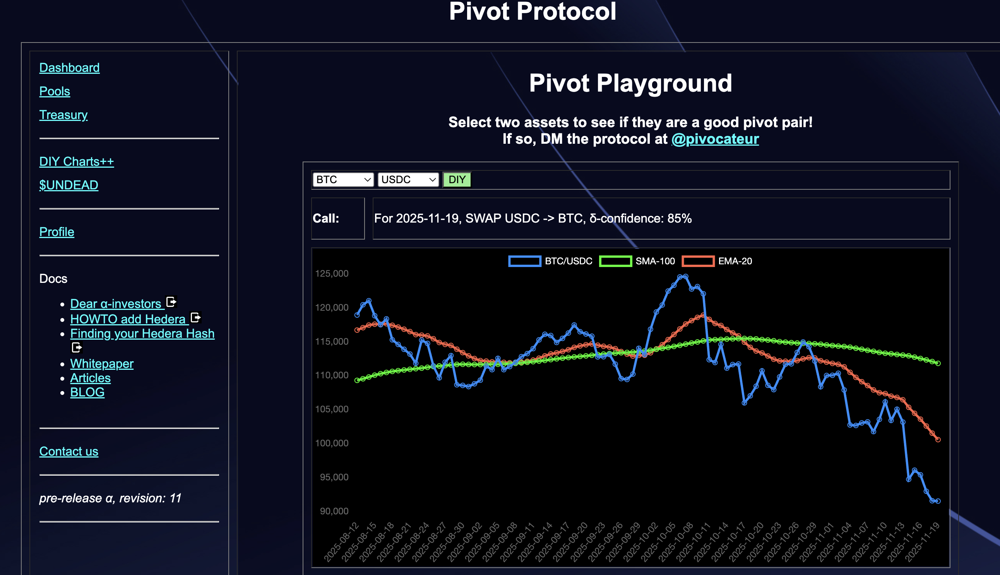 
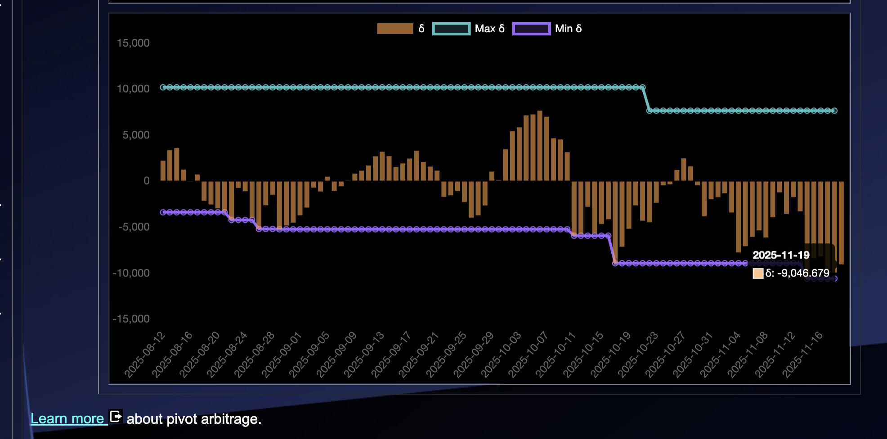 

The negative δ calls to open an USDC-on-BTC pivot, which I do. 

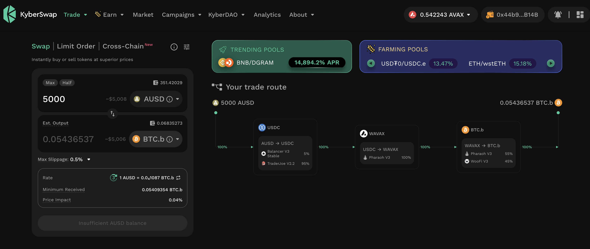 

I also open an BTC-on-USDC hedge. 

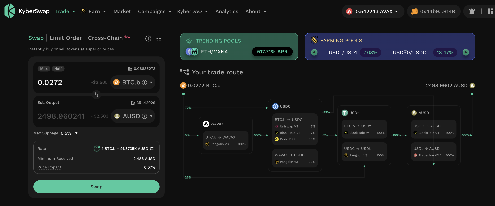 

The BTC+USDC pivot pool composition and γ-apportionment are as charted. 

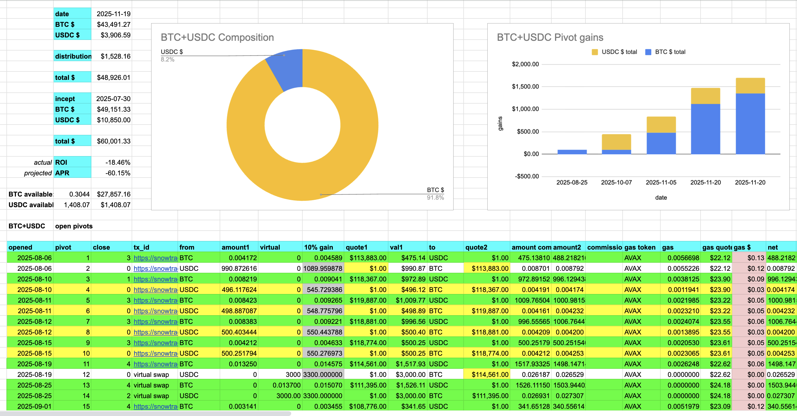 
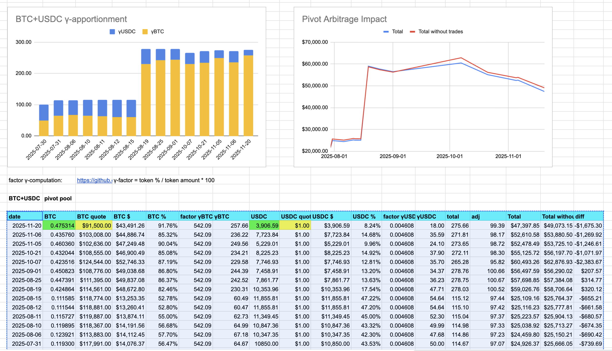 

