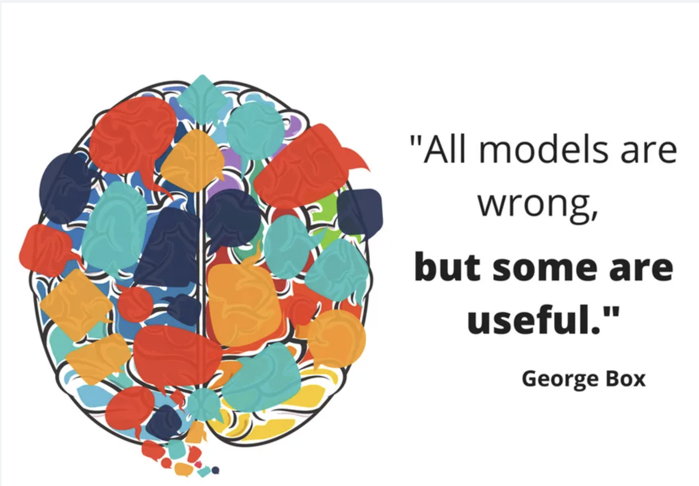
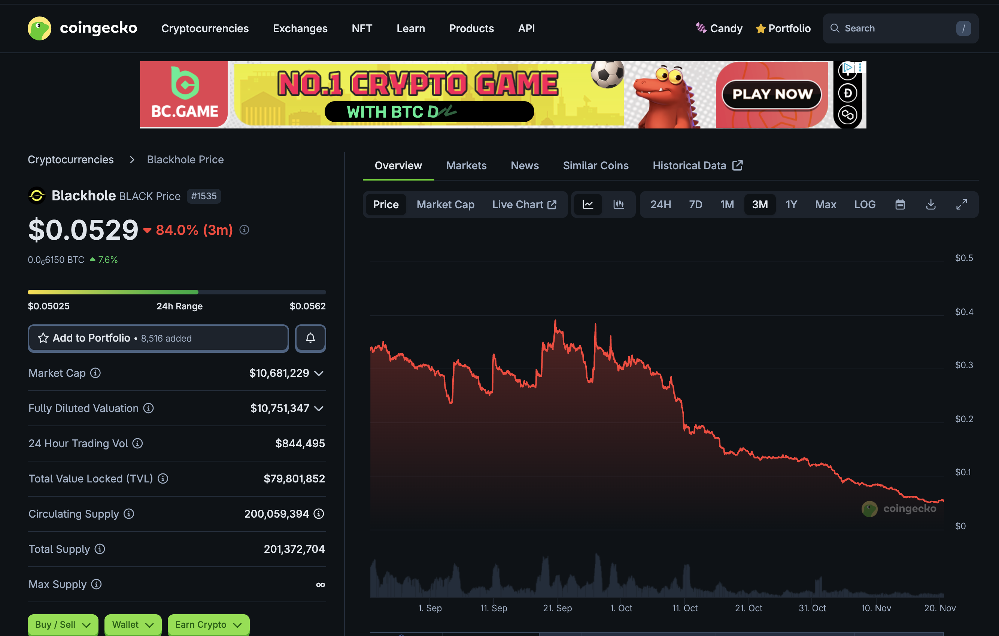
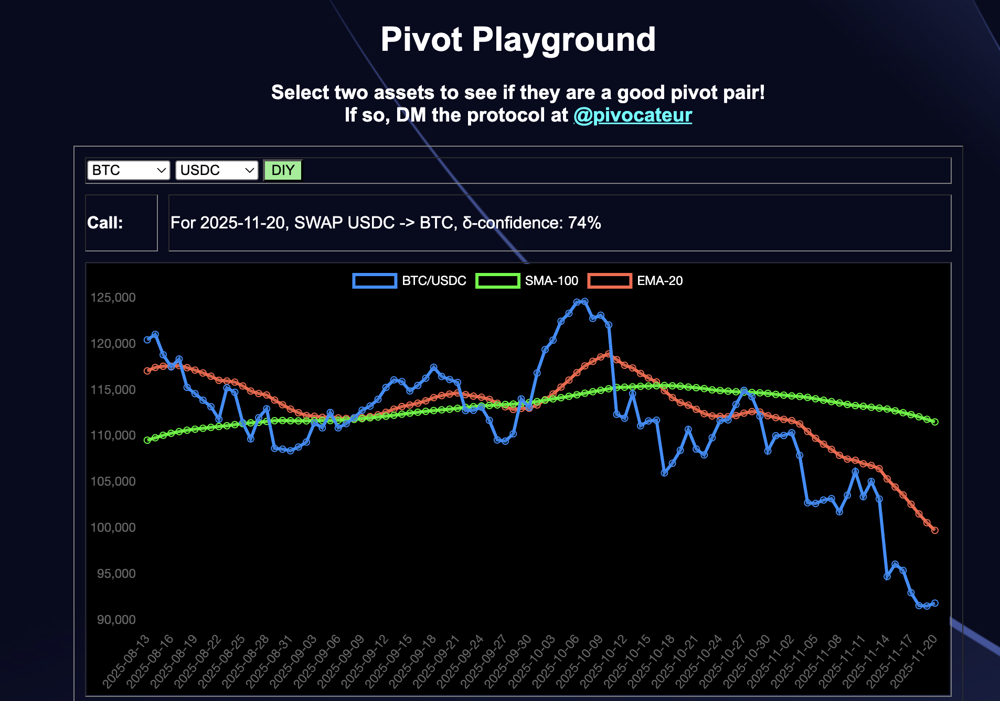
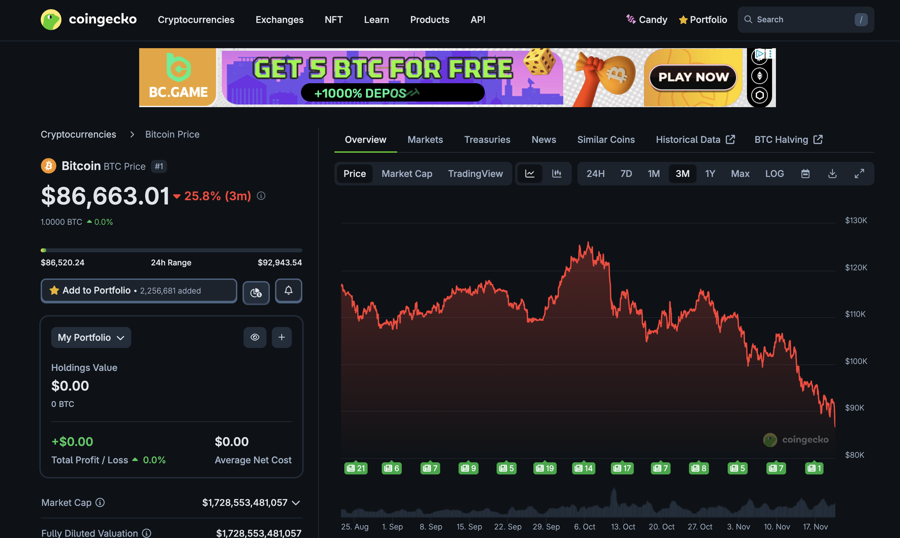
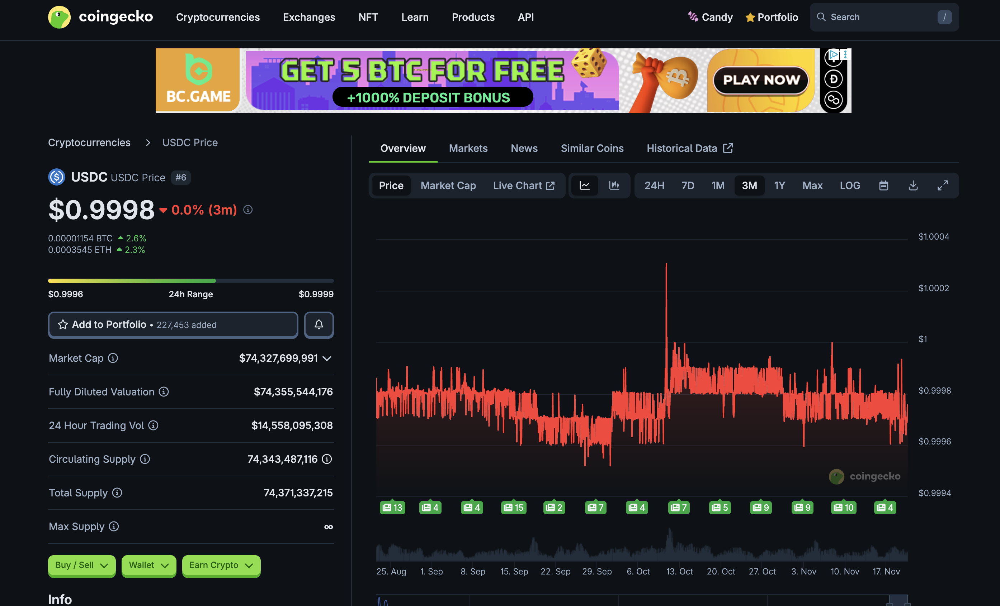

# Yesterday's workflow retrospective

2025-11-20

Good morning, pivoteurs!

Yesterday was supposed to be an exercise in time-SAVING, but turned into an exercise of putting-out-fire-after-fire because my model did not match the pivot-pool state.

Lesson learned: check, and recheck, the model to the pool before executing trades.

Yesterday's work, ending at 3:14 am this morning, took much longer than usual... 'disproving' that automation helps?

Nah. This is all part of the process. I have to iron out the kinks in the system, and it's better to catch them sooner, rather than later.

AND we closed a pivot!

## Checksum

To this end, that end being 'self-policing,' I've added checksums to the automated recommendations, so that I can quickly check that the internal Rust-model is the same as the active pivots I have on the pivot pool being analyzed.

Still very manual, but a step toward automation.
# Vote for $UNDEAD LPs on Blackhole 

2025-11-20 

 Good day, pivoteurs! 

A new day; a new Epoch on @BlackholeDex. 

Reminder to go [vote](https://blackhole.xyz/vote) for the @UndeadBlocks $UNDEAD liquidity pools on that DEX. 

 
 

[HOWTO vote instructions](https://x.com/pivocateur/status/1945637734682341791) 

#IVotedForUNDEAD 

# Pivot Arbitrage 

2025-11-20 Good day! 

Which way, pivoteurs? 

 
 
 

- [ ] $BTC 
- [ ] $USDC 
- [ ] both 
- [ ] Can you do the pivot arbitrage for me, al geophf?* 

*yes. [Yes, I can](https://pivoteur.github.io/diy.html?t1=BTC&t2=USDC). 😎 

