# BTC and automation

Good morning, pivoteurs! 2025-11-21

$BTC is doing what $BTC is doing.

Meanwhile, for my backend-automation, one minor, necessary, tweak is to show what a 10% gain in the close pivot would be.

This is necessary to close a pivot from simulated to frfr.

## Future work for automation

Okay, now I have two directions for future work:

1. consolidate all pivot close recommendations to one trade per side. This'll be a bit of infrastructure-work.

2. Automagically interate over all pivot pools to make a daily recommendation en masse, collating all assets to pivot.

... but before this coder gets carried away doing his favorite thing (spoiler: coding), let's do the daily workflow.

# Pivot Arbitrage 

2025-11-21 Good day! 

Which way, pivoteurs? 

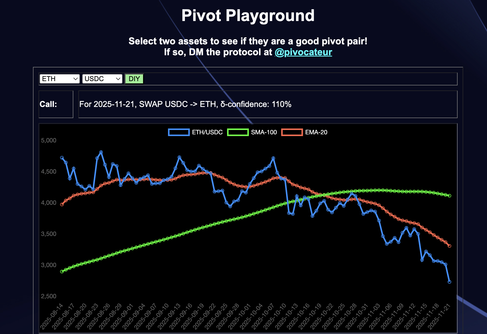 
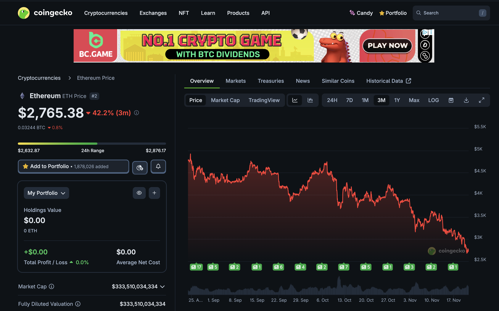 
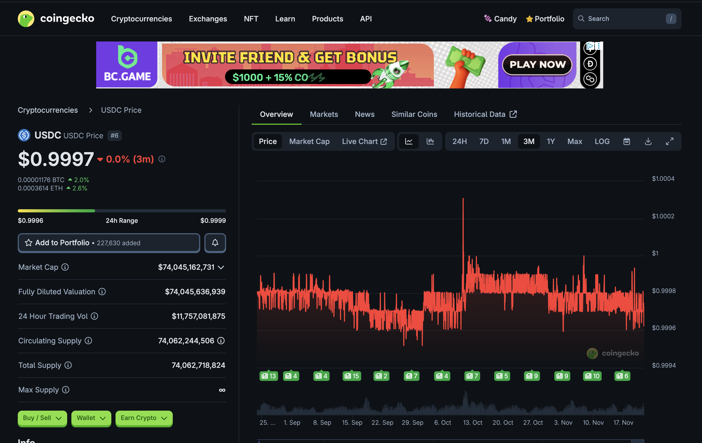 

- [ ] $ETH 
- [ ] $USDC 
- [ ] both 
- [ ] Can you do the pivot arbitrage for me, al geophf?* 

*yes. [Yes, I can](https://pivoteur.github.io/diy.html?t1=ETH&t2=USDC). 😎 

Some people panic when The Dip™️hits.
 Me? I smell opportunity, ... and get to WORK!

# Liquidity Pool Positions 

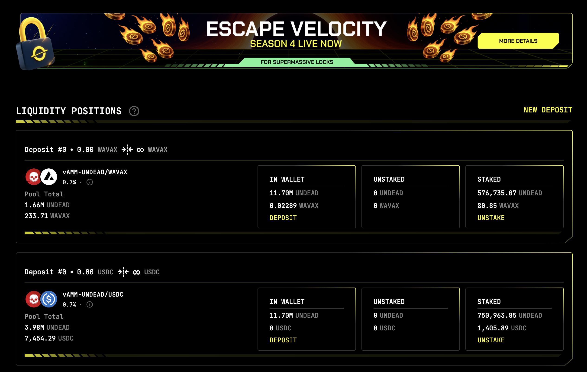 
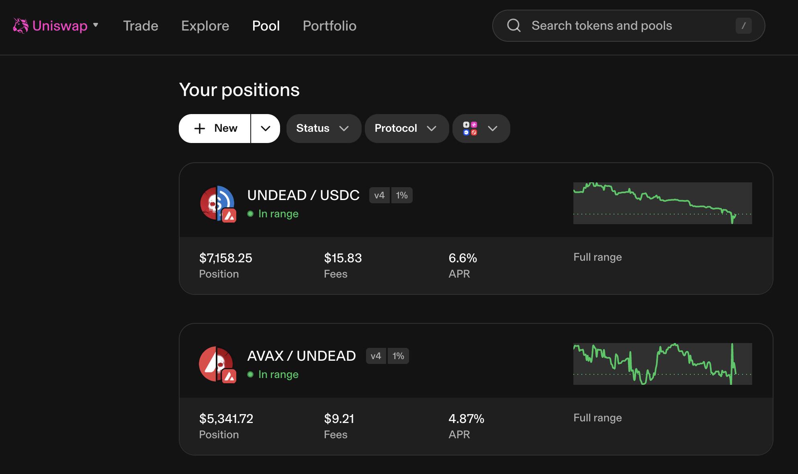 

The Blackhole and Uniswap $UNDEAD LPs are as shown. 

# Vault 

* I swap some accumulated $AVAX to $BTC.b 

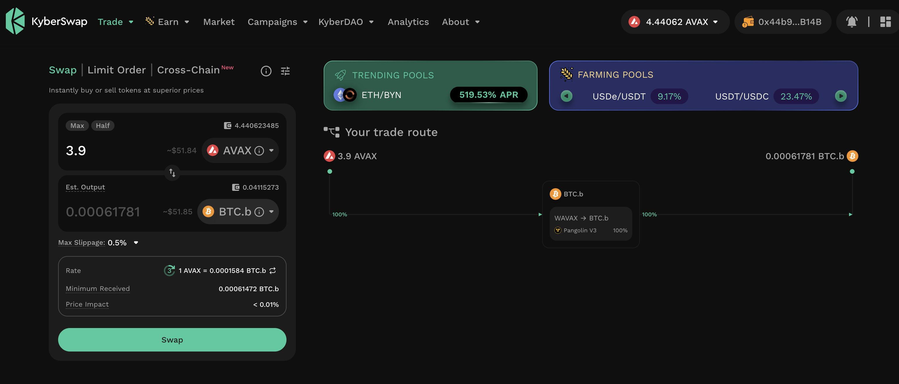 

* I send this $BTC.b to the vault 

 

# PIVOTS 

## BTC+ETH 

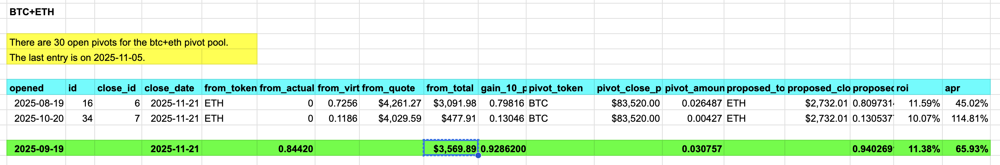 
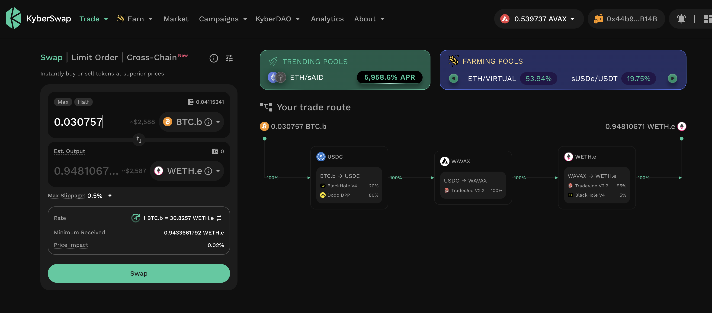 

Automation calls to close 2 ETH-on-BTC pivots (which I manually confirm) for gains of: 

* actual ROI: 12.28% / 70.02% APR projected 
* or: 0.844200 $ETH -> $BTC -> 0.947774 $ETH 
* or: $283.22 gain on 2 pivots totalling $3,569.89 

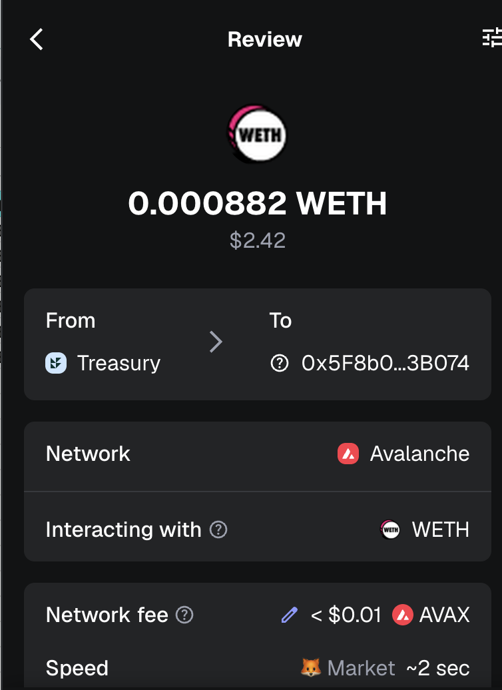 

I reinvest the gains or distribute 80% to stakers. 

## Open BTC+ETH pivots 

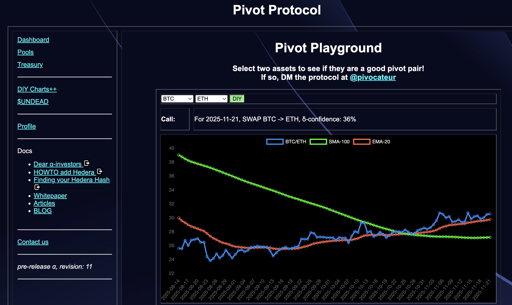 
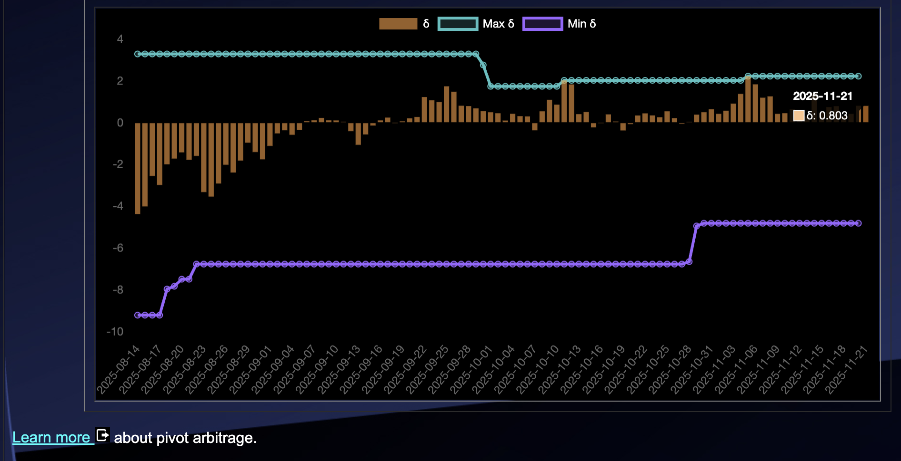 

The positive δ calls to open an BTC-on-ETH pivot, which I do. 

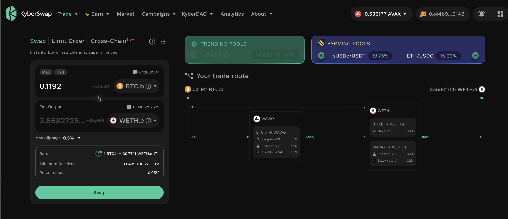 

I also open an ETH-on-BTC hedge. 

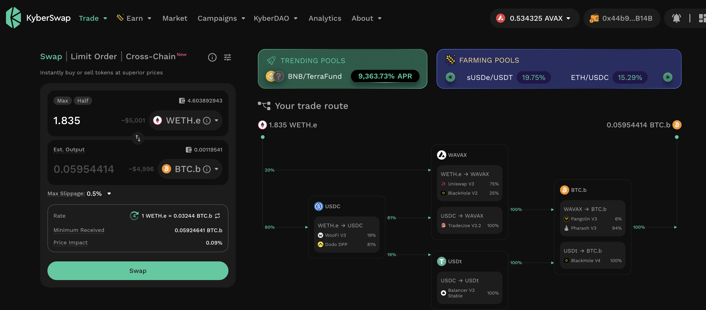 

The BTC+ETH pivot pool composition and γ-apportionment are as charted. 

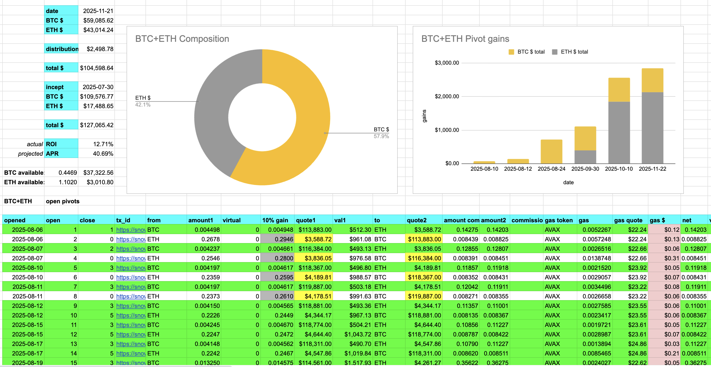 
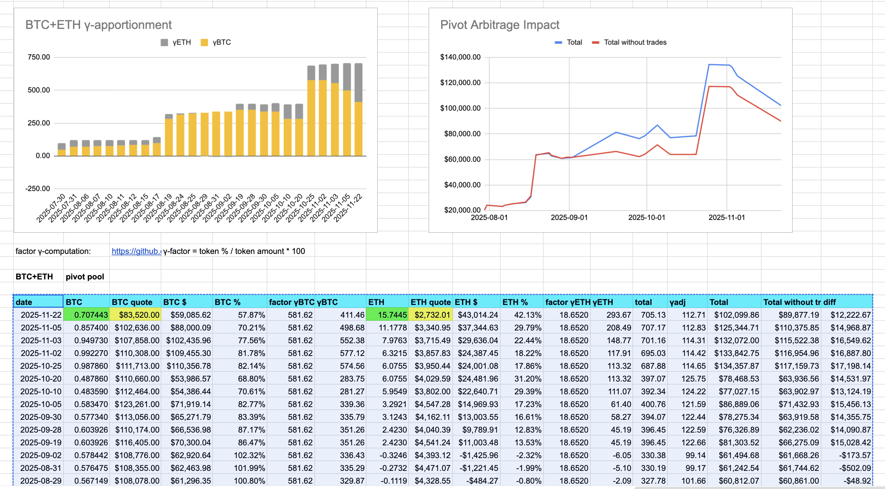 

