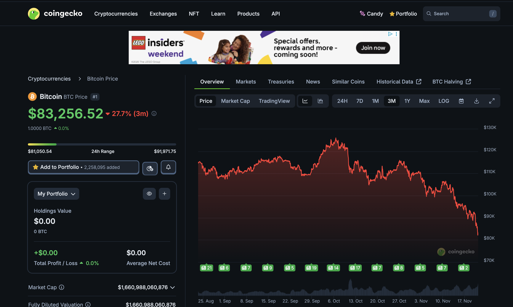
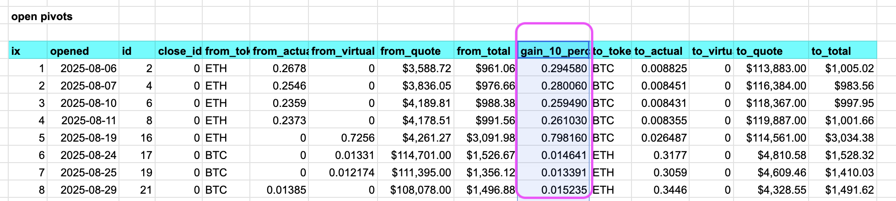

# BTC and automation

Good morning, pivoteurs! 2025-11-21

$BTC is doing what $BTC is doing.

Meanwhile, for my backend-automation, one minor, necessary, tweak is to show what a 10% gain in the close pivot would be.

This is necessary to close a pivot from simulated to frfr.
