# DEX HBAR/USDC-swap Race 

Same swap; 3 DEX, 2025-11-23 

I swap 3000 $HBAR for: 

1. 460.54 $USDC on @SaucerSwapLabs 💥 

 

2. 448.98 $USDC on @SimpleSwap_io 

 

3. 441.36 $USDC on @HSuiteNetwork 

 

Winner: @SaucerSwapLabs 💥 New title-holder! 

> Today is the first day where we do the DEX-race on @hedera. 

# PIVOTS 

## BTC+ETH 

* There are 30 open pivots for the BTC+ETH pivot pool. 
* The last entry is on 2025-11-22. 
* Recommendations are made for token quotes on 2025-11-23. 

> No close pivot recommendations for BTC+ETH pivot pool. 

## Open BTC+ETH pivots 

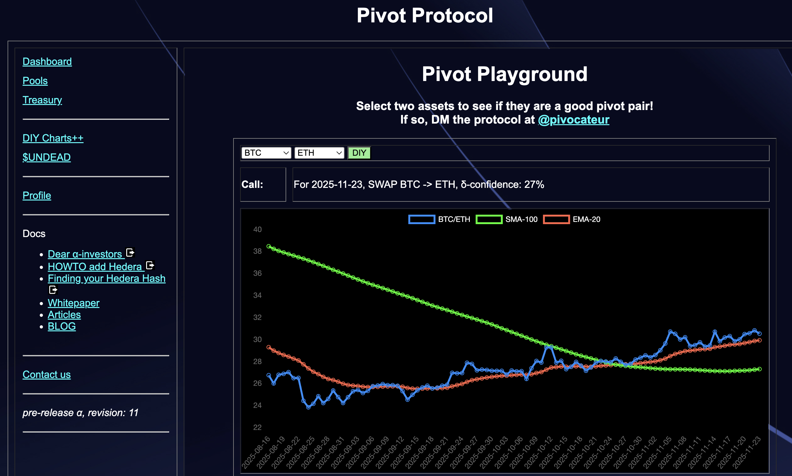 
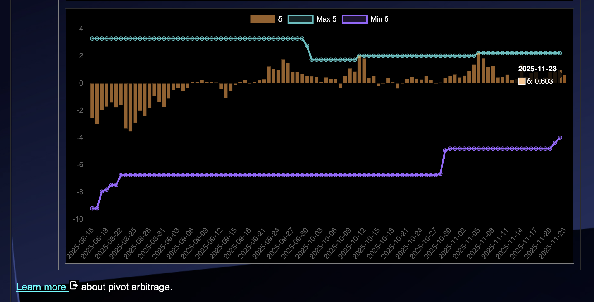 

The positive δ calls to open an BTC-on-ETH pivot, which I do. 

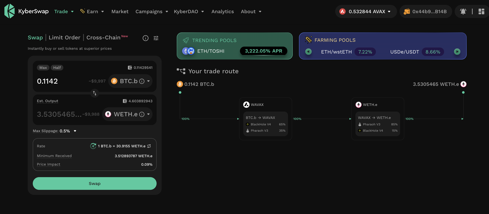 

I also open an ETH-on-BTC hedge. 

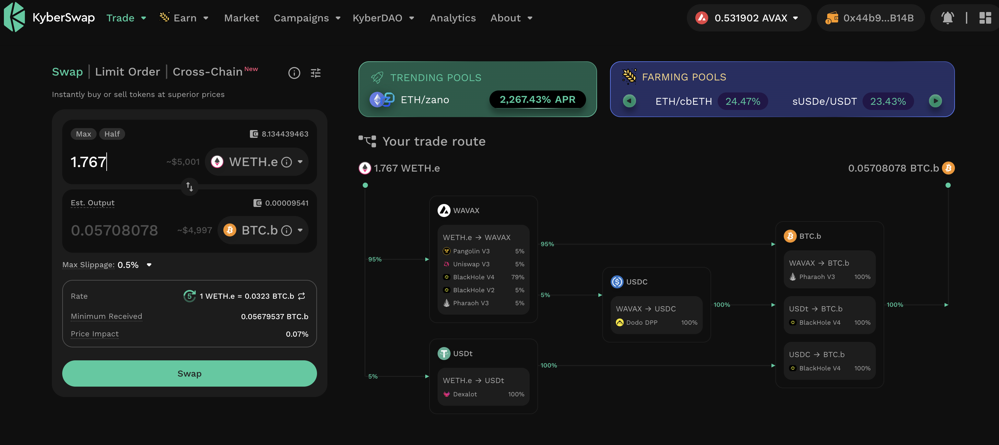 

The BTC+ETH pivot pool composition and γ-apportionment are as charted. 

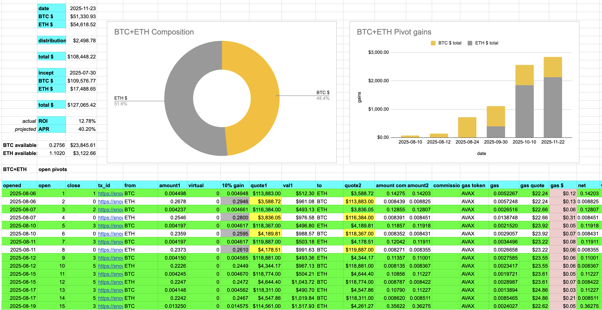 
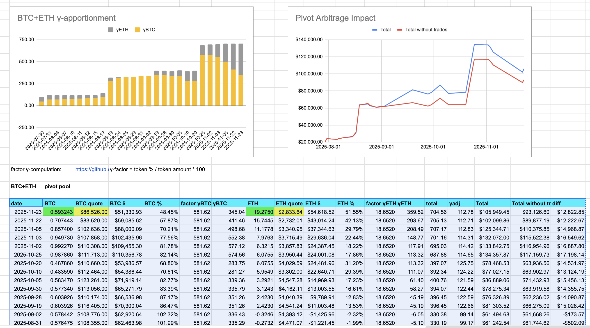 

## BTC+AVAX 

* There are 7 open pivots for the BTC+AVAX pivot pool. 
* The last entry is on 2025-11-05. 
* Recommendations are made for token quotes on 2025-11-23. 

> No close pivot recommendations for BTC+AVAX pivot pool. 

## Open BTC+AVAX pivots 

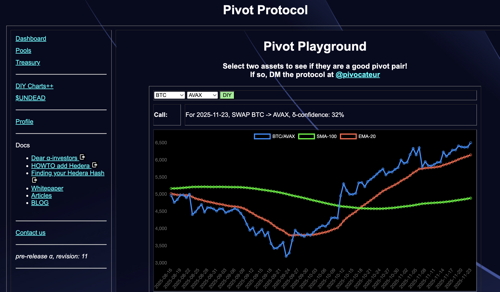 
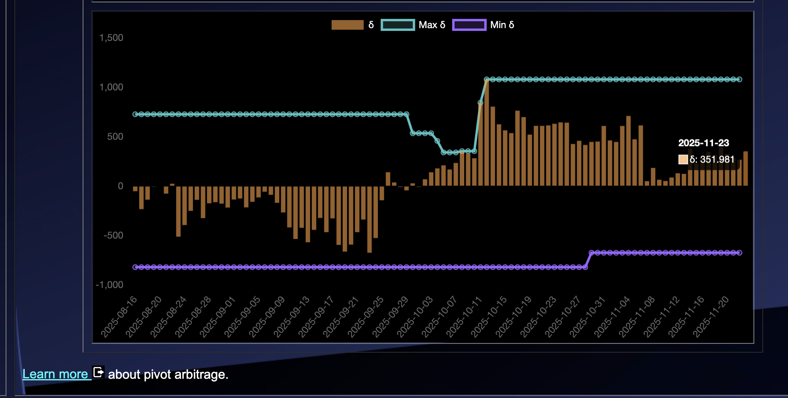 

The positive δ calls to open an BTC-on-AVAX pivot, which I do. 

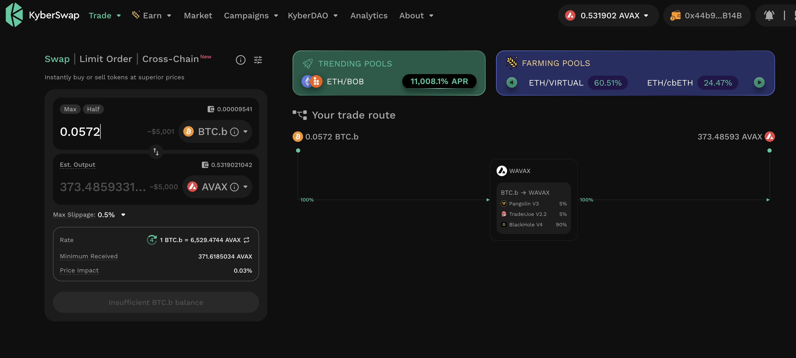 

I also open an AVAX-on-BTC hedge. 

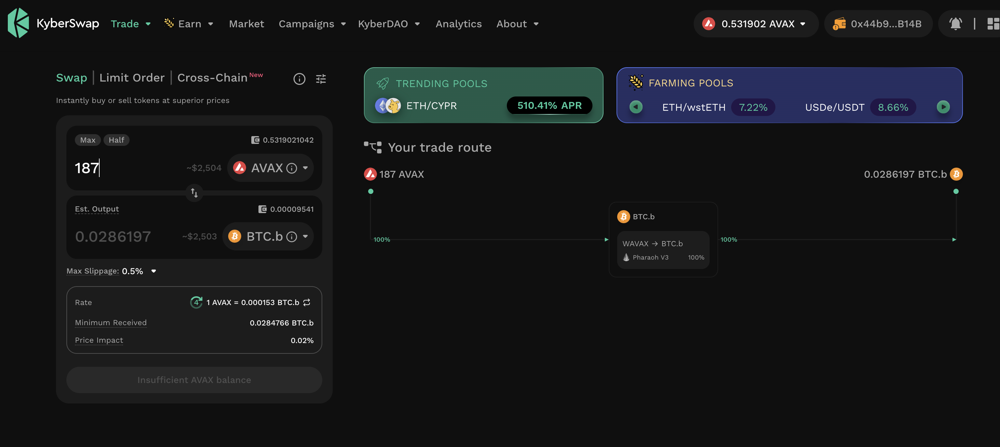 

The BTC+AVAX pivot pool composition and γ-apportionment are as charted. 

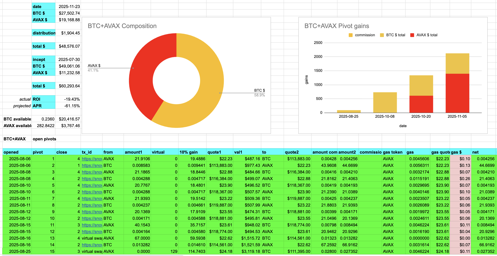 
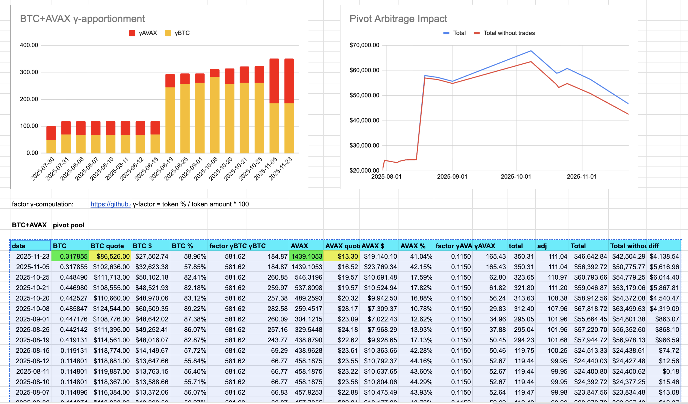 

## BTC+USDC 

* There are 10 open pivots for the BTC+USDC pivot pool. 
* The last entry is on 2025-11-20. 
* Recommendations are made for token quotes on 2025-11-23. 

> No close pivot recommendations for BTC+USDC pivot pool. 

## Open BTC+USDC pivots 

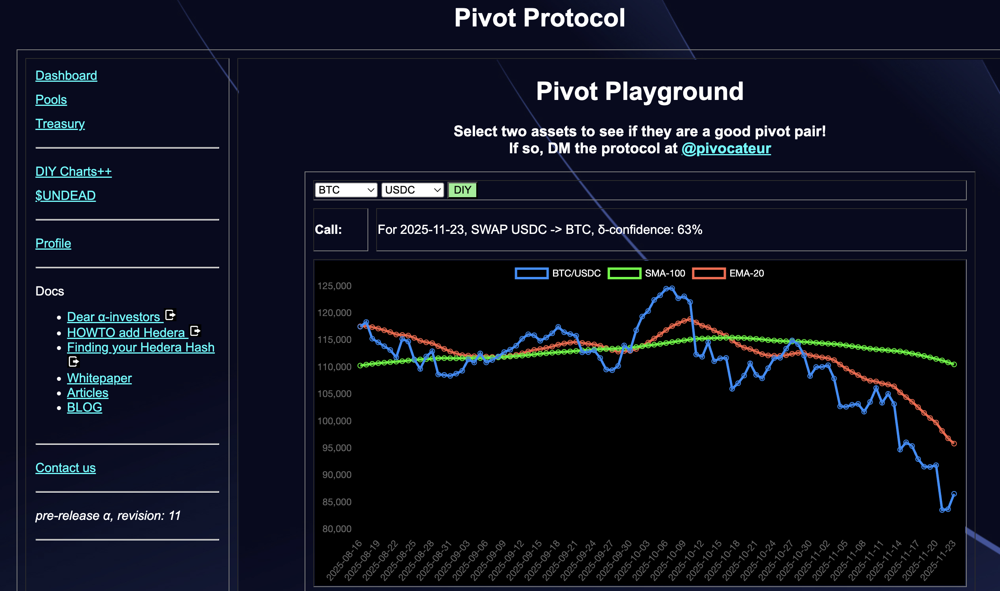 
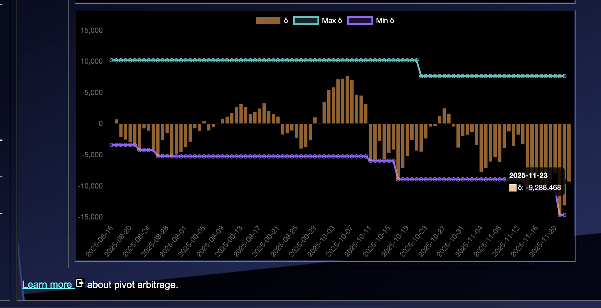 

The negative δ calls to open an USDC-on-BTC pivot, which I do. 

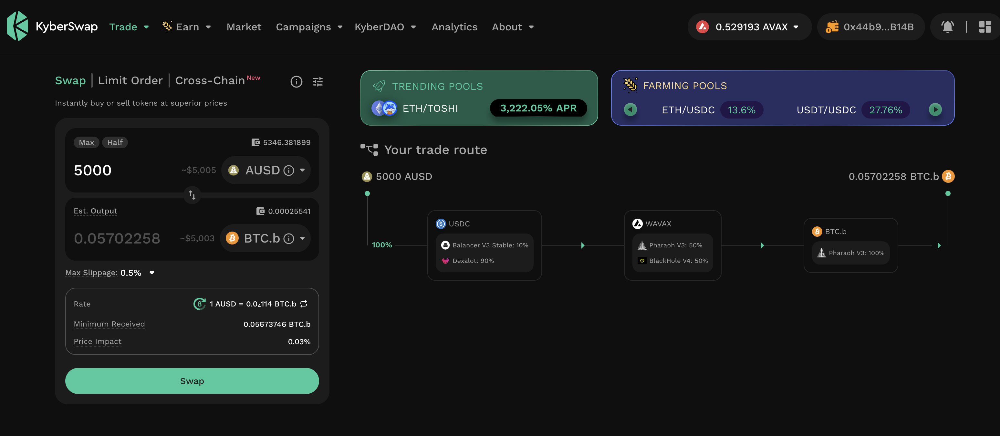 

I also open an BTC-on-USDC hedge. 

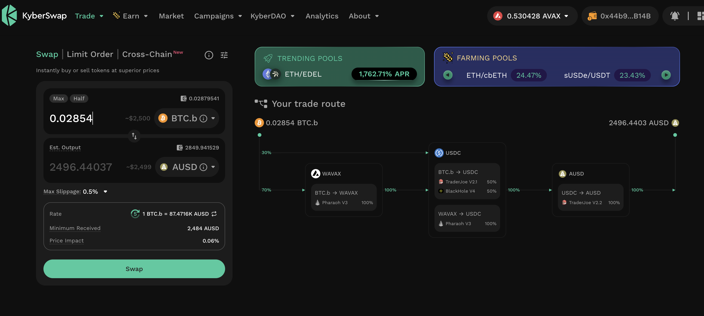 

The BTC+USDC pivot pool composition and γ-apportionment are as charted. 

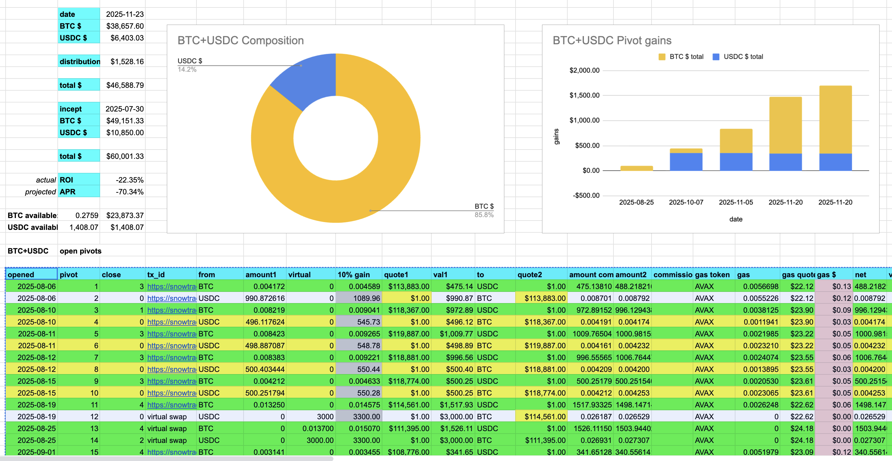 
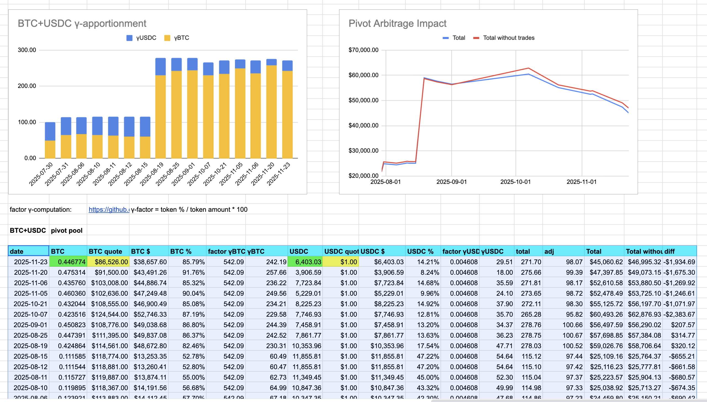 

## BTC+UNDEAD 

* There are 14 open pivots for the BTC+UNDEAD pivot pool. 
* The last entry is on 2025-10-21. 
* Recommendations are made for token quotes on 2025-11-23. 

> No close pivot recommendations for BTC+UNDEAD pivot pool. 

I DID do open pivots for BTC+UNDEAD, but my eyes are closing, so I'll record and report those data tomorrow.
