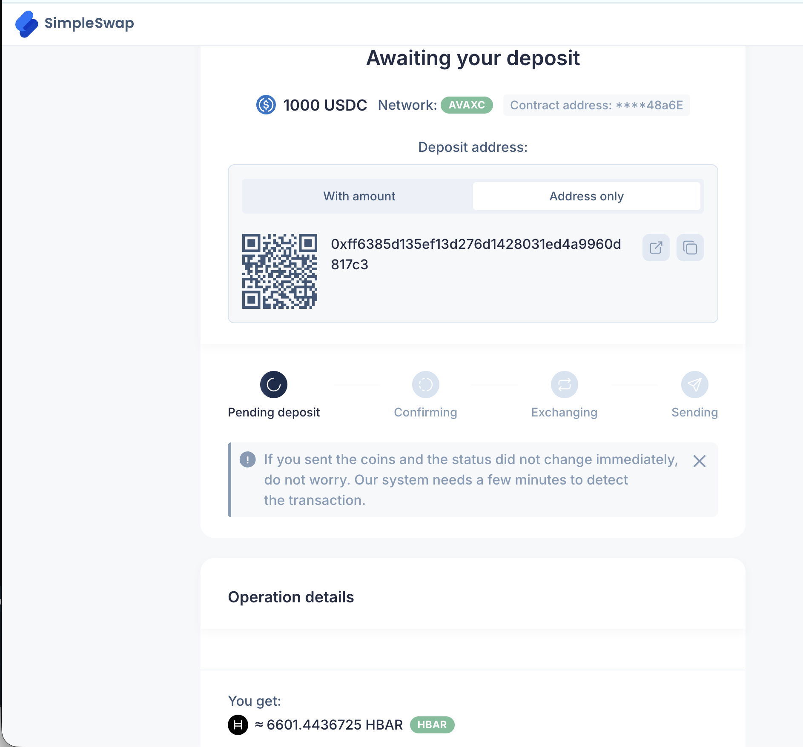
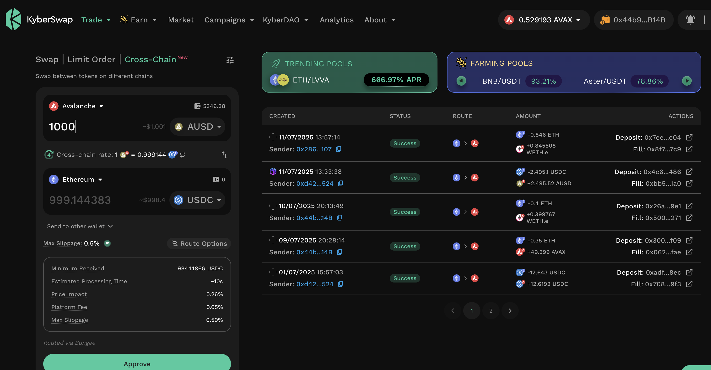
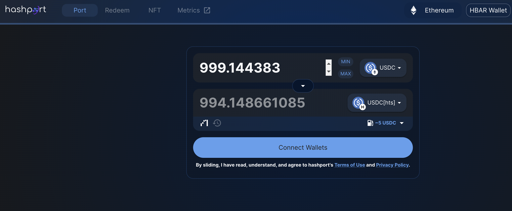
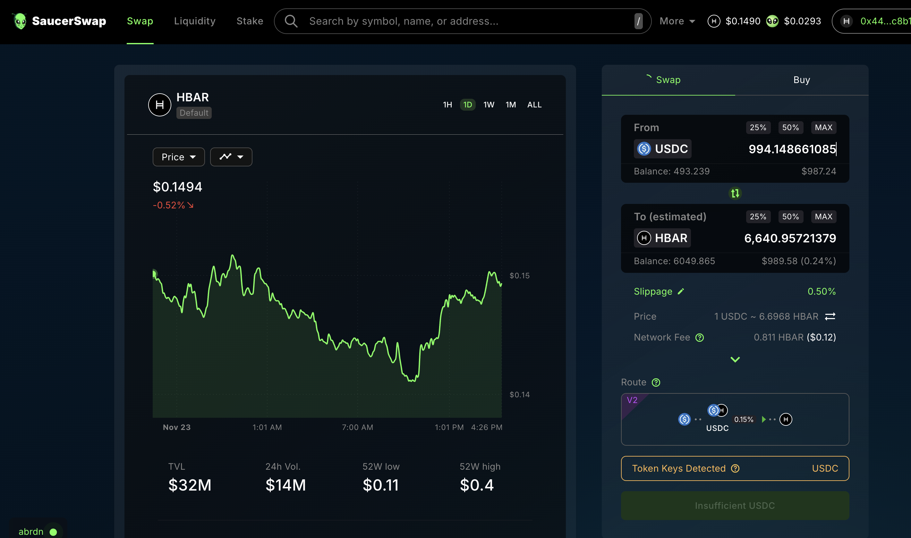
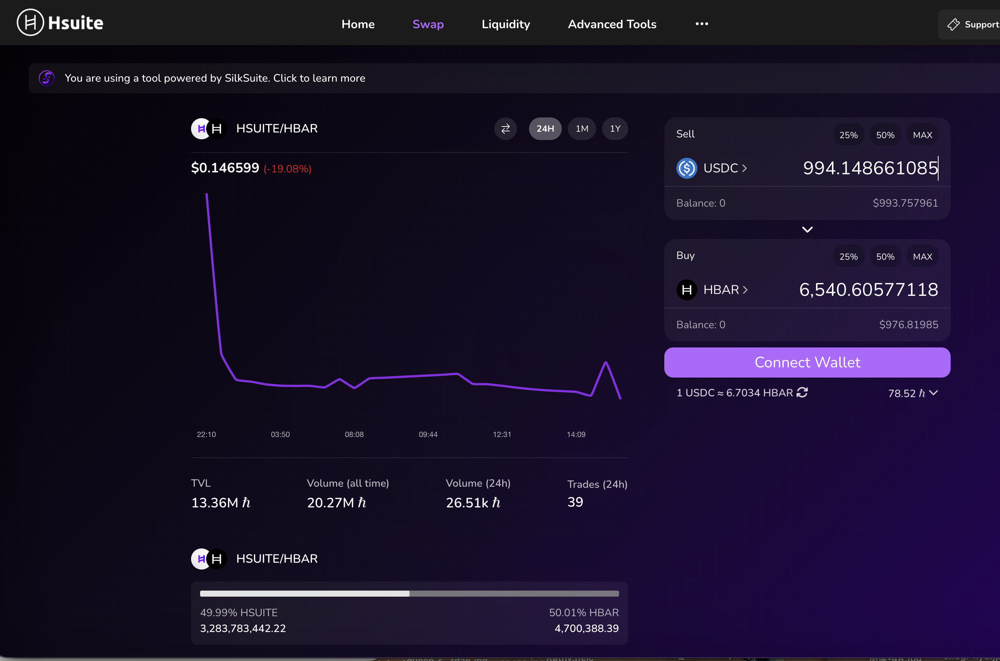

# BRIDGING
## Bridging Liquidity from Avalanche to Hedera

2025-11-24

Okay, we're going to work toward transitioning funds from @avax, where we're currently pivoting, to @hedera, where we go live with the Pivot protocol, end-of-year 2025.

I know of three ways to move liquidity from @avax to @hedera:

### SimpleSwap

I know of three ways to move liquidity from @avax to @hedera:

1. @avax $USDC -> @hedera $HBAR using @SimpleSwap_io, which has its own bridge, with its own associated (invisible) fees that show up as less $HBAR received.

1,000 @avax $USDC results in 6,601 @hedera $HBAR

### Hashport bridge

2. @avax $AUSD -> @ethereum $USDC using @KyberNetwork

  -> @hedera $USDC using @HashportNetwork (5 $USDC fee)

Then, swap to $HBAR using either:

* @SaucerSwapLabs, which has the most liquidity, yielding 6,643 $HBAR; or,

* @HSuiteNetwork, yielding 6,541 $HBAR 

(102 $HBAR less!)

