# PIVOTS 

## BTC+ETH 

* There are 32 open pivots for the BTC+ETH pivot pool. 
* The last entry is on 2025-11-23. 
* Recommendations are made for token quotes on 2025-11-26. 

> No close pivot recommendations for BTC+ETH pivot pool. 

### Transfer pivots to Hedera

Now that I've opened these pivots, let's move them to @hedera.

Easier said than done.

First thing's first. 

* I convert the $BTC and $ETH to $USDC, 

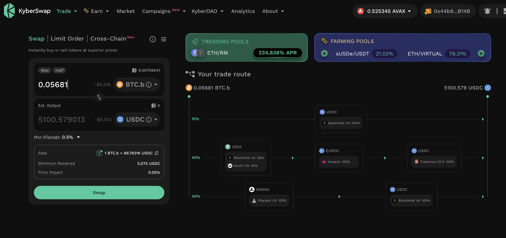
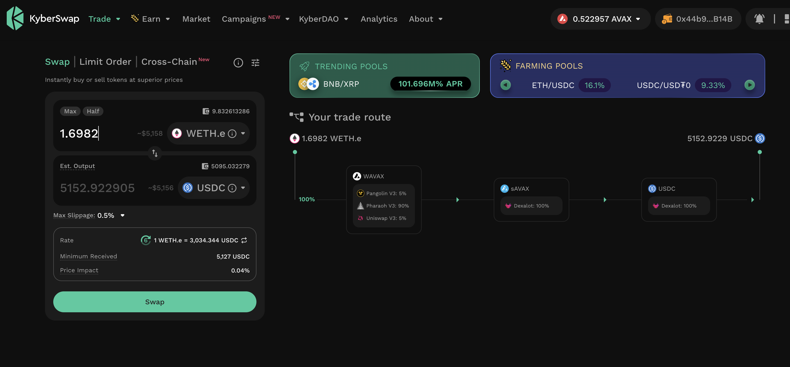

* then send that liquidity to @coinbase. 

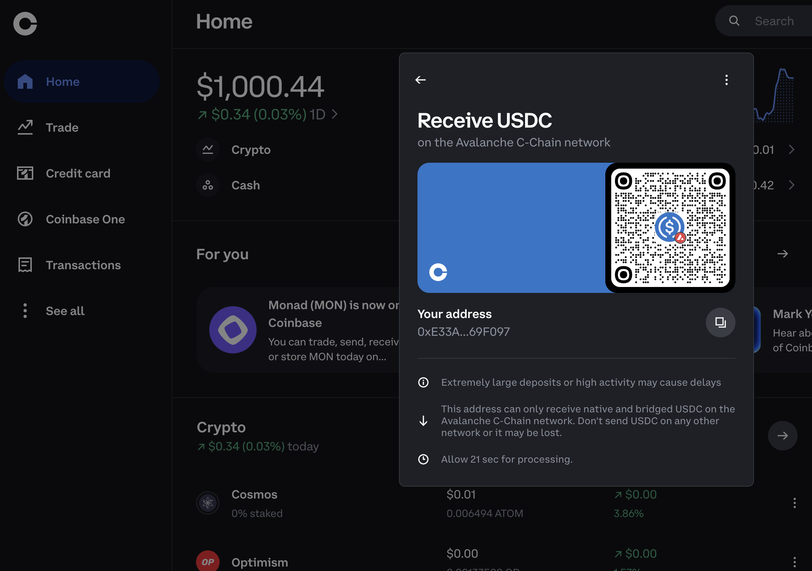
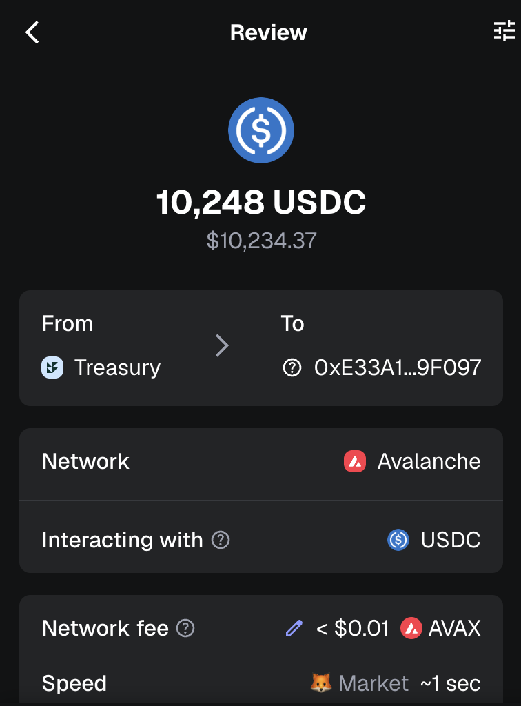

### Swap to $HBAR

Next, I swap the $USDC to $HBAR to send to @hedera, right?

Here's the thing, the @coinbase swap yields 68,260 $HBAR, 

...but the @SaucerSwapLabs of the same amount of $USDC yields 68,610.

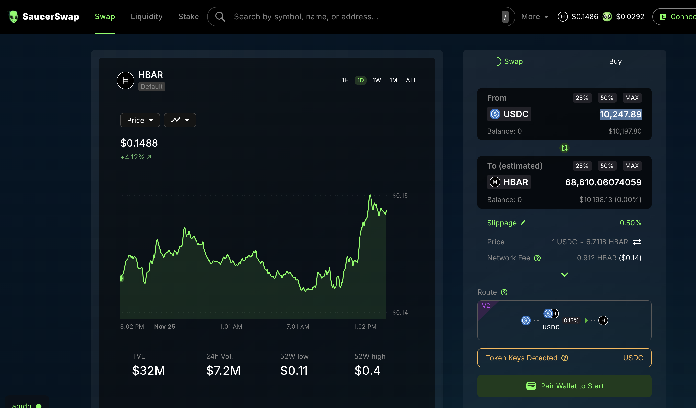

That's too much of a hit.

Or is it?

If I bridge via @HashportNetwork, I lose $50, anyway.

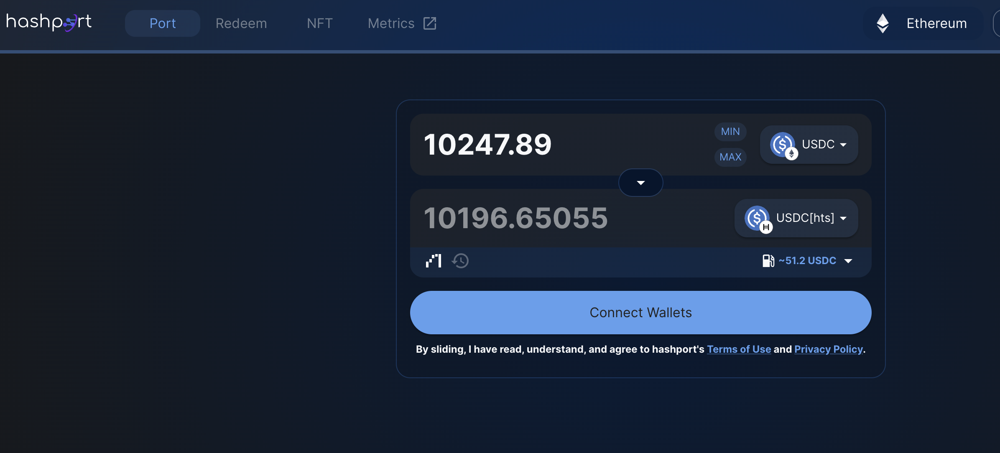
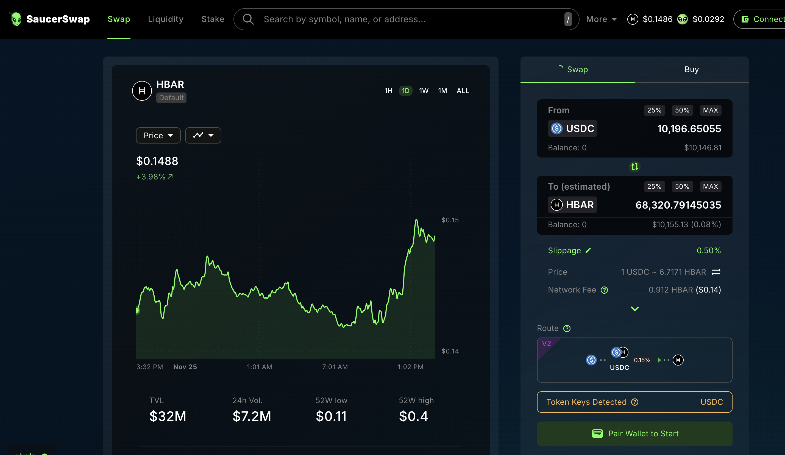

### BTC+ETH pivots on Hedera

The result is that a @coinbase swap with no bridging is within $10 of bridged assets to @hedera, so I swap to $HBAR on Coinbase and then send that liquidity to Hedera.

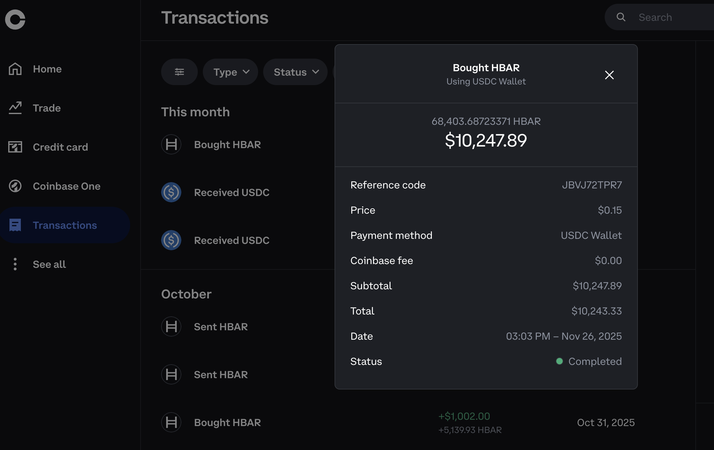
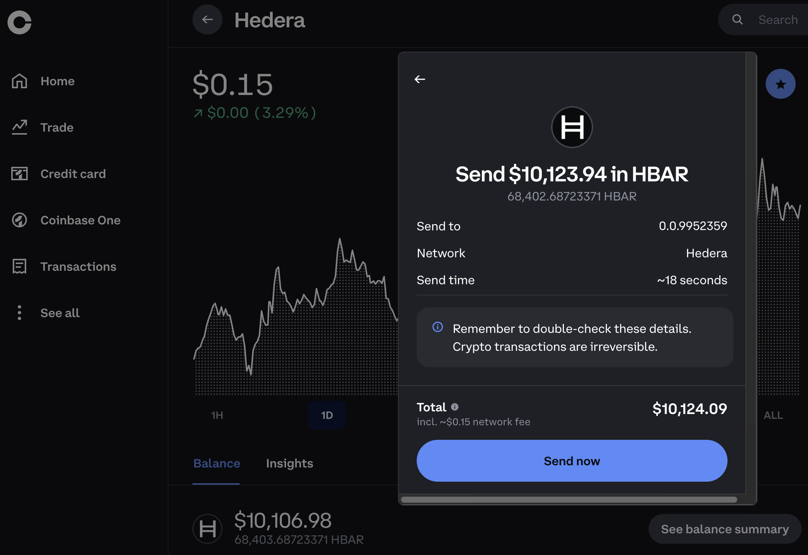

Once there (nearly instantanious), I swap to $BTC and $ETH.

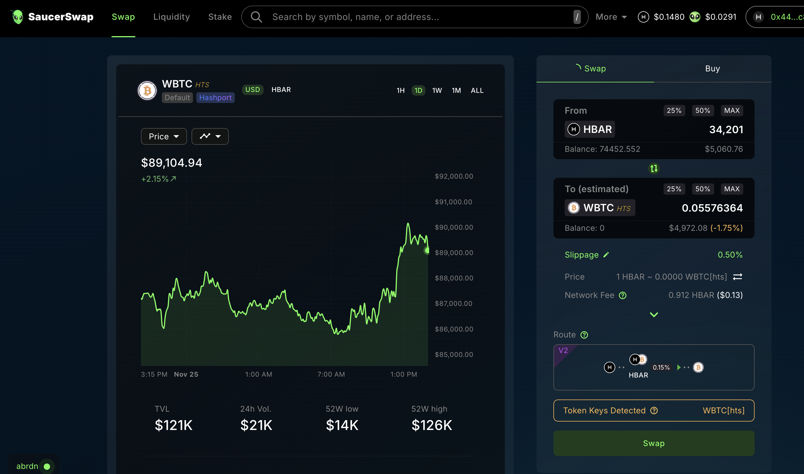
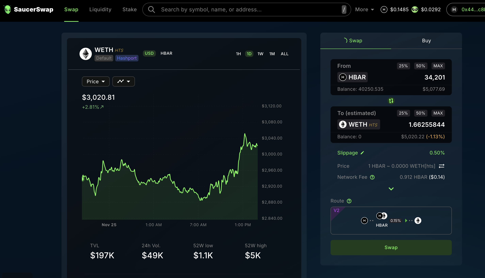

The BTC-on-ETH and ETH-on-BTC pivots that are now on @hedera are marked with a gray highlight in the open-pivot log.

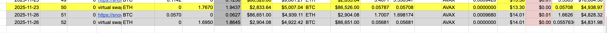

BTC+ETH pivots are now on @hedera.

The BTC+ETH pivot pool composition and γ-apportionment are as charted. 

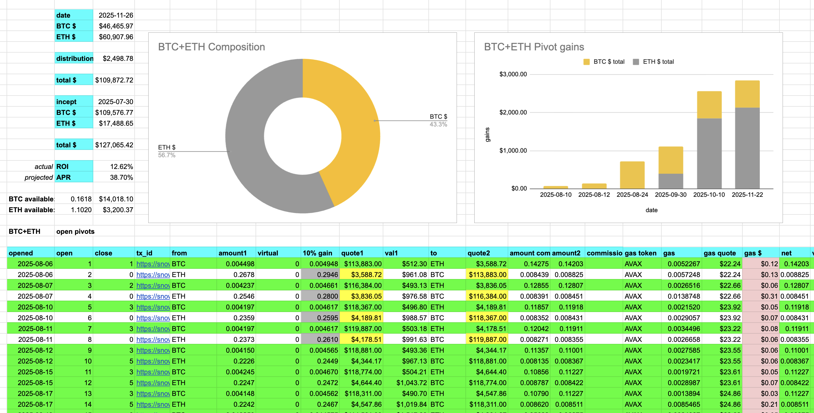 
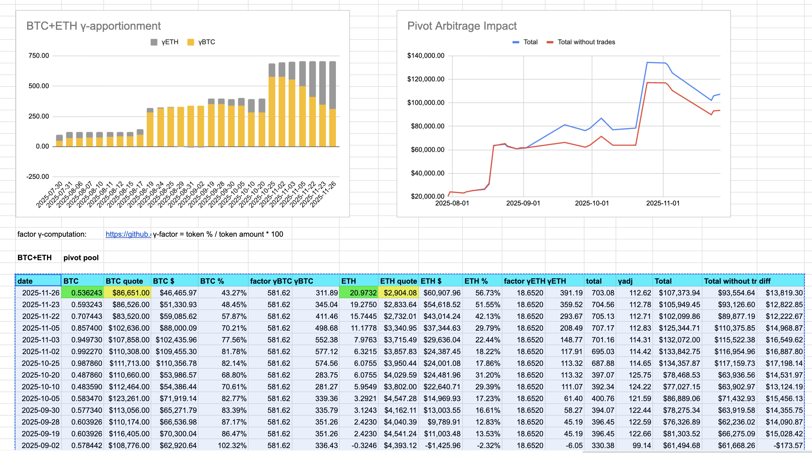 

