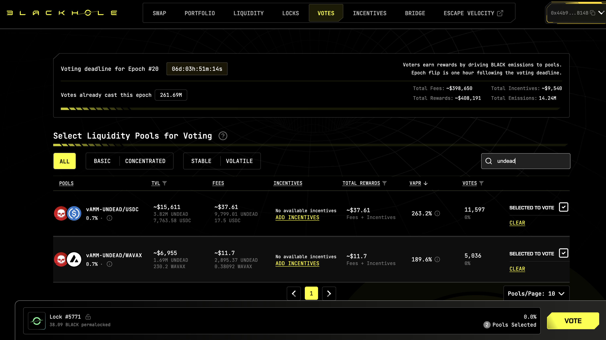
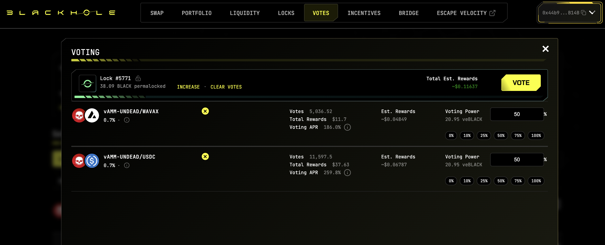
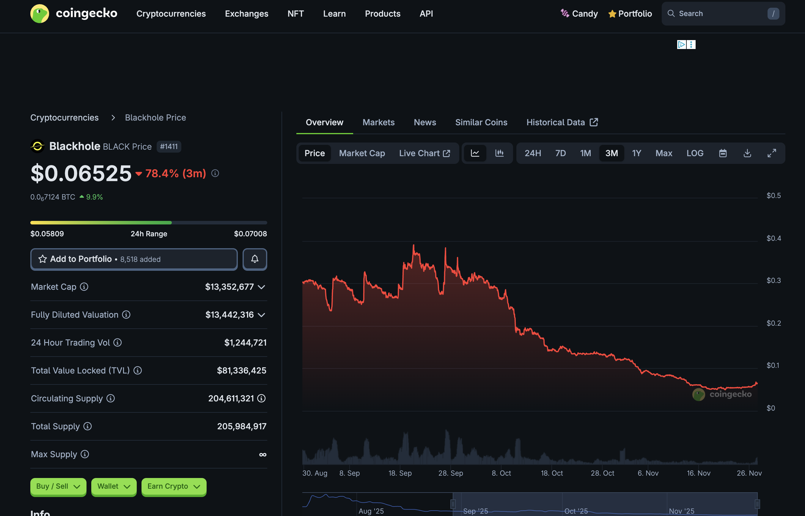
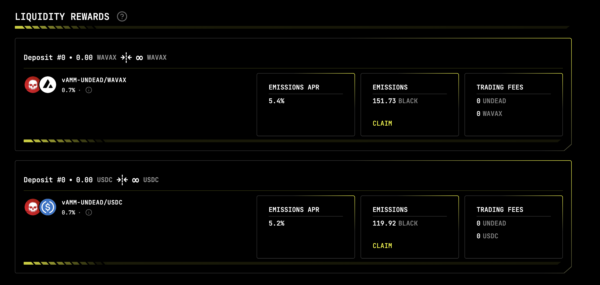
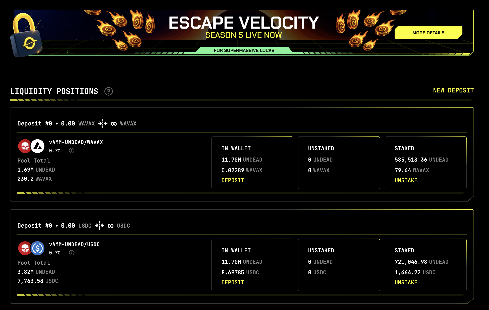
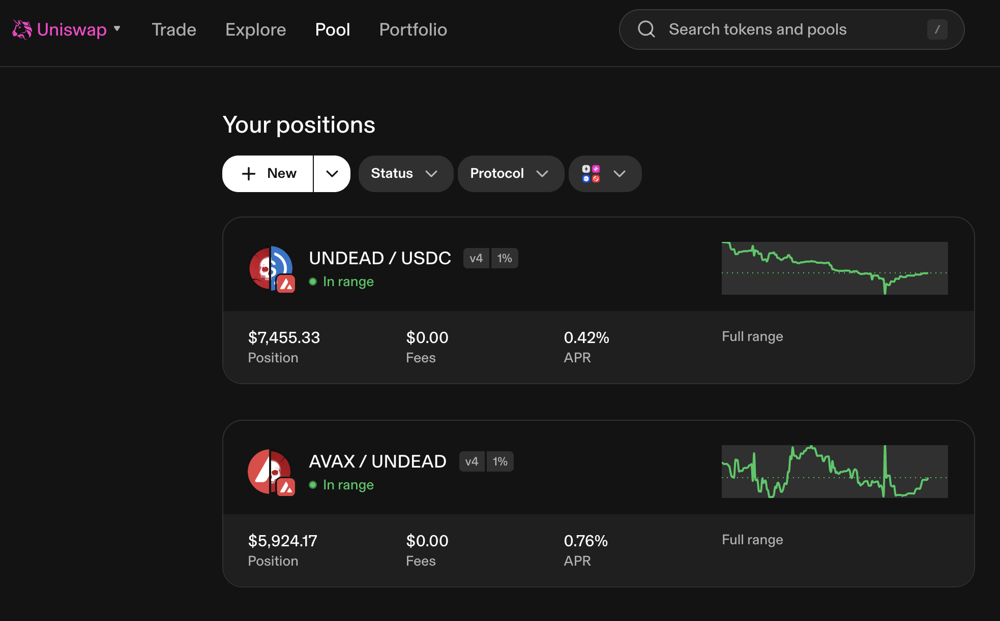
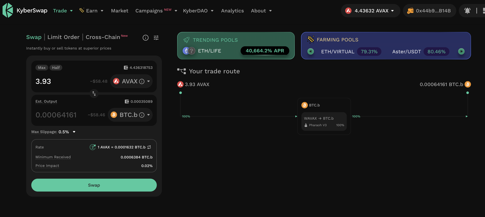
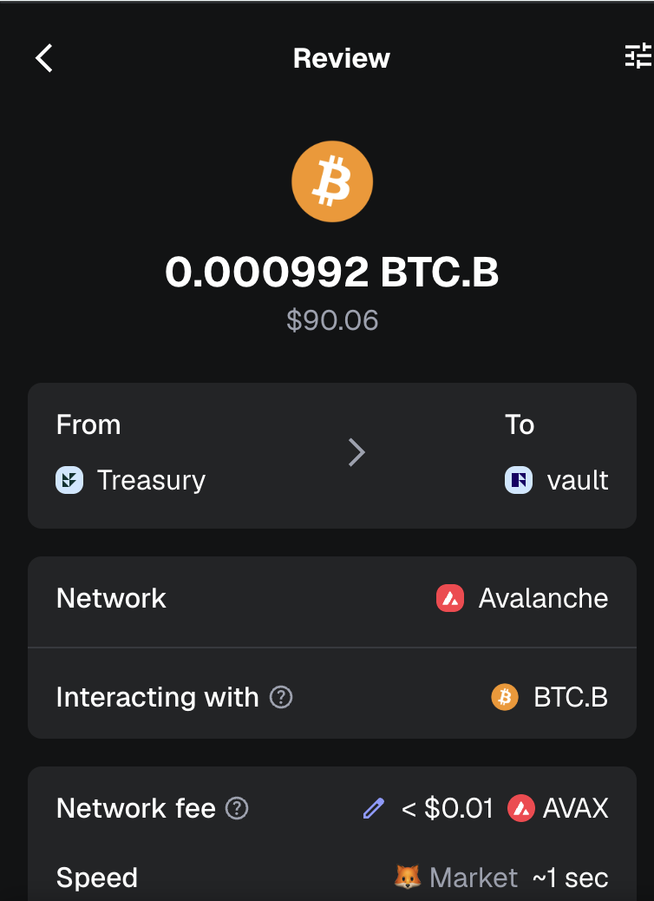
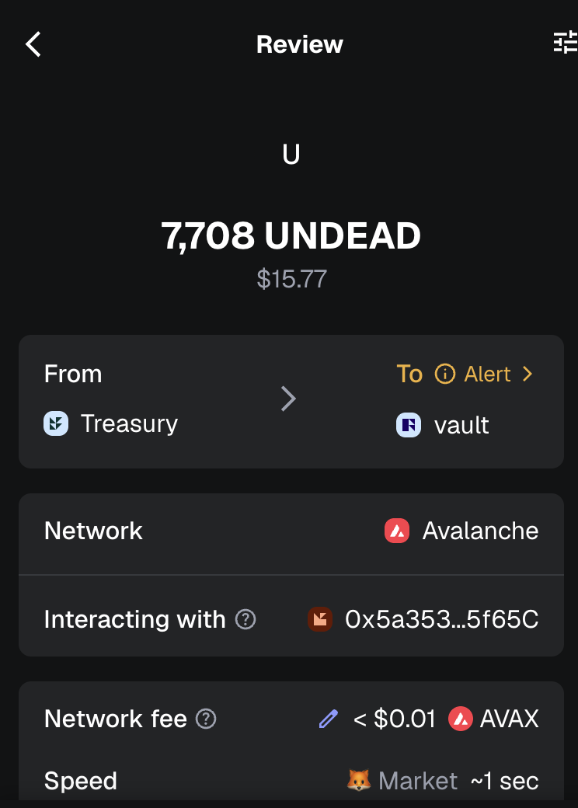

# Vote for $UNDEAD LPs on Blackhole 

2025-11-27 

Good day, pivoteurs! 

A new day; a new Epoch on @BlackholeDex. 

Reminder to go [vote](https://blackhole.xyz/vote) for the @UndeadBlocks $UNDEAD liquidity pools on that DEX. 

 
 

[HOWTO vote instructions](https://x.com/pivocateur/status/1945637734682341791) 

#IVotedForUNDEAD 

# Liquidity Pools 

@BlackholeDex $BLACK price-chart on @coingecko 

 

* I harvest the yields from the LPs on @BlackholeDex and @Uniswap; the LPs have reached parity. 

 
 

* swap the yields to $AVAX 

 

## Liquidity Pool Positions 

 
 

The Blackhole and Uniswap $UNDEAD LPs are as shown. 

# Vault 

* I swap some accumulated $AVAX to $BTC.b 

 

* I send this $BTC.b and $UNDEAD accumulated from the LP-yields on Uniswap to the vault 

 
 

