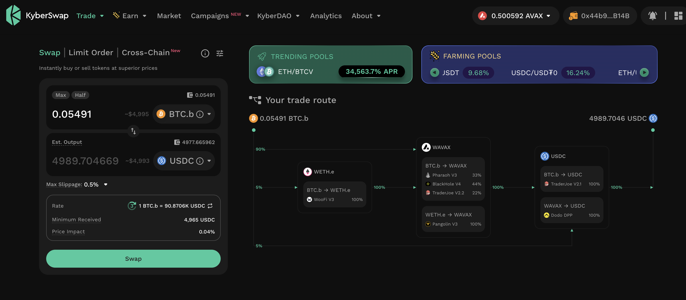
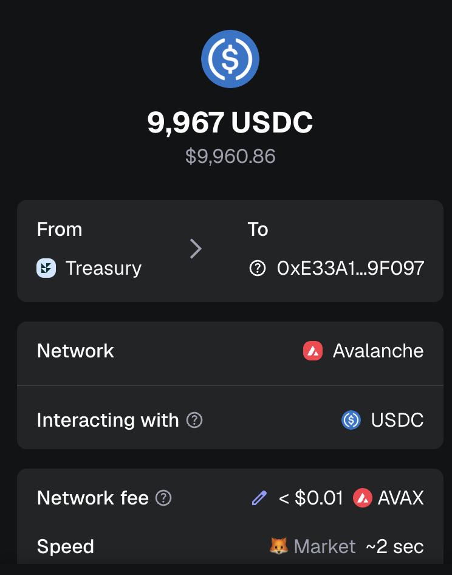
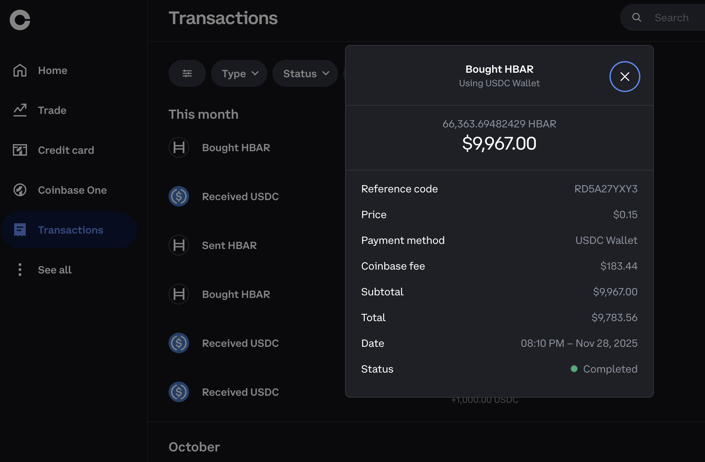
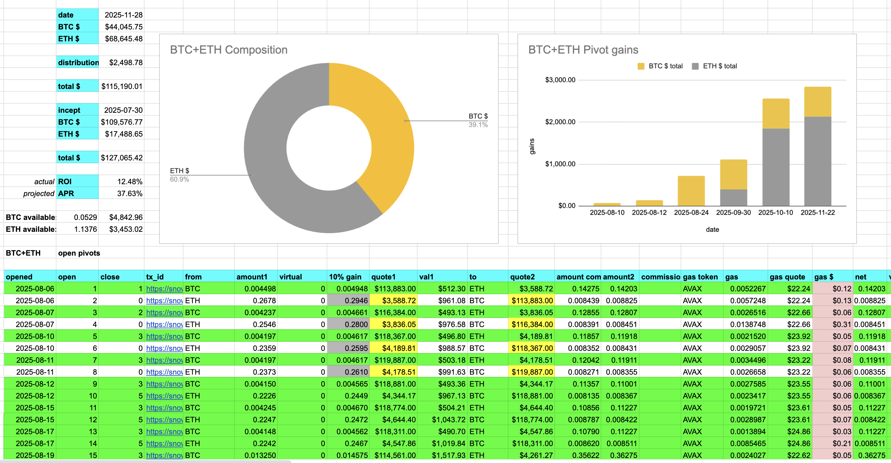
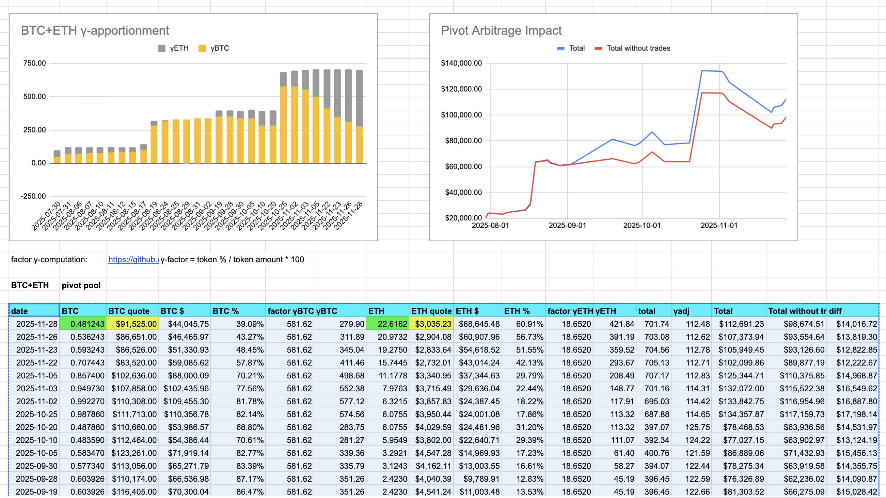

# PIVOTS 

## BTC+ETH 

*  There are 34 open pivots for the BTC+ETH pivot pool.  
*  The last entry is on 2025-11-26.  
*  Recommendations are made for token quotes on 2025-11-28.  

>  No close pivot recommendations for BTC+ETH pivot pool.  

## Open BTC+ETH pivots 

 
 

The meh δ makes no call, but I open an BTC-on-ETH pivot, anyway. 

 

I also open an ETH-on-BTC pivot. 

 

### Move pivots to Hedera 

* I swap 0.05491 BTC to USDC 

 

* I swap 1.643 ETH to USDC. 

 
 
 

and bridge that liquidity to Hedera as HBAR, where I swap back to BTC and ETH 

The BTC+ETH pivot pool composition and γ-apportionment are as charted. 

 
 

