# Completing `baewulf` by doing the work

2025-12-06

We have one more thing to do to make the close-side of baewulf complete: 
aggregate tokens-to-swap, but to do that, we need to distinguish on which 
blockchains the coins are.

TODO that we need to add blockchain info to pivots opened, so we may as well 
GET TO WORK!

# Step 1: bae

Today's quotes for tokens pivoted: collected! ✅

# Step 2: wulf, jr (`hound`, actually)

I run `hound` against the open pivots and it comes up with three recommendations:

* BTC+UNDEAD (on Avalanche)
* HBAR+USDC (on Hedera)
* UNDEAD+USDC (on Avalanche)

So! Work to be done! I'll go through EVERY pivot pool and add blockchain info

## Human-readable `hound`-runoff 

BTW, the `hound`-runoff is CSV so is human-readable from a spreadsheet.

Here's what the output looks like, cleaned-up.
# Vote for $UNDEAD LPs on Blackhole 

2025-12-06 

A new day; a new Epoch on @BlackholeDex. 

Reminder to go [vote](https://blackhole.xyz/vote) for the @UndeadBlocks $UNDEAD liquidity pools on that DEX. 

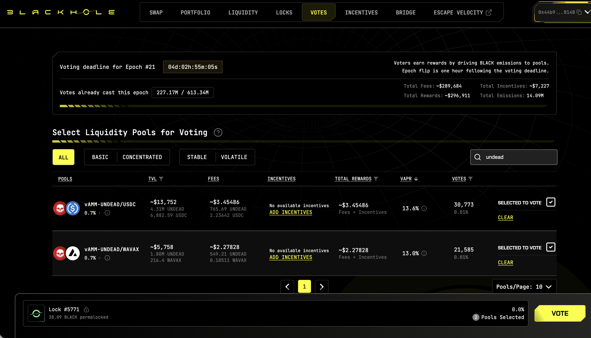 
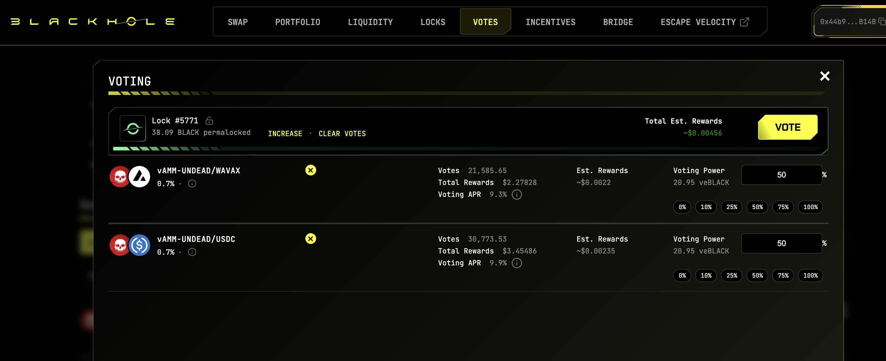 

[HOWTO vote instructions](https://x.com/pivocateur/status/1945637734682341791) 

#IVotedForUNDEAD 

# PIVOTS 

## BTC+ETH 

No close pivots. 

## Open BTC+ETH pivots 

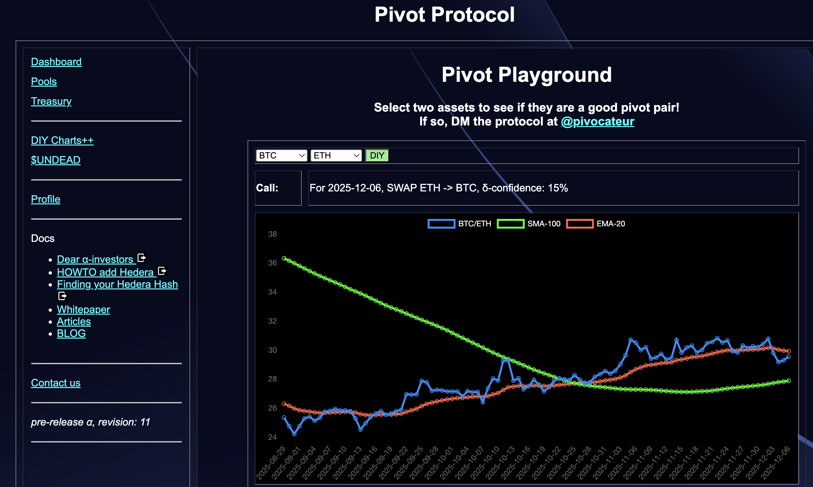 
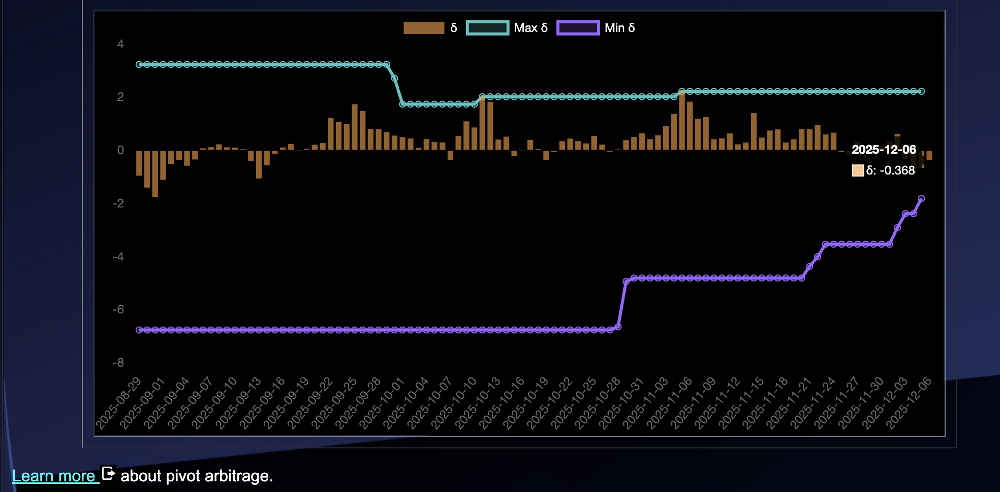 

The meh δ makes no call, but I open an BTC-on-ETH pivot, anyway. 

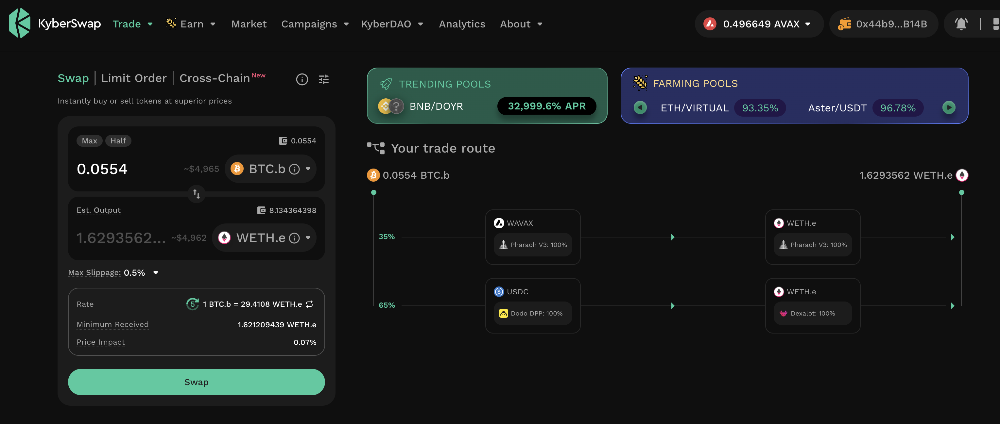 

I also open an ETH-on-BTC pivot. 

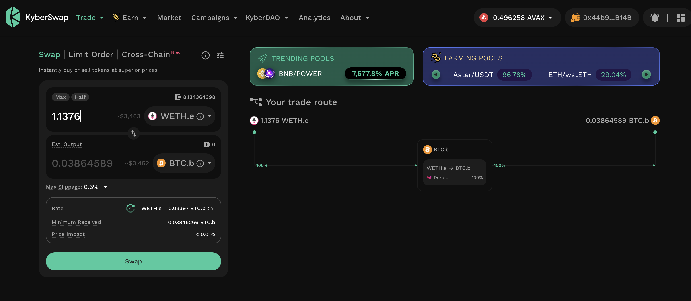 

### Move pivots to Hedera 

* I swap 0.0554 BTC to USDC 

* I swap 1.1376 ETH to USDC. 

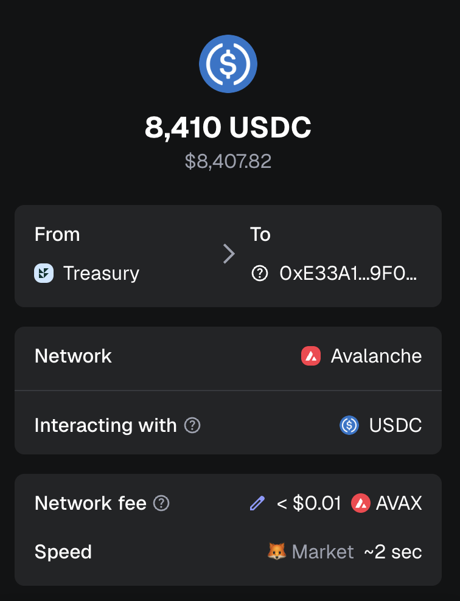 
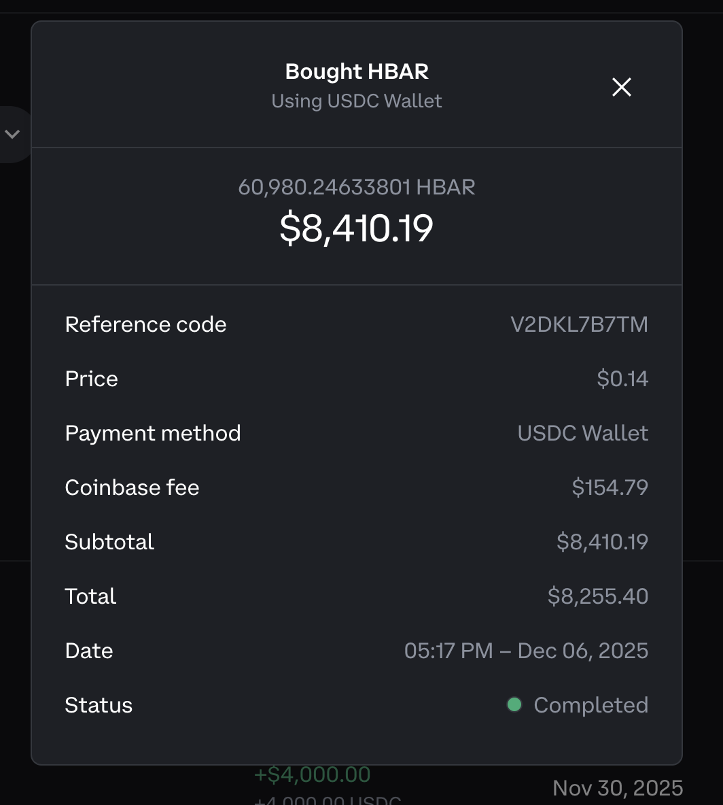 

and bridge that liquidity to Hedera as HBAR, where I swap back to BTC and ETH 

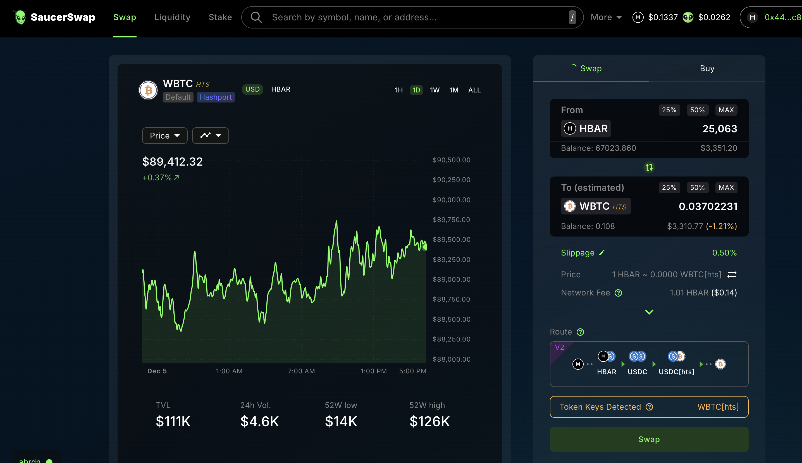 
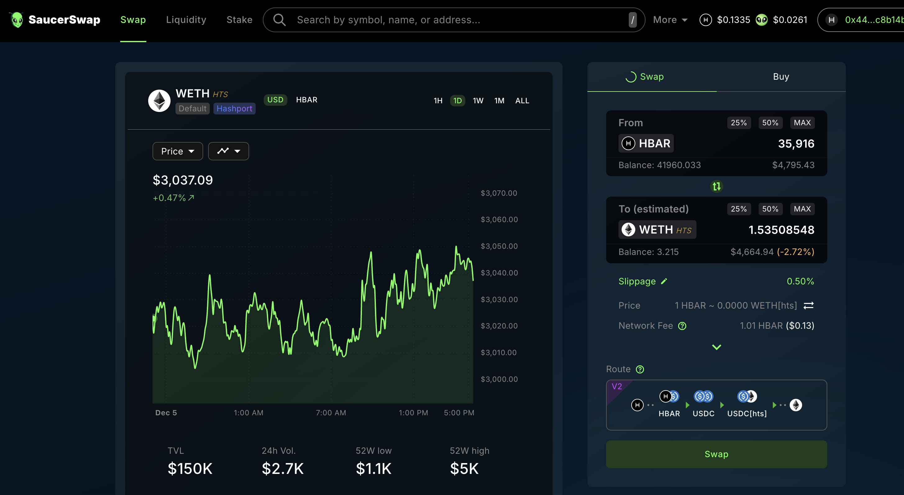 

The BTC+ETH pivot pool composition and γ-apportionment are as charted. 

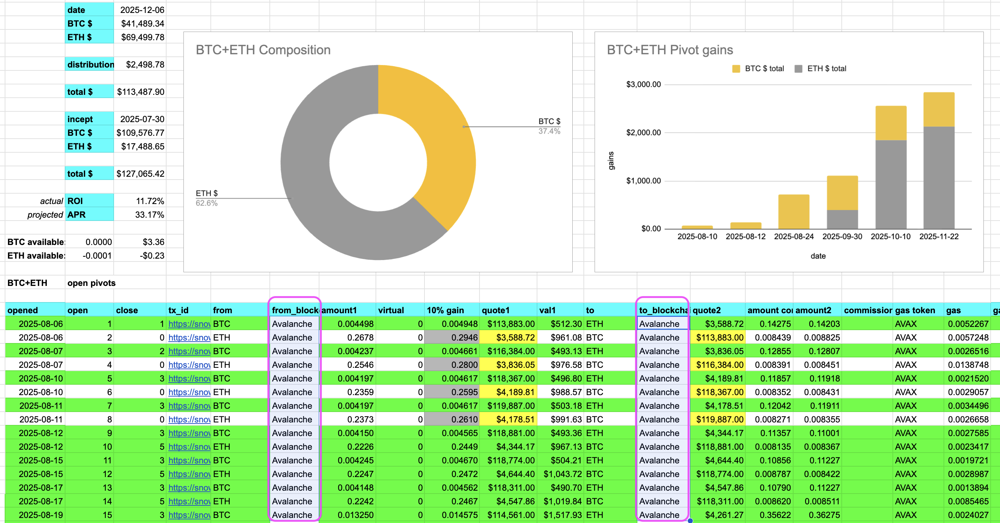 
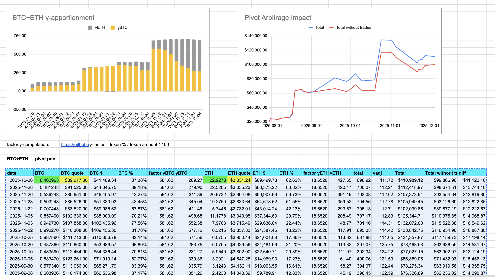 

You see that the assets' blockchains are now part of the pool's composition-data.

