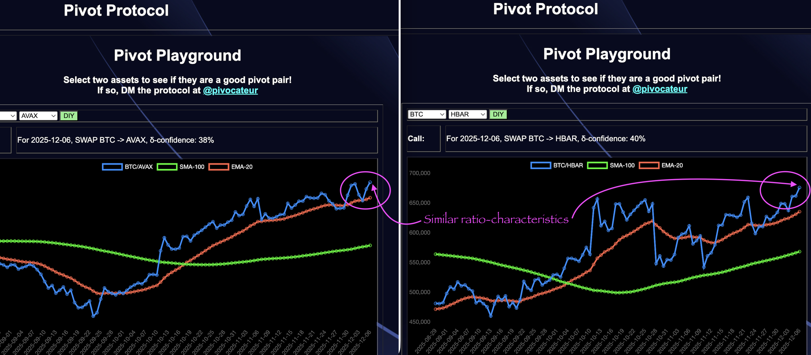
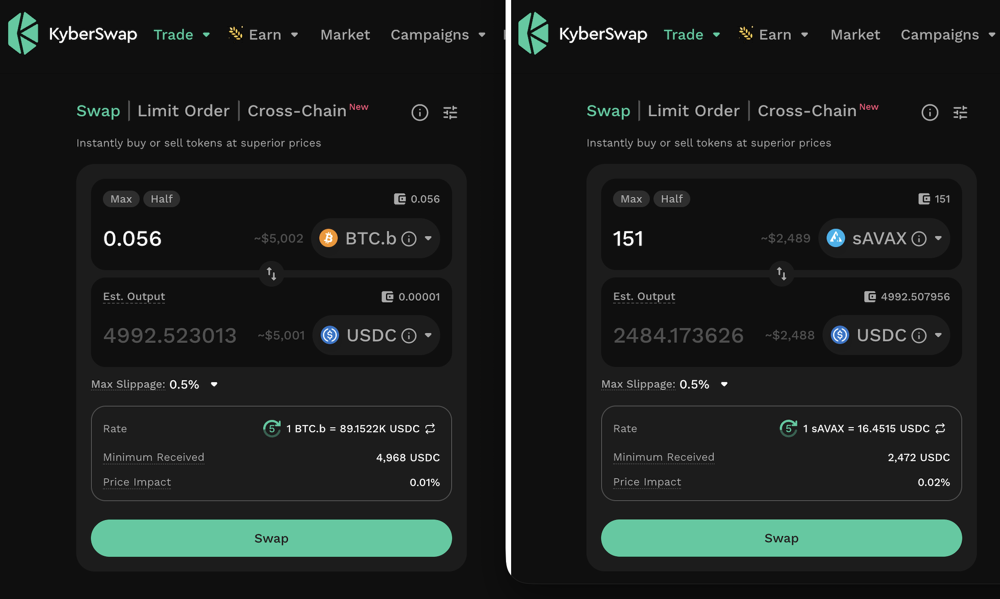
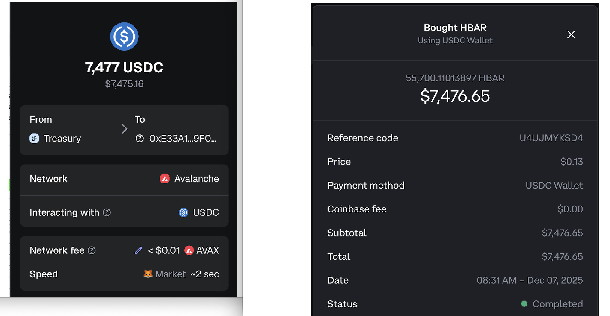
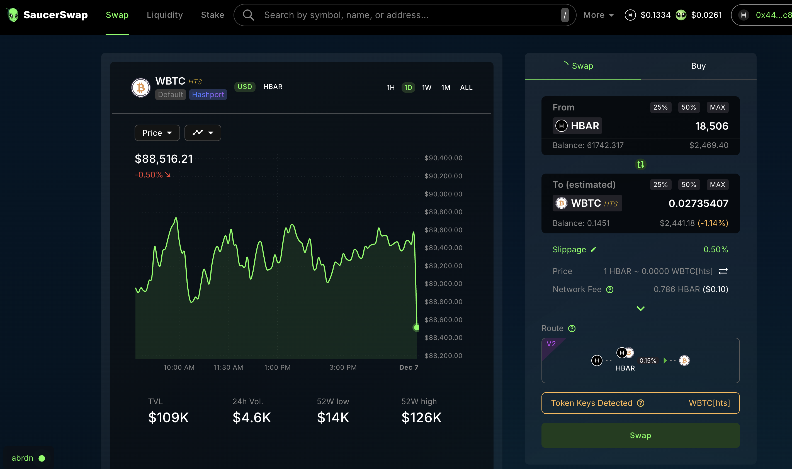

2025-12-08

I continue to migrate liquidity to @hedera.

For the BTC+AVAX pivot pool on @avax, I see that the ratio-characteristics are similar for BTC/AVAX and BTC/HBAR (even if the values are vastly different).

With that in mind, I open a pivot and hedge for BTC+HBAR on Hedera

