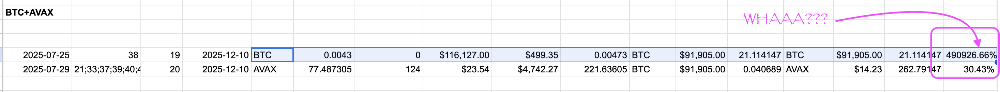

# Automation maintenance

2025-12-10

TFW my automation says I can trade 0.05 $BTC for 21 $BTC in pivot arbitrage making an ROI of:

* 490926.66%

eheheh. 😅

Although I spent all morning combing through the code for that bug, it was actually a bug in the data, saying $BTC->$BTC instead of $BTC-> $AVAX 🙄

