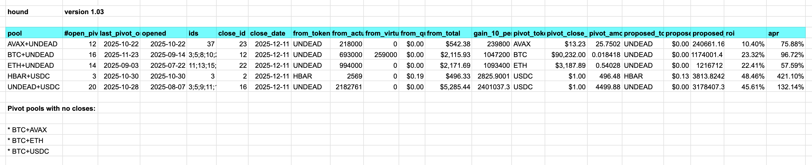

# Automation

We present an evolution in pivot arbitrage automation:

> `hound` version 1.03

This tool determines what pivots to close, and presents all close pivots in an unified, compact way, making pivot arbitrage workflow more efficient.  

