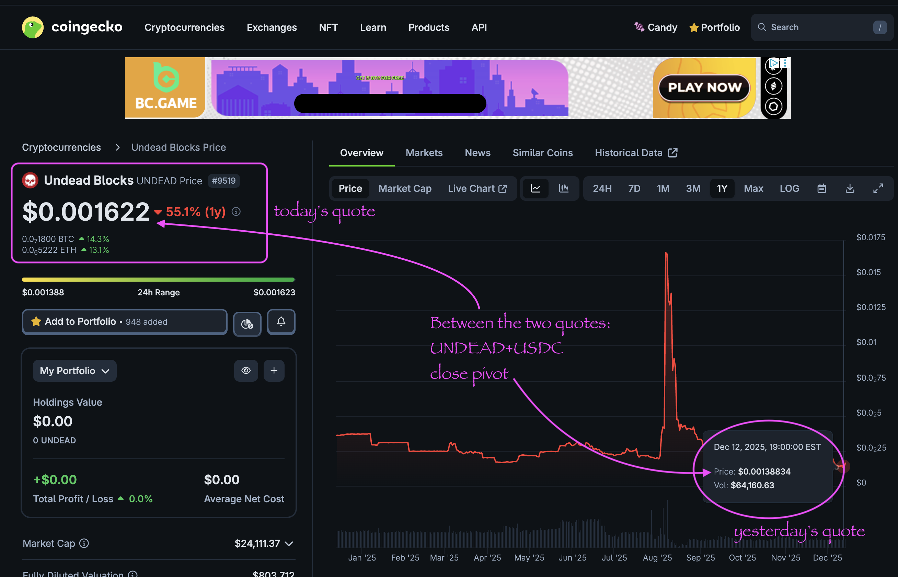

# Does Pivot Arbitrage Work?

> tl;dr: yes.

New article posted on LinkedIn: "[Does Pivot Arbitrage Work?](https://www.linkedin.com/feed/update/urn:li:activity:7405661075314163713/)" (tl;dr: yes) using $UNDEAD as a case-study.

## $UNDEAD performance analysis, 2025-12-13 

* "δ" indicates change since 2025-12-12 
* "α" is annualized since 2025-12-12 

* rank: 9519 (δ: 2.90% ) , α: 1057.43% 
* quote: $0.001622 (δ: 15.86% ) , α: 5787.86% 
* market cap: $24,111 (δ: 14.90% ) , α: 5437.41% 
* 24-hr volume: $71,268 (δ: 8.49% ) , α: 3099.04% 

