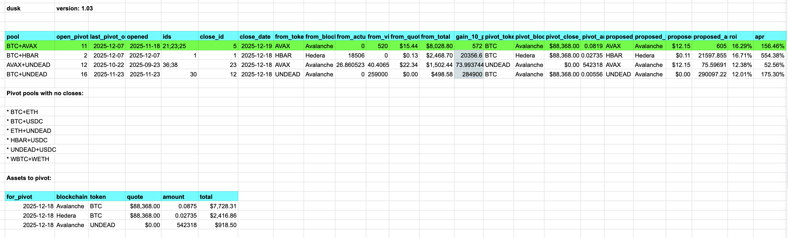
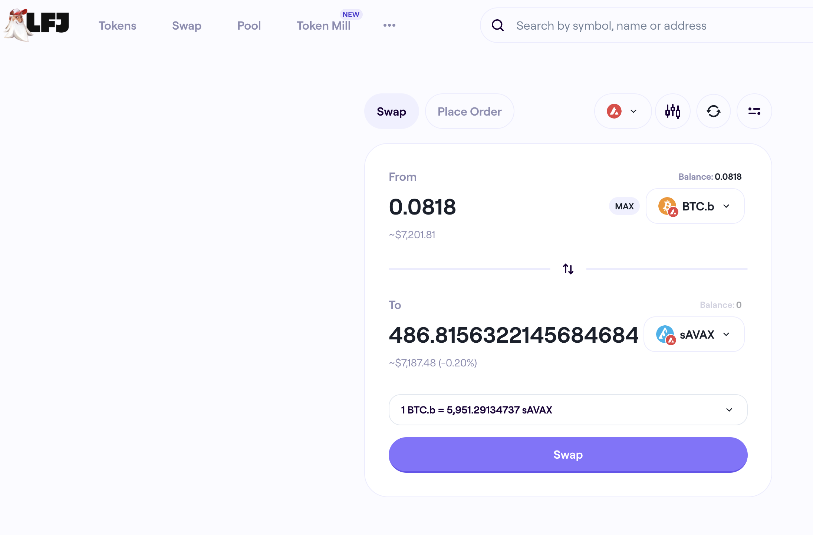
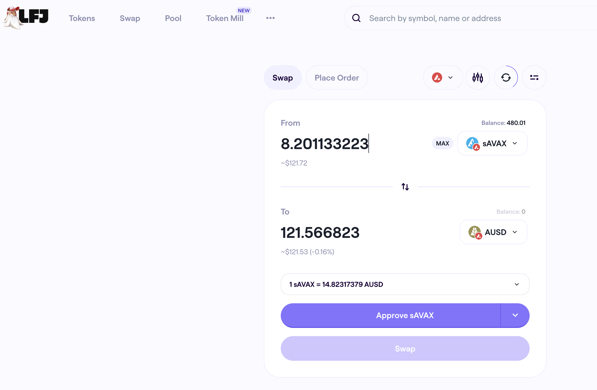
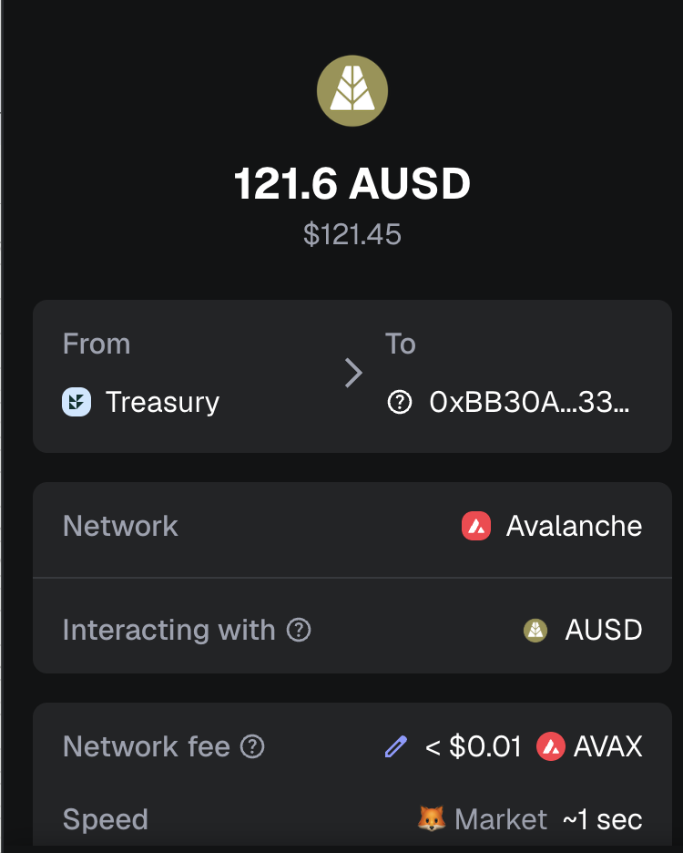

# Automation

Announcing [`dusk`](https://github.com/pivoteur/protocol/tree/main/dapps/dusk):
a dapp that compute close pivots then aggregates assets to pivot by blockchain.

This is a revolution upon previous iterations, cutting workflow by saving on 
asset-allocation for pivots.

# PIVOTS 

## BTC+AVAX 

 
 

Automation calls to close 3 AVAX-on-BTC hedges (which I manually confirm) for gains of: 

* actual ROI: 16.29% / 156.46% APR projected 
* or: 520 $AVAX -> $BTC -> 604 $AVAX 
* or: $1,012.55 gain on 3 hedges totalling $7,944.45 

 
 

I reinvest the gains or distribute 80% to stakers. 

