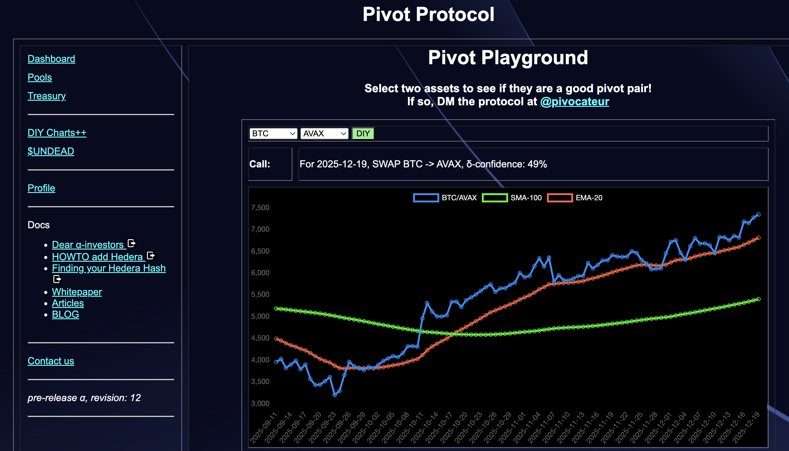
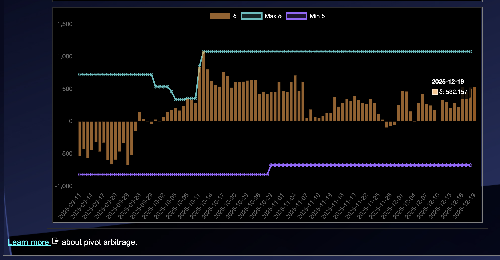
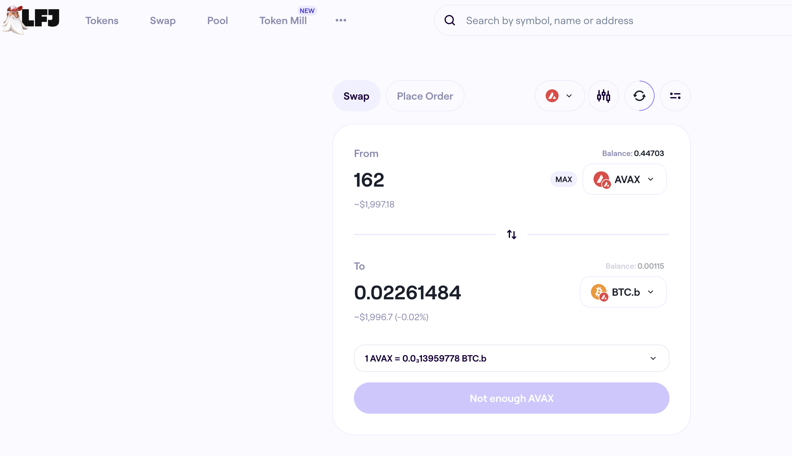
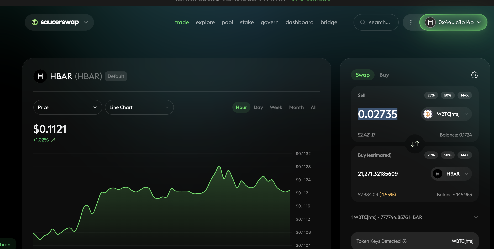
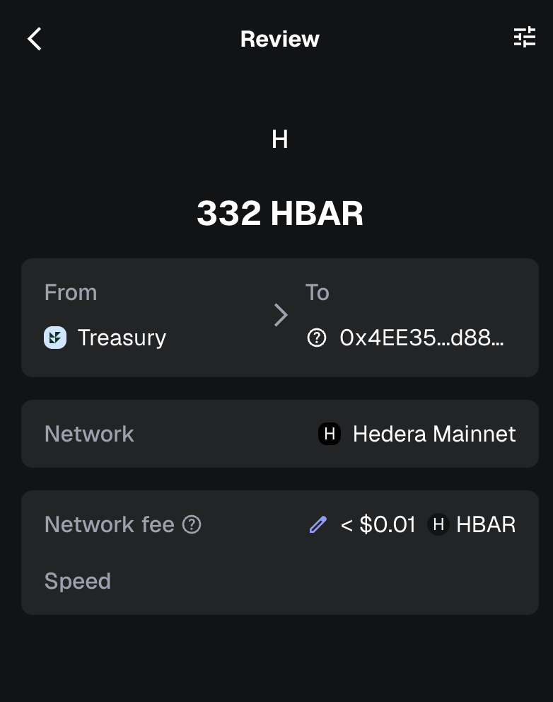
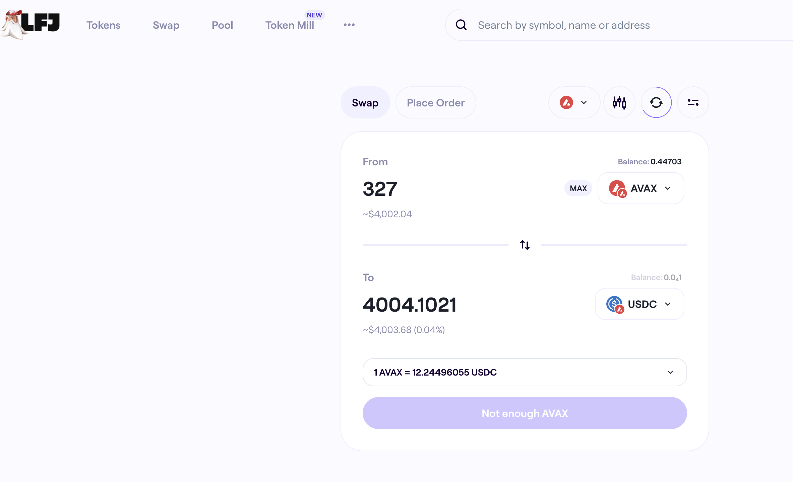

# PIVOTS, 2025-12-19

Good day, pivoteurs!

A new day brings new recommendations!

BUT before we get into today's pivots, we must tidy up the BTC+AVAX and BTC+HBAR pivot pools from the AVAX-on-BTC close hedge we did 'yesterday.'

(My day starts at 8:00 am EST, so 7:59 am is still yesterday in my book)

# PIVOTS 

## Open BTC+AVAX pivots 

 
 

The positive δ calls to open an BTC-on-AVAX pivot, which I do. 

 

I also open an AVAX-on-BTC hedge. 

 

## BTC+HBAR 

 

Automation calls to close 1 HBAR-on-BTC hedge (which I manually confirm) for gains of: 

* actual ROI: 14.95% / 454.62% APR projected 
* or: 18506 $HBAR -> $BTC -> 21270 $HBAR 
* or: $303.76 gain on a hedge totalling $2,468.70 

 

I reinvest or distribute the gains. 

### Move pivots to Hedera 

* I swap 0.0227 BTC to USDC 

 

* I swap 327 AVAX to USDC. 

 
 
 

and bridge that liquidity to Hedera as HBAR, where I swap back to BTC 

