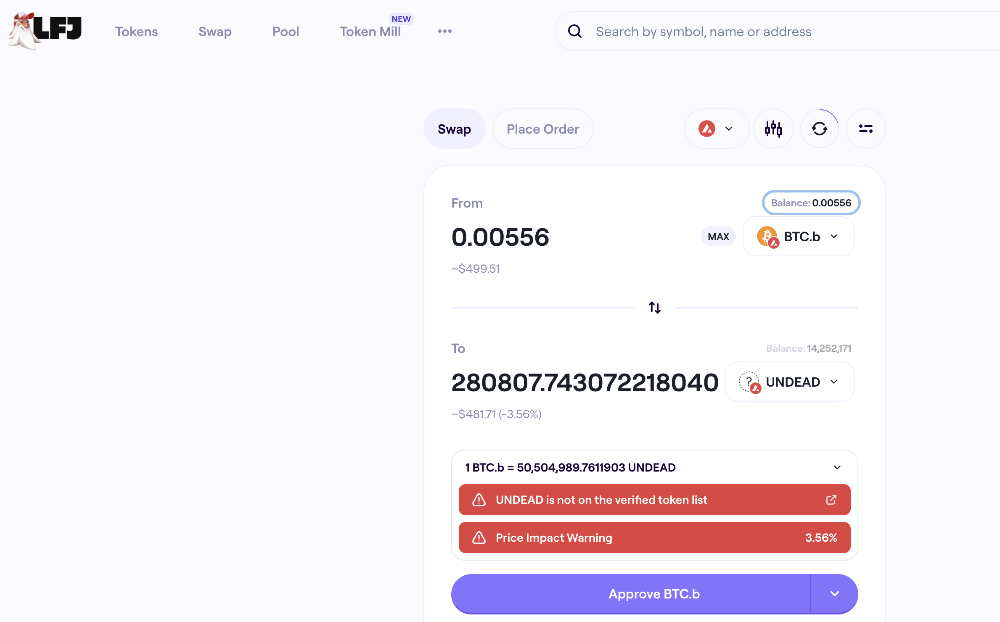

# PIVOTS, 2025-12-22

Automation calls for one close pivot. Let's take a look.

The swap doesn't make the 284k $UNDEAD, so I don't close the pivot. We shall check tomorrow, then!

This happens from time-to-time, as prices shift for both the primary and the pivoted asset. No biggie.
