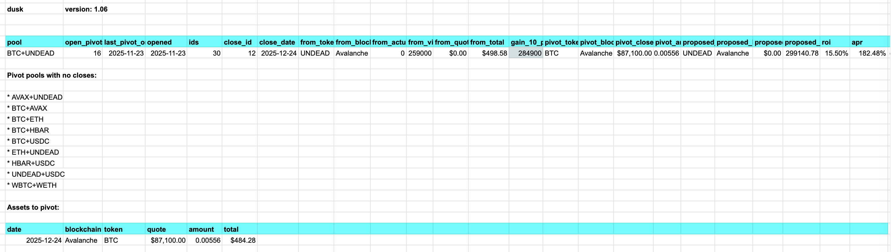
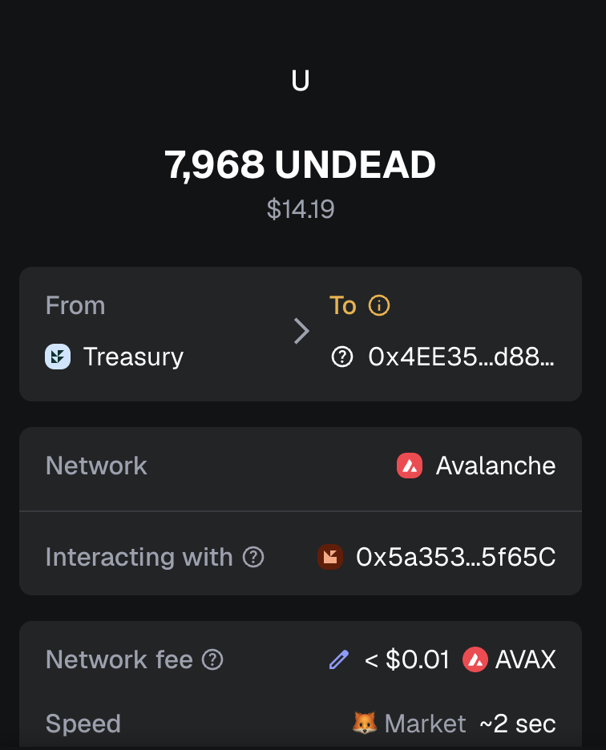

Merry Christmas, pivoteurs!

# PIVOTS 

## BTC+UNDEAD 

 
 

Automation calls to close 1 UNDEAD-on-BTC pivot (which I manually confirm) for gains of: 

* actual ROI: 7.43% / 84.77% APR projected 
* or: 259000.000 $UNDEAD -> $BTC -> 278250.796 $UNDEAD 
* or: $31.16 gain on a pivot totalling $498.58 

 

I reinvest and distribute the gains. 

