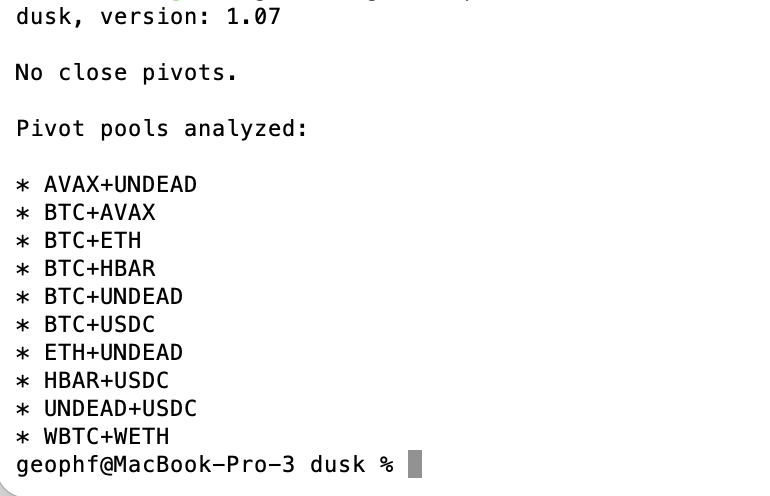

# Happy Boxing Day!

G'day, pivoteurs!

Now this is interesting. `dusk` reports no close-pivot recommendations, but 
it does so by reporting '[blank].'

Time to make 'no close pivots' explicit.

Time for a `dusk`-revision.

* "no close pivots": 
[done](https://github.com/pivoteur/protocol/tree/main/dapps/dusk). ✅ 

